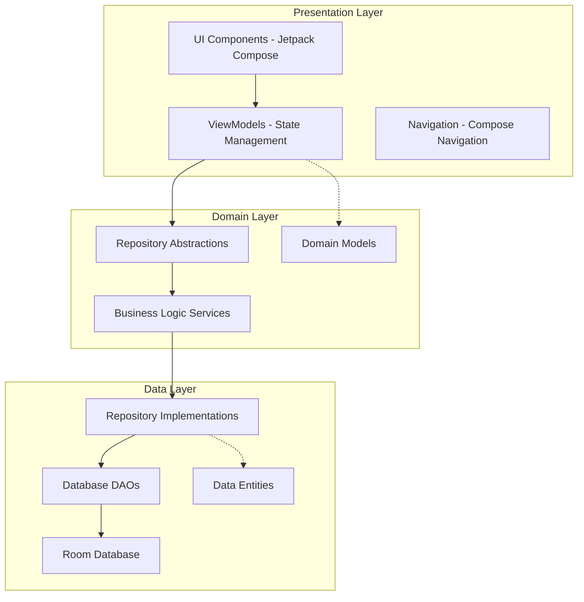

---
tags:
  - architecture
  - overview
  - mvvm
  - clean-architecture
  - room
  - compose
  - viewmodel
  - repository
  - testing
  - performance
  - technical-debt
created: 2025-10-08
related:
  - "[[Refactoring-Roadmap]]"
  - "[[Refactoring-Reality-Check]]"
  - "[[RoundViewModel-Audit]]"
  - "[[Scoring-ViewModel-Architecture]]"
  - "[[Service-Architecture]]"
---

# Archery Apprentice - Architecture Documentation

## Table of Contents
- [System Overview](#system-overview)
- [Technology Stack](#technology-stack)
- [Architecture Patterns](#architecture-patterns)
- [Module Structure](#module-structure)
- [Data Layer](#data-layer)
- [Domain Layer](#domain-layer)
- [Presentation Layer](#presentation-layer)
- [User Flows](#user-flows)
- [Data Flow Architecture](#data-flow-architecture)
- [Performance Considerations](#performance-considerations)
- [Testing Strategy](#testing-strategy)
- [Known Issues & Technical Debt](#known-issues--technical-debt)

## System Overview

Archery Apprentice is a comprehensive Android application for archery practice tracking, equipment management, and performance analytics. The application supports both individual and multi-participant scoring sessions with real-time statistics calculation and equipment performance tracking.

### High-Level Architecture Diagram

## Technology Stack

### Core Technologies
- **Language**: Kotlin 100%
- **UI Framework**: Jetpack Compose
- **Architecture**: MVVM with Clean Architecture principles
- **Database**: Room (SQLite)
- **Asynchronous Programming**: Kotlin Coroutines + StateFlow
- **Dependency Injection**: Manual DI with Factory Pattern

### Key Libraries
- **androidx.compose**: Modern declarative UI
- **androidx.room**: Type-safe database access
- **kotlinx.coroutines**: Reactive programming
- **androidx.lifecycle**: ViewModel and lifecycle management
- **androidx.navigation**: Type-safe navigation

### Development Tools
- **Testing**: JUnit 4, MockK, Robolectric, Compose Testing
- **Build System**: Gradle with Kotlin DSL
- **Code Quality**: Custom lint rules, architectural testing

## Architecture Patterns

### MVVM Implementation

The application follows the Model-View-ViewModel pattern with clear separation of concerns.

See full document for:
- Repository Pattern implementation
- Dependency Injection via Factory Pattern
- Module Structure with package organization
- Data Layer (database schema, operations, migrations)
- Domain Layer (business logic services)
- Presentation Layer (state management, ViewModels, Compose UI)
- User Flows (equipment management, round scoring, multi-participant)
- Data Flow Architecture (real-time scoring, multi-participant state sync)
- Performance Considerations (database, UI, background processing)
- Testing Strategy (unit, integration, UI tests)
- Known Issues & Technical Debt
- Refactoring Roadmap

## Known Issues & Technical Debt

### Critical Issues (Immediate Attention Required)

#### 1. God Class Anti-Patterns
- **RoundViewModel.kt**: 2,058 lines, 55 public methods
- **LiveScoringViewModel.kt**: 1,753 lines, 34 public methods
- **ActiveScoringScreen.kt**: 1,896 lines, excessive UI complexity

**Impact**: Difficult maintenance, complex testing, performance issues
**Resolution**: Break into specialized ViewModels and extract business logic

#### 2. Layer Violations
- **UI → Data Direct Access**: ViewModels importing database classes
- **Domain → UI Dependencies**: Services importing UI-specific types

**Impact**: Tight coupling, architectural inconsistency
**Resolution**: Implement proper abstraction layers and dependency inversion

#### 3. Performance Bottlenecks
- **N+1 Query Problems**: Sequential database queries in round loading
- **Excessive Recomposition**: StateFlow derivations causing UI performance issues
- **Memory Leaks**: Unbounded caches in ViewModels

**Impact**: Poor user experience, app crashes on large datasets
**Resolution**: Database query optimization, UI state management fixes

## Refactoring Roadmap

### Phase 1: Critical Architecture Fixes (4-6 weeks)
1. **Break down God Classes**
   - Split RoundViewModel into 4 specialized ViewModels
   - Extract business logic to domain services
   - Implement proper state management patterns

2. **Fix Layer Violations**
   - Remove direct database access from ViewModels
   - Create proper domain models for UI interactions
   - Implement dependency inversion principles

### Phase 2: Performance Optimization (3-4 weeks)
1. **Database Performance**
   - Add missing indexes for critical queries
   - Implement batch operations for bulk inserts
   - Optimize complex analytical queries

2. **UI Performance**
   - Fix StateFlow derivation patterns
   - Implement proper Compose recomposition optimization
   - Add performance monitoring and regression testing

### Phase 3: Testing & Quality (2-3 weeks)
1. **Close Testing Gaps**
   - Add tests for 11 missing equipment ViewModels
   - Implement repository tests for data layer
   - Create migration regression tests

2. **Code Quality Improvements**
   - Extract magic numbers to constants
   - Standardize code patterns and naming
   - Add comprehensive documentation

### Phase 4: Long-term Improvements (4-6 weeks)
1. **Advanced Architecture**
   - Implement use case pattern for complex business logic
   - Add domain events for cross-module communication
   - Consider modularization for larger features

2. **Developer Experience**
   - Add architectural testing to prevent regressions
   - Implement automated code quality checks
   - Create development and contribution guidelines

---

*Last Updated: January 2025*
*Document Version: 1.0*

This architecture documentation provides a comprehensive overview of the Archery Apprentice codebase structure, patterns, and improvement roadmap. For implementation details and specific refactoring tasks, refer to the companion [[Refactoring-Roadmap]] document.

*Note: This is a condensed version for Obsidian. The full 1,010-line document with all details, code examples, and Mermaid diagrams is available in the source file at: `docs/architecture/ARCHITECTURE.md`*