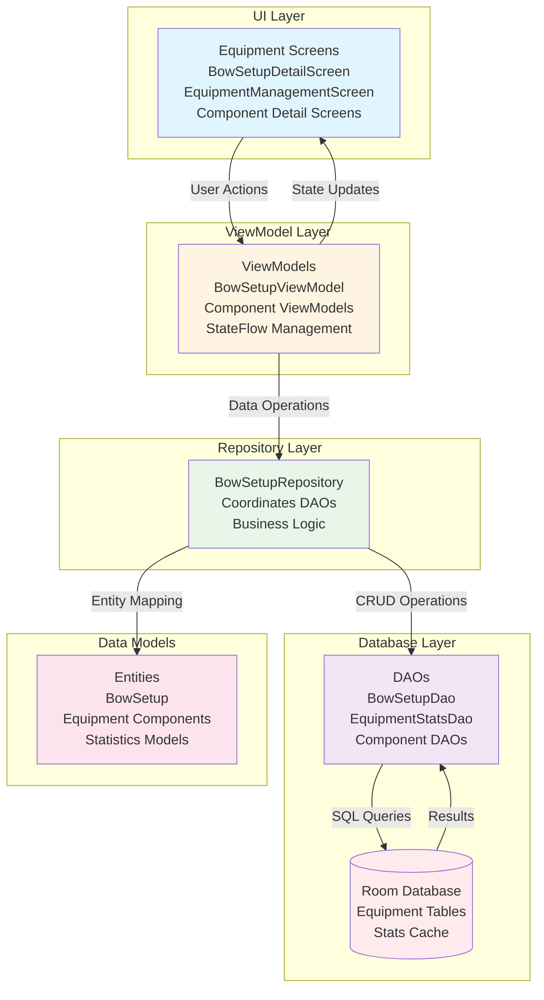
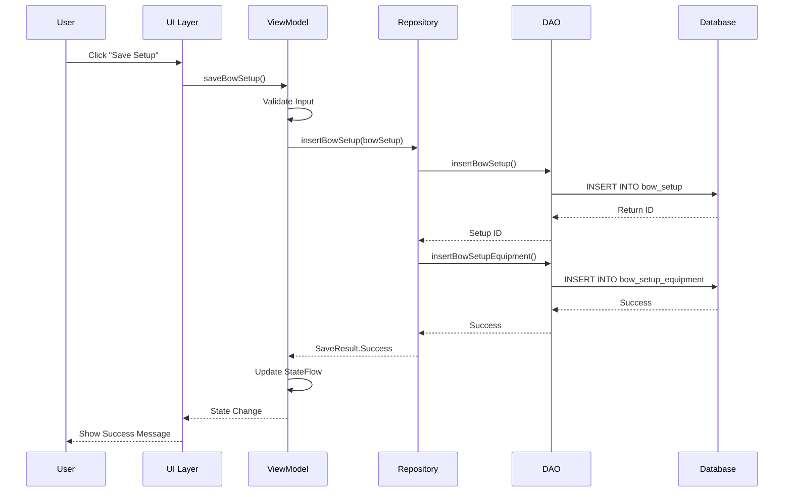
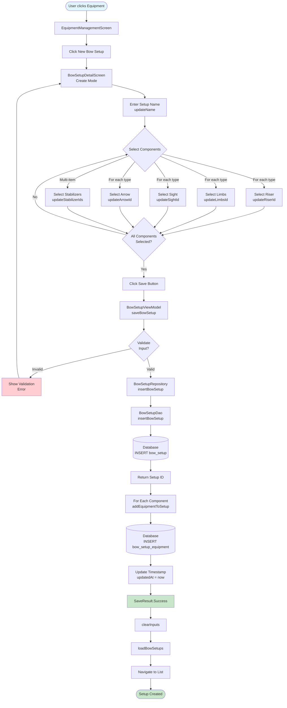

# Equipment Management: End-to-End Flow

**Tags:** #equipment #flow #bow-setup #statistics #end-to-end #architecture #diagrams
**Status:** ✅ **ACTIVE** | Complete documentation of equipment management system
**Last Updated:** October 13, 2025

**Related Documentation:**
- [[Equipment-ViewModels]] - ViewModel architecture
- [[Equipment-Statistics]] - Performance tracking
- [[Equipment-Repositories]] - Repository layer (referenced)
- [[Round-Lifecycle-Flow]] - How equipment integrates with scoring
- [[MVVM-Patterns]] - Architecture patterns used

---

## Overview

The Equipment Management system provides comprehensive tracking of archery equipment including bow setups, component management, equipment selection for rounds, and performance statistics aggregation. The system supports single-user equipment, guest equipment (multi-participant rounds), equipment versioning, and detailed statistics tracking per equipment configuration.

**Key Capabilities:**
- Create and manage complete bow setups with multiple components
- Track 10+ equipment types (riser, limbs, sight, stabilizer, arrows, etc.)
- Associate equipment with scoring rounds
- Track performance statistics per equipment configuration
- Version equipment setups to track changes over time
- Auto-generate guest setups for multi-participant rounds
- Advanced statistics including grouping analysis and fatigue detection

---

## Architecture Layers

### System Architecture Overview



### Layer Interaction Flow



---

### 1. Data Models

**Location:** `app/src/main/java/com/archeryapprentice/data/models/equipment/`

#### Core Equipment Container

**BowSetup** (BowSetup.kt:18-52)
```kotlin
@Entity(tableName = "bow_setup")
data class BowSetup(
    @PrimaryKey(autoGenerate = true)
    val id: Long = 0,
    val name: String = "",
    val version: Int = 1,                    // Equipment version tracking
    val notes: String = "",
    val createdAt: Date = Date(),
    val updatedAt: Date = Date(),
    val isActive: Boolean = true,            // Soft deletion
    val isDefault: Boolean = false,          // Default setup flag
    
    // Guest setup support for multi-participant rounds
    val isGuestSetup: Boolean = false,       // Auto-generated for guests
    val parentParticipantId: String? = null, // Links to SessionParticipant.id
    val sourceRoundId: Int? = null           // Round where guest setup was created
)
```

**Key Methods:**
- `isSelectableByMainUser()` - Filters out guest setups from user selection
- `getDisplayName()` - UI-friendly name with guest/default indicators
- `isAutoGenerated()` - Identifies system-generated setups

#### Equipment Components (17 Types)

**Individual Components:**
1. **Riser** - Bow handle/grip (Riser.kt)
2. **Limbs** - Bow limbs (Limbs.kt) with LimbLength enum
3. **Sight** - Aiming sight (Sight.kt) with SightMarks
4. **Arrow** - Arrow shaft (Arrow.kt) with ArrowPoint and ArrowNock
5. **BowString** - Bow string (BowString.kt)
6. **Plunger** - Button plunger (Plunger.kt)
7. **Rest** - Arrow rest (Rest.kt)
8. **Stabilizer** - Bow stabilizer (Stabilizer.kt) - **Multi-item**
9. **Weight** - Balance weights (Weight.kt) - **Multi-item**
10. **Accessory** - General accessories (Accessory.kt) - **Multi-item**

**Equipment Junction Table:**
```kotlin
@Entity(tableName = "bow_setup_equipment")
data class BowSetupEquipment(
    @PrimaryKey(autoGenerate = true)
    val id: Long = 0,
    val setupId: Long,                       // FK to BowSetup
    val equipmentType: EquipmentType,        // Type enum
    val equipmentId: Long,                   // FK to specific equipment
    val quantity: Int = 1,                   // For multi-item types
    val addedAt: Date = Date()
)
```

**Composite View Model:**
```kotlin
data class BowSetupWithEquipment(
    val setup: BowSetup,
    val riser: Riser? = null,
    val limbs: Limbs? = null,
    val sight: Sight? = null,
    val stabilizers: List<Stabilizer> = emptyList(),  // Multi-item
    val plunger: Plunger? = null,
    val rest: Rest? = null,
    val bowString: BowString? = null,
    val arrow: Arrow? = null,
    val weights: List<Weight> = emptyList(),          // Multi-item
    val accessories: List<Accessory> = emptyList()    // Multi-item
)
```

#### Equipment Statistics Models

**Location:** `app/src/main/java/com/archeryapprentice/data/models/EquipmentStatsModels.kt`

**Core Performance Metrics** (EquipmentStatsModels.kt:39-54)
```kotlin
data class EquipmentPerformanceStats(
    val bowSetupId: Long,
    val totalArrows: Int,
    val averageScore: Double,
    val xCount: Int,
    val tenCount: Int,
    val nineOrBetterCount: Int,
    val missCount: Int,
    val firstShotAt: Long,
    val lastShotAt: Long,
    val roundCount: Int
) {
    val accuracy: Double        // (tenCount / totalArrows) * 100
    val consistency: Double     // (nineOrBetterCount / totalArrows) * 100
    val missRate: Double        // (missCount / totalArrows) * 100
}
```

**Advanced Analytics** (EquipmentStatsModels.kt:94-150)
- **AdvancedShotGrouping** - Grouping analysis with eccentricity, bias detection
- **FatigueMetrics** - Performance decline analysis
- **ConsistencyMetrics** - End-to-end consistency tracking
- **EquipmentDistancePerformance** - Distance-specific stats
- **ComparativeEquipmentStats** - Cross-equipment comparison

**Snapshot for Historical Tracking:**
```kotlin
@Entity(tableName = "arrow_equipment_snapshot")
data class ArrowEquipmentSnapshot(
    @PrimaryKey(autoGenerate = true)
    val id: Long = 0,
    val arrowScoreId: Long,                  // FK to ArrowScore
    val bowSetupId: Long,                    // Equipment used for this arrow
    val bowSetupVersion: Int,                // Version tracking
    val riserId: Long? = null,               // Component snapshots
    val limbsId: Long? = null,
    // ... all component IDs
    val capturedAt: Long = System.currentTimeMillis()
)
```

---

### 2. Database Layer

**Location:** `app/src/main/java/com/archeryapprentice/data/dao/`

#### BowSetupDao (BowSetupDao.kt:15-115)

**CRUD Operations:**
```kotlin
@Dao
interface BowSetupDao {
    // Basic operations
    @Insert suspend fun insertBowSetup(bowSetup: BowSetup): Long
    @Update suspend fun updateBowSetup(bowSetup: BowSetup)
    @Delete suspend fun deleteBowSetup(bowSetup: BowSetup)
    @Query("UPDATE bow_setup SET isActive = 0 WHERE id = :id")
    suspend fun softDeleteBowSetup(id: Long)
    
    // Retrieval queries
    @Query("SELECT * FROM bow_setup WHERE isActive = 1 ORDER BY updatedAt DESC")
    fun getAllActiveBowSetups(): Flow<List<BowSetup>>
    
    @Query("SELECT * FROM bow_setup WHERE id = :id AND isActive = 1")
    suspend fun getBowSetupById(id: Long): BowSetup?
    
    @Query("SELECT * FROM bow_setup WHERE isDefault = 1 AND isActive = 1 LIMIT 1")
    suspend fun getDefaultBowSetup(): BowSetup?
    
    // Guest setup queries (Lines 75-114)
    @Query("SELECT * FROM bow_setup WHERE isGuestSetup = 1 
            AND parentParticipantId = :participantId 
            AND sourceRoundId = :roundId AND isActive = 1 LIMIT 1")
    suspend fun getGuestSetupForParticipant(participantId: String, roundId: Int): BowSetup?
    
    @Query("SELECT * FROM bow_setup WHERE isActive = 1 AND isGuestSetup = 0 
            ORDER BY isDefault DESC, updatedAt DESC")
    fun getSelectableBowSetups(): Flow<List<BowSetup>>
}
```

**Equipment Junction Operations:**
```kotlin
// BowSetupEquipment CRUD
@Insert(onConflict = OnConflictStrategy.REPLACE)
suspend fun insertBowSetupEquipment(bowSetupEquipment: BowSetupEquipment)

@Query("DELETE FROM bow_setup_equipment WHERE setupId = :setupId AND equipmentType = :equipmentType")
suspend fun deleteEquipmentByType(setupId: Long, equipmentType: EquipmentType)

@Query("SELECT * FROM bow_setup_equipment WHERE setupId = :setupId")
suspend fun getEquipmentForSetup(setupId: Long): List<BowSetupEquipment>
```

#### EquipmentStatsDao (EquipmentStatsDao.kt:13-150)

**Equipment Snapshot Operations:**
```kotlin
@Dao
interface EquipmentStatsDao {
    @Insert(onConflict = OnConflictStrategy.REPLACE)
    suspend fun insertEquipmentSnapshot(snapshot: ArrowEquipmentSnapshot): Long
    
    @Query("SELECT * FROM arrow_equipment_snapshot WHERE bowSetupId = :bowSetupId 
            AND bowSetupVersion = :version ORDER BY capturedAt DESC")
    suspend fun getSnapshotsForBowSetupVersion(bowSetupId: Long, version: Int): List<ArrowEquipmentSnapshot>
}
```

**Equipment Usage Tracking:**
```kotlin
@Query("SELECT DISTINCT bowSetupId, bowSetupVersion, COUNT(*) as usageCount
        FROM arrow_equipment_snapshot 
        WHERE capturedAt >= :startDate
        GROUP BY bowSetupId, bowSetupVersion
        ORDER BY usageCount DESC")
suspend fun getEquipmentUsageStats(startDate: Long): List<EquipmentUsageSummary>
```

**Stats Cache Management:**
```kotlin
@Insert(onConflict = OnConflictStrategy.REPLACE)
suspend fun insertStatsCache(cache: EquipmentStatsCache): Long

@Query("SELECT * FROM equipment_stats_cache 
        WHERE cacheKey = :cacheKey AND validUntil > :currentTime")
suspend fun getValidCacheEntry(cacheKey: String, currentTime: Long): EquipmentStatsCache?
```

---

### 3. Repository Layer

**Location:** `app/src/main/java/com/archeryapprentice/domain/repository/BowSetupRepository.kt`

#### BowSetupRepository (BowSetupRepository.kt:41-377)

**Initialization:**
```kotlin
class BowSetupRepository(
    private val bowSetupDao: BowSetupDao,
    private val riserDao: RiserDao,
    private val limbsDao: LimbsDao,
    private val sightDao: SightDao,
    // ... all component DAOs
)
```

**Core Operations:**
```kotlin
// Setup retrieval
fun getAllBowSetups(): Flow<List<BowSetup>>
fun getSelectableBowSetups(): Flow<List<BowSetup>>  // Excludes guest setups
suspend fun getBowSetupById(id: Long): BowSetup?
suspend fun getDefaultBowSetup(): BowSetup?

// Setup creation
suspend fun getOrCreateDefaultBowSetup(): BowSetup  // Lines 65-80
suspend fun insertBowSetup(bowSetup: BowSetup): Long
suspend fun updateBowSetup(bowSetup: BowSetup)
suspend fun deleteBowSetup(bowSetup: BowSetup)      // Soft delete
```

**Guest Setup Management** (Lines 95-158):
```kotlin
/**
 * Get or create guest bow setup for participant in round
 * Ensures each guest has their own setup for statistics tracking
 */
suspend fun getOrCreateGuestBowSetup(
    participant: SessionParticipant,
    roundId: Int
): BowSetup {
    // Check if guest setup exists
    val existingSetup = bowSetupDao.getGuestSetupForParticipant(participant.id, roundId)
    if (existingSetup != null) return existingSetup
    
    // Create new guest setup
    val guestSetup = BowSetup(
        name = "Guest Setup - ${participant.displayName}",
        notes = "Auto-generated for guest participant",
        isGuestSetup = true,
        parentParticipantId = participant.id,
        sourceRoundId = roundId,
        isActive = true
    )
    
    val newId = insertBowSetup(guestSetup)
    return getBowSetupById(newId) ?: guestSetup.copy(id = newId)
}

// Guest cleanup
suspend fun cleanupGuestSetupsForRound(roundId: Int)
suspend fun getGuestSetupStats(): GuestSetupStats
```

**Equipment Management** (Lines 219-257):
```kotlin
suspend fun addEquipmentToSetup(
    setupId: Long,
    equipmentType: EquipmentType,
    equipmentId: Long,
    quantity: Int = 1
) {
    // Single-item types: Remove existing first
    if (isSingleItemEquipment(equipmentType)) {
        bowSetupDao.deleteEquipmentByType(setupId, equipmentType)
    }
    
    // Insert new equipment
    val bowSetupEquipment = BowSetupEquipment(
        setupId = setupId,
        equipmentType = equipmentType,
        equipmentId = equipmentId,
        quantity = quantity
    )
    bowSetupDao.insertBowSetupEquipment(bowSetupEquipment)
    
    // Update timestamp
    getBowSetupById(setupId)?.let { setup ->
        updateBowSetup(setup.copy(updatedAt = Date()))
    }
}

suspend fun removeEquipmentFromSetup(setupId: Long, equipmentType: EquipmentType, equipmentId: Long)
suspend fun getEquipmentForSetup(setupId: Long): List<BowSetupEquipment>
```

**Complete Setup Assembly** (Lines 260-312):
```kotlin
suspend fun getBowSetupWithEquipment(setupId: Long): BowSetupWithEquipment? {
    val setup = getBowSetupById(setupId) ?: return null
    val equipmentList = getEquipmentForSetup(setupId)
    
    // Fetch all components by type
    val riserEquipment = equipmentList.find { it.equipmentType == EquipmentType.RISER }
    val riser = riserEquipment?.let { riserDao.getRiserById(it.equipmentId) }
    
    val limbsEquipment = equipmentList.find { it.equipmentType == EquipmentType.LIMBS }
    val limbs = limbsEquipment?.let { limbsDao.getLimbsById(it.equipmentId) }
    
    // ... fetch all other components
    
    // Multi-item equipment
    val stabilizerEquipment = equipmentList.filter { it.equipmentType == EquipmentType.STABILIZER }
    val stabilizers = stabilizerEquipment.mapNotNull {
        stabilizerDao.getStabilizerById(it.equipmentId)
    }
    
    return BowSetupWithEquipment(
        setup = setup,
        riser = riser,
        limbs = limbs,
        sight = sight,
        stabilizers = stabilizers,
        // ... all components
    )
}
```

**Versioning Support** (Lines 315-348):
```kotlin
suspend fun createNewVersion(originalSetupId: Long, newName: String? = null): Long? {
    val originalSetup = getBowSetupById(originalSetupId) ?: return null
    val originalEquipment = getEquipmentForSetup(originalSetupId)
    
    // Increment version
    val nextVersion = originalSetup.version + 1
    
    // Create new setup version
    val newSetup = originalSetup.copy(
        id = 0,  // Auto-generate new ID
        name = newName ?: originalSetup.name,
        version = nextVersion,
        createdAt = Date(),
        updatedAt = Date()
    )
    
    val newSetupId = insertBowSetup(newSetup)
    
    // Copy all equipment to new version
    val newEquipmentList = originalEquipment.map {
        it.copy(setupId = newSetupId, addedAt = Date())
    }
    bowSetupDao.insertBowSetupEquipmentList(newEquipmentList)
    
    return newSetupId
}
```

---

### 4. ViewModel Layer

**Location:** `app/src/main/java/com/archeryapprentice/ui/equipment/viewModels/`

#### Architecture Pattern

All equipment ViewModels follow consistent pattern:

```kotlin
class ComponentViewModel(private val repository: ComponentRepository) : ViewModel() {
    // 1. Observable state for list
    private val _items = MutableStateFlow<List<Component>>(emptyList())
    val items: StateFlow<List<Component>> = _items.asStateFlow()
    
    // 2. Input state for forms
    private val _inputState = MutableStateFlow(ComponentInputState())
    val inputState: StateFlow<ComponentInputState> = _inputState.asStateFlow()
    
    // 3. CRUD operations
    init { loadItems() }
    suspend fun saveComponent(): SaveResult
    fun deleteComponent(component: Component)
    fun loadComponentForEdit(id: Long)
    fun clearInputs()
    
    // 4. Field update methods
    fun updateBrand(value: String) {
        _inputState.value = _inputState.value.copy(brand = value)
    }
}
```

**See:** [[Equipment-ViewModels]] for complete ViewModel documentation including:
- ArrowViewModel, StabilizerViewModel, SightViewModel, etc. (10 component ViewModels)
- BowSetupViewModel (coordinates complete setup)
- EquipmentListViewModel (inventory management)

**Key Patterns:**
- **StateFlow**: Reactive state management
- **SaveResult**: Consistent error handling
- **InputState**: Immutable form state
- **Field Updates**: Granular, type-safe updates

---

### 5. UI Layer

**Location:** `app/src/main/java/com/archeryapprentice/ui/equipment/pages/`

#### Main Equipment Screens

**EquipmentManagementScreen.kt**
- Entry point for equipment management
- Navigation hub to all equipment types
- Equipment type selection

**SelectEquipmentTypeScreen.kt**
- Grid/list view of equipment types
- Quick navigation to component entry
- Search and filter capabilities

**BowSetupDetailScreen.kt** (equipment/)
- Complete bow setup creation/editing
- Component selection for each type
- Equipment assembly and validation
- Performance statistics display (tabs)

#### Component Detail Screens (equipment/detailpages/)

Individual screens for each equipment type:
- ArrowDetailScreen.kt
- RiserDetailScreen.kt
- LimbsDetailScreen.kt
- SightDetailScreen.kt
- StabilizerDetailScreen.kt
- BowStringDetailScreen.kt
- PlungerDetailScreen.kt
- RestDetailScreen.kt
- WeightDetailScreen.kt
- AccessoryDetailScreen.kt

**Pattern**: All follow same layout:
1. Input form with validation
2. Equipment list display
3. Edit/delete actions
4. Save/cancel buttons

#### Equipment Analytics Screens (equipment/analytics/)

**EquipmentAnalyticsHubScreen.kt**
- Central analytics dashboard
- Performance overview
- Navigation to detailed views

**EquipmentComparisonScreen.kt**
- Side-by-side equipment comparison
- Performance metrics comparison
- Chart visualizations

**EquipmentExportScreen.kt**
- Export equipment data
- Statistics export
- Share functionality

#### Performance Statistics Tab

**BowSetupPerformanceTab** (component in BowSetupDetailScreen)
- Accuracy percentage by equipment
- Average score per arrow
- X count and 10 count
- Rounds completed with equipment
- Distance-specific performance
- Advanced grouping analysis
- Fatigue detection
- Consistency metrics

---

## User Journeys

### Journey 1: Create New Bow Setup

**Flow:** Equipment Hub → New Setup → Add Components → Save



**1. Navigate to Equipment** (EquipmentManagementScreen)
```
User clicks "Equipment" in bottom nav
→ EquipmentManagementScreen displays
→ Shows equipment type options
```

**2. Create New Setup** (BowSetupDetailScreen)
```
User clicks "New Bow Setup"
→ BowSetupDetailScreen displays in create mode
→ BowSetupViewModel initializes empty InputState
   - Location: BowSetupViewModel.kt:init
   - Sets isEditing = false, editingId = 0
```

**3. Enter Setup Details**
```
User enters setup name: "Competition Setup"
→ BowSetupViewModel.updateName("Competition Setup")
   - Location: BowSetupViewModel.kt:updateName()
   - Updates inputState.name via StateFlow
```

**4. Add Components** (Per Component Type)
```
User clicks "Select Riser"
→ Navigation to RiserDetailScreen
→ User selects riser from list
→ BowSetupViewModel.updateRiserId(selectedRiser.id)
   - Location: BowSetupViewModel.kt:updateRiserId()
   
Repeat for:
- Limbs (updateLimbsId)
- Sight (updateSightId)
- Arrows (updateArrowId)
- String (updateStringId)
- Plunger (updatePlungerId)
- Rest (updateRestId)
- Stabilizers (updateStabilizerIds) - Multi-item
- Weights (updateWeightIds) - Multi-item
```

**5. Save Setup**
```
User clicks "Save"
→ BowSetupViewModel.saveBowSetup()
   - Location: BowSetupViewModel.kt:saveBowSetup()
   - Validates inputState
   - Creates BowSetup entity
   - Calls BowSetupRepository.insertBowSetup()
   
Repository Flow:
→ BowSetupRepository.insertBowSetup(bowSetup)
   - Location: BowSetupRepository.kt:82
   - bowSetupDao.insertBowSetup(bowSetup) returns ID
   
→ For each component:
   - BowSetupRepository.addEquipmentToSetup(setupId, type, componentId)
   - Location: BowSetupRepository.kt:219-237
   - Creates BowSetupEquipment junction entry
   - bowSetupDao.insertBowSetupEquipment()
   
→ Updates setup timestamp
   - getBowSetupById(setupId)
   - updateBowSetup(setup.copy(updatedAt = Date()))
   - Location: BowSetupRepository.kt:235-236
```

**6. Success & Navigation**
```
SaveResult.Success returned
→ BowSetupViewModel.clearInputs()
→ BowSetupViewModel.loadBowSetups() refreshes list
→ Navigate back to equipment list
→ New setup appears in list
```

**File References:**
- BowSetupDetailScreen.kt - UI composition
- BowSetupViewModel.kt - State management
- BowSetupRepository.kt:82, 219-237 - Data operations
- BowSetupDao.kt:19, 47 - Database operations

---

### Journey 2: Select Equipment for Round

**Flow:** Round Creation → Equipment Selection → Associate with Round

```mermaid
flowchart TD
    Start([New Round]) --> RoundStart[RoundViewModel<br/>startNewRound]
    RoundStart --> EquipSelect[Equipment Selection<br/>Screen]
    
    EquipSelect --> QuerySetups[BowSetupRepository<br/>getSelectableBowSetups]
    QuerySetups --> DAOQuery[BowSetupDao<br/>Exclude Guest Setups]
    DAOQuery --> DBQuery[(Database<br/>WHERE isGuestSetup=0)]
    DBQuery --> DisplayList[Display Setup List<br/>Ordered by Default, Updated]
    
    DisplayList --> Search{User Searches?}
    Search -->|Yes| Filter[Client-Side Filter]
    Search -->|No| UserSelect
    Filter --> UserSelect[User Selects Setup]
    
    UserSelect --> UpdateVM[RoundViewModel<br/>updateSelectedBowSetup]
    UpdateVM --> CompleteRound[User Completes Round<br/>Setup]
    CompleteRound --> CreateRound[RoundViewModel<br/>createRound]
    
    CreateRound --> MultiCheck{Multi-Participant?}
    
    MultiCheck -->|No| InsertRound[RoundRepository<br/>insertRound<br/>with bowSetupId]
    
    MultiCheck -->|Yes| InsertRoundMP[RoundRepository<br/>insertRound]
    InsertRoundMP --> GuestLoop{For Each<br/>Guest Participant}
    
    GuestLoop --> CreateGuest[BowSetupRepository<br/>getOrCreateGuestBowSetup]
    CreateGuest --> CheckExist{Guest Setup<br/>Exists?}
    
    CheckExist -->|Yes| ReturnExisting[Return Existing<br/>Guest Setup]
    CheckExist -->|No| CreateNew[Create New<br/>Guest Setup]
    CreateNew --> InsertGuest[(Database<br/>INSERT guest setup)]
    InsertGuest --> LinkGuest[Link to participantId<br/>and roundId]
    LinkGuest --> ReturnExisting
    
    ReturnExisting --> MoreGuests{More Guests?}
    MoreGuests -->|Yes| GuestLoop
    MoreGuests -->|No| InsertRound
    
    InsertRound --> FirstArrow[User Shoots<br/>First Arrow]
    FirstArrow --> CreateSnapshot[Create<br/>ArrowEquipmentSnapshot]
    CreateSnapshot --> SnapshotData[Capture bowSetupId<br/>bowSetupVersion<br/>all component IDs]
    SnapshotData --> InsertSnapshot[(Database<br/>INSERT snapshot)]
    InsertSnapshot --> End([Round Ready<br/>Equipment Tracked])
    
    style Start fill:#e1f5ff
    style End fill:#c8e6c9
    style CreateGuest fill:#fff9c4
    style CreateSnapshot fill:#f3e5f5
```



**1. Start New Round** (from RoundScoringScreen)
```
User clicks "New Round" in scoring
→ RoundViewModel.startNewRound()
   - Location: RoundViewModel.kt:startNewRound()
   - Initializes round creation state
```

**2. Equipment Selection Prompt**
```
During round creation flow:
→ Equipment selection screen displays
→ BowSetupRepository.getSelectableBowSetups()
   - Location: BowSetupRepository.kt:59
   - Returns Flow<List<BowSetup>> excluding guest setups
   
Database Query:
→ BowSetupDao.getSelectableBowSetups()
   - Location: BowSetupDao.kt:85-91
   - Query: WHERE isActive = 1 AND isGuestSetup = 0
   - Orders by isDefault DESC, updatedAt DESC
```

**3. Filter/Search**
```
User enters search: "Competition"
→ ViewModel filters list client-side
→ Displays matching setups only
```

**4. Select Setup**
```
User selects "Competition Setup"
→ RoundViewModel.updateSelectedBowSetup(setupId)
   - Location: RoundViewModel.kt:updateSelectedBowSetup()
   - Stores setupId in round creation state
```

**5. Create Round with Equipment**
```
User completes round setup, clicks "Create Round"
→ RoundViewModel.createRound()
   - Location: RoundViewModel.kt:createRound()
   - Creates Round entity with bowSetupId
   
→ RoundRepository.insertRound(round)
   - Saves round with FK to bow_setup.id
   
For Multi-Participant Rounds:
→ For each guest participant:
   - BowSetupRepository.getOrCreateGuestBowSetup(participant, roundId)
   - Location: BowSetupRepository.kt:99-127
   - Auto-creates guest setup if not exists
   - Associates with participant.id and roundId
```

**6. Equipment Snapshot on First Arrow**
```
When user shoots first arrow:
→ Arrow created with ArrowScore entity
→ ArrowEquipmentSnapshot created
   - Location: During arrow save in RoundViewModel
   - Captures bowSetupId, bowSetupVersion
   - Captures all component IDs from setup
   - timestamp = System.currentTimeMillis()
   
→ EquipmentStatsDao.insertEquipmentSnapshot(snapshot)
   - Location: EquipmentStatsDao.kt:20
```

**File References:**
- RoundViewModel.kt - Round creation logic
- BowSetupRepository.kt:59, 99-127 - Equipment retrieval and guest setup
- BowSetupDao.kt:85-91 - Selectable setups query
- EquipmentStatsDao.kt:20 - Snapshot creation

---

### Journey 3: View Equipment Statistics

**Flow:** Equipment List → Setup Detail → Performance Tab → Statistics Display

```mermaid
flowchart TD
    Start([Navigate to<br/>Equipment]) --> List[Equipment List<br/>getAllBowSetups]
    List --> Select[User Selects<br/>Competition Setup]
    Select --> LoadSetup[BowSetupViewModel<br/>loadBowSetupForEdit]
    
    LoadSetup --> RepoGet[BowSetupRepository<br/>getBowSetupWithEquipment]
    RepoGet --> FetchComponents[Fetch Setup +<br/>All Components]
    FetchComponents --> Display[BowSetupDetailScreen<br/>Displays]
    
    Display --> ClickPerf[User Clicks<br/>Performance Tab]
    ClickPerf --> PerfTab[BowSetupPerformanceTab<br/>Displays]
    
    PerfTab --> CheckCache{Check Stats<br/>Cache}
    CheckCache --> CacheQuery[EquipmentStatsDao<br/>getValidCacheEntry]
    CacheQuery --> CacheValid{Cache Valid?}
    
    CacheValid -->|Yes, validUntil > now| ReturnCached[Return Cached<br/>Statistics]
    ReturnCached --> DisplayStats
    
    CacheValid -->|No, miss or expired| QuerySnapshots[Query Arrow<br/>Snapshots]
    QuerySnapshots --> GetSnapshots[EquipmentStatsDao<br/>getSnapshotsForBowSetupVersion]
    GetSnapshots --> SnapshotsDB[(Database<br/>arrow_equipment_snapshot)]
    SnapshotsDB --> JoinArrows[Join to<br/>ArrowScore]
    
    JoinArrows --> Aggregate[Aggregate Metrics<br/>totalArrows, averageScore<br/>xCount, tenCount]
    Aggregate --> CalcDerived[Calculate Derived<br/>accuracy, consistency<br/>missRate]
    CalcDerived --> CreateStats[EquipmentPerformanceStats<br/>Data Class]
    
    CreateStats --> CacheResults[Create Cache Entry<br/>validUntil = now + duration]
    CacheResults --> InsertCache[(Database<br/>INSERT equipment_stats_cache)]
    InsertCache --> DisplayStats[Display Statistics]
    
    DisplayStats --> ShowBasic[Show Basic Stats<br/>Accuracy, Average, X Count<br/>10 Count, Consistency]
    
    ShowBasic --> AdvancedCheck{Advanced<br/>Analytics?}
    AdvancedCheck -->|No| DateFilter
    
    AdvancedCheck -->|Yes| CalcAdvanced[Calculate Advanced<br/>Shot Grouping<br/>Fatigue Metrics<br/>Consistency Analysis]
    CalcAdvanced --> ShowAdvanced[Display Advanced<br/>Eccentricity, Bias<br/>Performance Drop<br/>Trends]
    ShowAdvanced --> DateFilter
    
    DateFilter --> FilterDate{User Filters<br/>Date Range?}
    FilterDate -->|Yes| Invalidate[Invalidate Cache<br/>Recalculate with Filter]
    Invalidate --> QuerySnapshots
    FilterDate -->|No| End([Statistics<br/>Displayed])
    
    style Start fill:#e1f5ff
    style End fill:#c8e6c9
    style ReturnCached fill:#c8e6c9
    style CalcAdvanced fill:#f3e5f5
```



**1. Navigate to Equipment**
```
User clicks "Equipment" in bottom nav
→ Equipment list displays all bow setups
→ BowSetupRepository.getAllBowSetups()
   - Location: BowSetupRepository.kt:56
   - Returns Flow<List<BowSetup>>
```

**2. Select Setup**
```
User clicks "Competition Setup"
→ Navigate to BowSetupDetailScreen(setupId)
→ BowSetupViewModel.loadBowSetupForEdit(setupId)
   - Location: BowSetupViewModel.kt:loadBowSetupForEdit()
   - Loads complete setup with equipment
   
→ BowSetupRepository.getBowSetupWithEquipment(setupId)
   - Location: BowSetupRepository.kt:260-312
   - Fetches setup + all components
   - Returns BowSetupWithEquipment
```

**3. View Performance Tab**
```
User clicks "Performance" tab
→ BowSetupPerformanceTab displays
→ Triggers statistics calculation
```

**4. Statistics Aggregation**
```
// Check cache first
→ EquipmentStatsDao.getValidCacheEntry(cacheKey)
   - Location: EquipmentStatsDao.kt:59
   - Returns cached stats if valid
   
If cache miss or expired:
→ Calculate statistics from raw data
   
→ Query arrow snapshots:
   - EquipmentStatsDao.getSnapshotsForBowSetupVersion(setupId, version)
   - Location: EquipmentStatsDao.kt:38
   - Returns List<ArrowEquipmentSnapshot>
   
→ Aggregate performance metrics:
   - Total arrows, average score, X count, 10 count
   - Calculate accuracy, consistency, miss rate
   - Location: EquipmentStatsModels.kt:39-54
   
→ Cache results:
   - Create EquipmentStatsCache entry
   - Set validUntil = now + cacheDuration
   - EquipmentStatsDao.insertStatsCache(cache)
```

**5. Display Statistics**
```
Performance Tab shows:
- **Accuracy**: (tenCount / totalArrows) * 100
- **Average Score**: Sum of all arrow scores / totalArrows
- **X Count**: Count of X-ring hits
- **10 Count**: Count of 10-ring hits
- **Consistency**: (nineOrBetterCount / totalArrows) * 100
- **Miss Rate**: (missCount / totalArrows) * 100
- **Rounds Completed**: Distinct round count
- **First Used**: Timestamp of first arrow
- **Last Used**: Timestamp of most recent arrow
```

**6. Advanced Analytics (If Enabled)**
```
Advanced Statistics Tab shows:

**Shot Grouping Analysis**:
→ AdvancedShotGrouping calculated
   - Location: EquipmentStatsModels.kt:94-150
   - Eccentricity (1.0 = circular, >1.0 = elliptical)
   - Group center (x, y coordinates)
   - Horizontal/vertical bias
   - Primary axis angle
   - Average group size
   - Radial consistency

**Fatigue Metrics**:
→ FatigueMetrics calculated
   - Location: EquipmentStatsModels.kt:155-175
   - Recent vs. earlier performance comparison
   - Performance drop percentage
   - Grouping deterioration
   - Fatigue score (0-1 scale)
   - Recommendations based on fatigue level

**Consistency Analysis**:
→ ConsistencyMetrics calculated
   - Location: EquipmentStatsModels.kt:180-202
   - Score variation across ends
   - Performance trend (improving/declining/stable)
   - Consistency percentage
   - Most/least consistent ends

**Distance-Specific Performance**:
→ EquipmentDistancePerformance queried
   - Location: EquipmentStatsModels.kt:76-85
   - Breakdown by distance (18m, 30m, 50m, 70m, etc.)
   - Accuracy and score average per distance
   - 10 count percentage per distance
```

**7. Filter by Date Range**
```
User selects date range: "Last 30 days"
→ Statistics recalculated with filter
→ Only arrows from selected range included
→ Cache invalidated, new cache entry created
```

**File References:**
- BowSetupDetailScreen.kt - Performance tab UI
- BowSetupViewModel.kt - Statistics state management
- BowSetupRepository.kt:260-312 - Setup + equipment retrieval
- EquipmentStatsDao.kt:38, 59 - Snapshot queries + cache
- EquipmentStatsModels.kt:39-54, 94-202 - Statistics calculation

---

### Journey 4: Edit Equipment

**Flow:** Equipment List → Setup Detail → Edit Components → Save Changes

```mermaid
flowchart TD
    Start([Navigate to<br/>Equipment]) --> List[Equipment List]
    List --> SelectSetup[User Selects<br/>Competition Setup]
    SelectSetup --> LoadEdit[BowSetupViewModel<br/>loadBowSetupForEdit]
    
    LoadEdit --> SetEditMode[isEditing = true<br/>editingId = setupId]
    SetEditMode --> LoadData[BowSetupRepository<br/>getBowSetupWithEquipment]
    LoadData --> PopulateForm[Populate InputState<br/>with Current Data]
    PopulateForm --> DisplayForm[BowSetupDetailScreen<br/>Edit Mode]
    
    DisplayForm --> UserEdits[User Clicks<br/>Change Sight]
    UserEdits --> NavSight[Navigate to<br/>SightDetailScreen]
    NavSight --> SelectNewSight[User Selects<br/>New Sight]
    SelectNewSight --> UpdateVM[BowSetupViewModel<br/>updateSightId]
    UpdateVM --> BackToForm[Back to<br/>Detail Screen]
    
    BackToForm --> ClickSave[User Clicks<br/>Save Changes]
    ClickSave --> CheckActive{Active Rounds<br/>Using Equipment?}
    
    CheckActive -->|Yes| ShowWarning[Show Warning Dialog<br/>Equipment in Active Rounds]
    ShowWarning --> UserChoice{User Chooses}
    
    UserChoice -->|Create New Version| CreateVersion[BowSetupRepository<br/>createNewVersion]
    CreateVersion --> IncrementVer[Increment Version<br/>version = original + 1]
    IncrementVer --> CopySetup[Create New Setup<br/>with New Version]
    CopySetup --> CopyEquipment[Copy All Equipment<br/>to New Setup]
    CopyEquipment --> ApplyChanges[Apply Changes to<br/>New Version]
    ApplyChanges --> SaveSuccess
    
    UserChoice -->|Update Anyway| DirectUpdate
    UserChoice -->|Cancel| DisplayForm
    
    CheckActive -->|No| DirectUpdate[Validate Input]
    DirectUpdate --> ValidCheck{Valid?}
    
    ValidCheck -->|No| ShowError[Show Validation<br/>Error]
    ShowError --> DisplayForm
    
    ValidCheck -->|Yes| RepoUpdate[BowSetupRepository<br/>updateBowSetup]
    RepoUpdate --> UpdateTimestamp[Update Timestamp<br/>updatedAt = now]
    UpdateTimestamp --> RemoveOld[Remove Old Equipment<br/>removeEquipmentFromSetup]
    RemoveOld --> AddNew[Add New Equipment<br/>addEquipmentToSetup]
    AddNew --> InvalidateCache[Invalidate<br/>Statistics Cache]
    InvalidateCache --> SaveSuccess[SaveResult.Success]
    
    SaveSuccess --> Refresh[Refresh Setup List<br/>loadBowSetups]
    Refresh --> End([Setup Updated])
    
    style Start fill:#e1f5ff
    style End fill:#c8e6c9
    style ShowWarning fill:#fff9c4
    style ShowError fill:#ffcdd2
```



**1. Navigate to Equipment**
```
User clicks "Equipment" in bottom nav
→ Equipment list displays
```

**2. Select Existing Setup**
```
User clicks "Competition Setup"
→ Navigate to BowSetupDetailScreen(setupId)
→ BowSetupViewModel.loadBowSetupForEdit(setupId)
   - Location: BowSetupViewModel.kt:loadBowSetupForEdit()
   - Sets isEditing = true, editingId = setupId
   - Loads current setup data into inputState
   
→ BowSetupRepository.getBowSetupWithEquipment(setupId)
   - Location: BowSetupRepository.kt:260-312
   - Returns complete setup with all components
```

**3. Modify Components**
```
User clicks "Change Sight"
→ Navigation to SightDetailScreen
→ User selects new sight
→ BowSetupViewModel.updateSightId(newSightId)
   - Location: BowSetupViewModel.kt:updateSightId()
   - Updates inputState.sightId
```

**4. Save Changes**
```
User clicks "Save Changes"
→ BowSetupViewModel.saveBowSetup()
   - Location: BowSetupViewModel.kt:saveBowSetup()
   - Validates changes
   - Since isEditing = true, performs update instead of insert
   
→ BowSetupRepository.updateBowSetup(bowSetup.copy(updatedAt = Date()))
   - Location: BowSetupRepository.kt:84
   - Updates setup timestamp
   
→ For changed components:
   - BowSetupRepository.removeEquipmentFromSetup(setupId, type, oldId)
   - Location: BowSetupRepository.kt:239-251
   - Deletes old BowSetupEquipment entry
   
   - BowSetupRepository.addEquipmentToSetup(setupId, type, newId)
   - Location: BowSetupRepository.kt:219-237
   - Inserts new BowSetupEquipment entry
```

**5. Version Decision Point**
```
User has option: "Create New Version" or "Update Existing"

If "Create New Version":
→ BowSetupViewModel.createNewVersionAndSave()
   
→ BowSetupRepository.createNewVersion(originalSetupId, newName)
   - Location: BowSetupRepository.kt:315-348
   - Increments version number
   - Creates new BowSetup with version = original.version + 1
   - Copies all equipment to new version
   - Returns new setupId
   
→ Apply changes to new version setup
→ Original setup remains unchanged (historical record)

If "Update Existing":
→ Direct update as described in step 4
→ Existing setup modified
```

**6. Handle Rounds Using Equipment**
```
When equipment is modified:
→ Check if any active rounds use this equipment
   - Query: rounds WHERE bowSetupId = setupId AND status != COMPLETED
   
If active rounds exist:
→ Show warning: "Equipment is used in active rounds"
→ Options:
   1. "Create New Version" - Recommended (preserves history)
   2. "Update Anyway" - Updates setup, active rounds see changes
   3. "Cancel" - Abort edit
```

**7. Statistics Cache Invalidation**
```
On equipment update:
→ Invalidate statistics cache for this equipment
→ EquipmentStatsDao.deleteCacheForEquipment(setupId)
   - Location: EquipmentStatsDao.kt:79
→ Next statistics view will recalculate from raw data
```

**File References:**
- BowSetupDetailScreen.kt - Edit UI
- BowSetupViewModel.kt - Edit state management
- BowSetupRepository.kt:84, 219-251, 315-348 - Update + versioning operations
- BowSetupDao.kt:22, 53, 56 - Database updates
- EquipmentStatsDao.kt:79 - Cache invalidation

---

## Multi-Participant Equipment Flow

### Guest Setup Auto-Creation

```mermaid
flowchart TD
    Start([Create Multi-Participant<br/>Round]) --> RoundCreate[RoundViewModel<br/>createMultiParticipantRound]
    RoundCreate --> Participants[Participants:<br/>Main User<br/>Guest: Alice<br/>Guest: Bob]
    
    Participants --> MainUser{Main User<br/>Equipment}
    MainUser --> SelectMain[User Selects<br/>Competition Setup]
    SelectMain --> AssignMain[Round.bowSetupId =<br/>selectedSetupId]
    
    Participants --> GuestLoop{For Each<br/>Guest Participant}
    
    GuestLoop --> GuestAlice[Guest: Alice]
    GuestAlice --> CheckAlice[BowSetupRepository<br/>getOrCreateGuestBowSetup<br/>participant=Alice, roundId]
    
    CheckAlice --> QueryAlice[BowSetupDao<br/>getGuestSetupForParticipant<br/>participantId=alice.id]
    QueryAlice --> ExistAlice{Guest Setup<br/>Exists?}
    
    ExistAlice -->|Yes| ReturnAlice[Return Existing<br/>Guest Setup - Alice]
    
    ExistAlice -->|No| CreateAlice[Create New BowSetup<br/>name=Guest Setup - Alice<br/>isGuestSetup=true]
    CreateAlice --> LinkAlice[parentParticipantId=alice.id<br/>sourceRoundId=roundId]
    LinkAlice --> InsertAlice[(Database<br/>INSERT bow_setup)]
    InsertAlice --> ReturnAlice
    
    ReturnAlice --> GuestBob[Guest: Bob]
    GuestBob --> CheckBob[getOrCreateGuestBowSetup<br/>participant=Bob]
    CheckBob --> CreateBob[Create or Return<br/>Guest Setup - Bob]
    CreateBob --> AssignMain
    
    AssignMain --> RoundReady[Round Created<br/>Equipment Assigned]
    RoundReady --> Shooting[During Shooting]
    
    Shooting --> AliceShot[Alice Shoots Arrow]
    AliceShot --> AliceSnap[ArrowEquipmentSnapshot<br/>bowSetupId=alice_guest_setup_id<br/>participantId=alice.id]
    
    Shooting --> BobShot[Bob Shoots Arrow]
    BobShot --> BobSnap[ArrowEquipmentSnapshot<br/>bowSetupId=bob_guest_setup_id<br/>participantId=bob.id]
    
    Shooting --> MainShot[Main User Shoots]
    MainShot --> MainSnap[ArrowEquipmentSnapshot<br/>bowSetupId=competition_setup_id<br/>participantId=main_user_id]
    
    AliceSnap --> Stats[Statistics Tracked<br/>Independently Per Participant]
    BobSnap --> Stats
    MainSnap --> Stats
    
    Stats --> SelectableCheck{Guest Setups<br/>Selectable?}
    SelectableCheck --> Isolation[NO - Guest Setups<br/>Excluded from Main User<br/>getSelectableBowSetups]
    
    Isolation --> Cleanup{Round<br/>Deleted?}
    Cleanup -->|Yes| CleanupGuest[cleanupGuestSetupsForRound<br/>Set isActive=false]
    Cleanup -->|No| End([Independent Equipment<br/>Tracking])
    CleanupGuest --> End
    
    style Start fill:#e1f5ff
    style End fill:#c8e6c9
    style CreateAlice fill:#fff9c4
    style CreateBob fill:#fff9c4
    style Stats fill:#f3e5f5
```



When creating multi-participant round:

**1. Round Creation with Participants**
```
User creates round with participants:
- Local User (Main User)
- Guest Archer 1 "Alice"
- Guest Archer 2 "Bob"

→ RoundViewModel.createMultiParticipantRound(participants)
```

**2. Equipment Assignment**
```
Main User:
→ User selects existing bow setup: "Competition Setup"
→ Round.bowSetupId = selectedSetupId

Guest Archers (Alice, Bob):
→ For each guest:
   - BowSetupRepository.getOrCreateGuestBowSetup(participant, roundId)
   - Location: BowSetupRepository.kt:99-127
   
   Check if exists:
   → BowSetupDao.getGuestSetupForParticipant(participantId, roundId)
   → If exists: Return existing guest setup
   
   If not exists:
   → Create new BowSetup:
      - name = "Guest Setup - Alice"
      - isGuestSetup = true
      - parentParticipantId = alice.id
      - sourceRoundId = roundId
      - isActive = true
   → insertBowSetup(guestSetup)
   → Return new guest setup
```

**3. Guest Setup Isolation**
```
Guest setups are:
- NOT selectable by main user in dropdowns
  - BowSetupDao.getSelectableBowSetups() excludes isGuestSetup = true
  - BowSetup.isSelectableByMainUser() returns false for guest setups

- Only visible in guest's round context
  - Associated with specific participantId + roundId
  
- Automatically cleaned up when round deleted
  - BowSetupRepository.cleanupGuestSetupsForRound(roundId)
  - Location: BowSetupRepository.kt:144-146
  - Sets isActive = false for all guest setups in round
```

**4. Statistics Tracking Per Participant**
```
Each arrow shot in multi-participant round:
→ ArrowScore created with participantId
→ ArrowEquipmentSnapshot created with:
   - bowSetupId = guest setup ID (for Alice/Bob)
   - bowSetupId = user setup ID (for main user)
   - participantId = shooter's ID
   
Statistics queries filter by participantId + bowSetupId:
→ Alice's performance with "Guest Setup - Alice"
→ Bob's performance with "Guest Setup - Bob"
→ Main User's performance with "Competition Setup"
→ All independent and separately tracked
```

**5. Guest Setup Cleanup**
```
Periodic maintenance (app startup):
→ BowSetupRepository.cleanupOrphanedGuestSetups()
   - Location: BowSetupRepository.kt:195-216
   - Finds guest setups where sourceRoundId doesn't exist
   - Soft deletes orphaned setups (isActive = false)
   - Returns count of cleaned setups
```

---

## Statistics Tracking Deep Dive

### Equipment Snapshot & Statistics Flow

```mermaid
flowchart TD
    Start([Arrow Shot]) --> CreateArrow[Create ArrowScore<br/>scoreValue, isX, etc.]
    CreateArrow --> ArrowSaved[(Database<br/>INSERT arrow_score)]
    ArrowSaved --> CreateSnap[Create ArrowEquipmentSnapshot]
    
    CreateSnap --> SnapData[Capture Data:<br/>bowSetupId<br/>bowSetupVersion<br/>riserId, limbsId, sightId<br/>all component IDs]
    SnapData --> SaveSnap[(Database<br/>INSERT arrow_equipment_snapshot<br/>capturedAt=now)]
    
    SaveSnap --> CheckCache{Statistics<br/>Cache Valid?}
    CheckCache -->|Yes| Continue[Continue Shooting]
    CheckCache -->|No| InvalidateCache[Invalidate Cache<br/>deleteCacheForEquipment]
    InvalidateCache --> Continue
    
    Continue --> ViewStats{User Views<br/>Statistics?}
    ViewStats -->|No| End([Snapshot Preserved])
    
    ViewStats -->|Yes| QueryCache[EquipmentStatsDao<br/>getValidCacheEntry]
    QueryCache --> CacheCheck{Cache Valid?}
    
    CacheCheck -->|Yes, validUntil > now| ReturnCache[Return Cached<br/>EquipmentPerformanceStats]
    ReturnCache --> DisplayCache[Display Statistics]
    DisplayCache --> End
    
    CacheCheck -->|No, expired or missing| FetchSnapshots[EquipmentStatsDao<br/>getSnapshotsForBowSetupVersion]
    FetchSnapshots --> SnapshotsDB[(Database<br/>SELECT arrow_equipment_snapshot<br/>WHERE bowSetupId, version)]
    
    SnapshotsDB --> JoinArrows[Join to ArrowScore<br/>via arrowScoreId]
    JoinArrows --> ArrowsDB[(Database<br/>Get scoreValue, isX<br/>scoredAt for each arrow)]
    
    ArrowsDB --> AggregateBasic[Aggregate Basic Metrics:<br/>totalArrows = COUNT<br/>averageScore = AVG<br/>xCount = COUNT WHERE isX<br/>tenCount = COUNT WHERE value=10]
    
    AggregateBasic --> CalcDerived[Calculate Derived:<br/>accuracy = tenCount/total * 100<br/>consistency = 9+count/total * 100<br/>missRate = missCount/total * 100]
    
    CalcDerived --> CreateStats[Create EquipmentPerformanceStats<br/>Data Class]
    CreateStats --> CheckAdvanced{Calculate<br/>Advanced Analytics?}
    
    CheckAdvanced -->|Yes| CalcGrouping[Shot Grouping Analysis<br/>eccentricity, bias<br/>group center, axis angle]
    CalcGrouping --> CalcFatigue[Fatigue Detection<br/>recent vs earlier<br/>performance drop]
    CalcFatigue --> CalcConsistency[Consistency Analysis<br/>end-to-end variation<br/>performance trends]
    CalcConsistency --> CalcDistance[Distance-Specific<br/>Breakdown by distance<br/>accuracy per distance]
    CalcDistance --> AdvancedReady
    
    CheckAdvanced -->|No| AdvancedReady[Statistics Ready]
    AdvancedReady --> CacheIt[Create Cache Entry<br/>validUntil = now + duration]
    CacheIt --> InsertCache[(Database<br/>INSERT equipment_stats_cache<br/>statsData=JSON)]
    
    InsertCache --> DisplayStats[Display Statistics:<br/>Accuracy, Average Score<br/>X Count, 10 Count<br/>Consistency, Miss Rate<br/>+ Advanced if enabled]
    DisplayStats --> End
    
    style Start fill:#e1f5ff
    style End fill:#c8e6c9
    style ReturnCache fill:#c8e6c9
    style CalcGrouping fill:#f3e5f5
    style CalcFatigue fill:#f3e5f5
```



### Equipment Snapshot Capture

**When:** Every arrow shot is captured with equipment details

**Process:**
```
1. User shoots arrow
   → ArrowScore created (id, endScoreId, arrowNumber, scoreValue, ...)
   → ArrowScore.bowSetupId = current equipment ID
   → ArrowScore.bowSetupVersion = current version
   
2. Equipment snapshot created
   → ArrowEquipmentSnapshot entity:
      - arrowScoreId: FK to ArrowScore
      - bowSetupId: Equipment used
      - bowSetupVersion: Version at time of shot
      - riserId, limbsId, sightId, ...: All component IDs
      - capturedAt: Timestamp
   
   → EquipmentStatsDao.insertEquipmentSnapshot(snapshot)
   
3. Cache invalidation
   → If new round or significant time gap:
      - Invalidate relevant cache entries
      - Force recalculation on next stats view
```

**Why Snapshot?**
- Historical accuracy: Equipment changes don't affect past performance
- Version tracking: Compare performance across equipment versions
- Component analysis: Identify which component changes affect performance

### Performance Metrics Calculation

**Basic Statistics** (EquipmentStatsModels.kt:39-54):
```kotlin
data class EquipmentPerformanceStats(
    val bowSetupId: Long,
    val totalArrows: Int,              // COUNT(*) from snapshots
    val averageScore: Double,          // AVG(scoreValue) from arrow_scores
    val xCount: Int,                   // COUNT WHERE isX = true
    val tenCount: Int,                 // COUNT WHERE scoreValue = 10
    val nineOrBetterCount: Int,        // COUNT WHERE scoreValue >= 9
    val missCount: Int,                // COUNT WHERE scoreValue = 0
    val firstShotAt: Long,             // MIN(scoredAt)
    val lastShotAt: Long,              // MAX(scoredAt)
    val roundCount: Int                // COUNT(DISTINCT roundId)
) {
    // Derived metrics
    val accuracy: Double = (tenCount.toDouble() / totalArrows) * 100
    val consistency: Double = (nineOrBetterCount.toDouble() / totalArrows) * 100
    val missRate: Double = (missCount.toDouble() / totalArrows) * 100
}
```

**Query Path:**
```
1. EquipmentStatsDao.getSnapshotsForBowSetupVersion(bowSetupId, version)
   → Returns List<ArrowEquipmentSnapshot>
   
2. For each snapshot, join to ArrowScore:
   → Get scoreValue, isX, scoredAt
   
3. Aggregate in memory or database:
   → Total arrows: COUNT(*)
   → Average score: SUM(scoreValue) / COUNT(*)
   → X count: COUNT WHERE isX = true
   → 10 count: COUNT WHERE scoreValue = 10
   → Miss count: COUNT WHERE scoreValue = 0
   
4. Calculate derived metrics:
   → accuracy = (10 count / total) * 100
   → consistency = (9+ count / total) * 100
   
5. Cache results:
   → EquipmentStatsCache entry with validUntil timestamp
```

### Advanced Analytics

**Shot Grouping Analysis** (EquipmentStatsModels.kt:94-150):
```
Requires arrow coordinates (xCoordinate, yCoordinate, targetCenterX, targetCenterY)

Calculations:
1. Normalize coordinates relative to target center
2. Calculate group center (mean x, mean y)
3. Calculate average distance from group center
4. Calculate eccentricity (ellipse ratio):
   - Fit ellipse to shot group
   - eccentricity = major axis / minor axis
   - 1.0 = circular, >1.0 = elliptical
5. Detect bias:
   - horizontalBias = mean(x - groupCenterX)
   - verticalBias = mean(y - groupCenterY)
6. Calculate primary axis angle (for elliptical groups)

Results:
→ AdvancedShotGrouping data class
→ Provides insights:
   - "Circular grouping" vs "Highly directional"
   - "Bias high and right" direction indicators
   - "Excellent" / "Good" / "Fair" / "Needs improvement" quality
```

**Fatigue Detection** (EquipmentStatsModels.kt:155-175):
```
Compares recent performance to earlier performance:

1. Split arrows into:
   - Recent shots: Last 20% of session
   - Earlier shots: First 80% of session
   
2. Calculate metrics for each:
   - Average score
   - Average group size (if coordinates available)
   
3. Compare:
   - performanceDrop = (earlierAvg - recentAvg) / earlierAvg
   - groupingDeterioration = (recentGroupSize - earlierGroupSize) / earlierGroupSize
   
4. Compute fatigue score:
   - fatigueScore = weighted average of drops
   - 0-1 scale (0 = no fatigue, 1 = high fatigue)
   
5. Generate recommendations:
   - < 0.3: "Maintain current intensity"
   - 0.3-0.6: "Consider shorter sessions"
   - > 0.6: "Reduce shot count or rest"
```

**Consistency Analysis** (EquipmentStatsModels.kt:180-202):
```
Analyzes end-to-end performance:

1. Group arrows by end number
2. Calculate score for each end
3. Compute variation:
   - Standard deviation of end scores
   - Coefficient of variation
   
4. Detect trends:
   - Linear regression of end scores over time
   - trend = slope of regression line
   - Positive = improving, Negative = declining
   
5. Identify outliers:
   - mostConsistentEnd = end with lowest variation
   - leastConsistentEnd = end with highest variation
```

### Distance-Specific Performance

```
EquipmentDistancePerformance (EquipmentStatsModels.kt:76-85)

Query:
→ JOIN arrow_equipment_snapshot 
  WITH arrow_scores (via arrowScoreId)
  WITH end_scores (via endScoreId)
  WITH rounds (via roundId)
  
→ GROUP BY bowSetupId, distance, distanceUnit

Aggregations:
- arrowCount: COUNT(*)
- averageScore: AVG(scoreValue)
- tenCount: COUNT WHERE scoreValue = 10
- xCount: COUNT WHERE isX = true
- nineOrBetterCount: COUNT WHERE scoreValue >= 9

Per Distance Results:
- 18 meters: 95% accuracy, avg 9.5
- 30 meters: 88% accuracy, avg 9.0
- 50 meters: 72% accuracy, avg 8.2
- 70 meters: 65% accuracy, avg 7.8

Insights:
→ Identifies optimal distance for equipment
→ Highlights distance-specific weaknesses
→ Guides practice focus
```

### Cache Management

**Cache Strategy:**
```kotlin
@Entity(tableName = "equipment_stats_cache")
data class EquipmentStatsCache(
    @PrimaryKey(autoGenerate = true)
    val id: Long = 0,
    val cacheKey: String,                  // Unique identifier for query
    val equipmentType: String,             // "bow_setup", "riser", etc.
    val equipmentId: Long,                 // FK to equipment
    val statsData: String,                 // JSON-serialized stats
    val createdAt: Long,                   // Cache creation time
    val validUntil: Long,                  // Expiration timestamp
    val lastRoundId: Long? = null          // For invalidation
)
```

**Cache Lifecycle:**
```
1. Statistics Request:
   → Check cache: EquipmentStatsDao.getValidCacheEntry(cacheKey, now)
   → If valid (validUntil > now): Return cached data
   → If invalid/missing: Proceed to calculation
   
2. Calculate Statistics:
   → Query raw data from database
   → Aggregate and calculate metrics
   → Serialize to JSON
   
3. Store in Cache:
   → Create EquipmentStatsCache entry
   → Set validUntil = now + cacheDuration (e.g., 1 hour)
   → insertStatsCache(cache)
   
4. Cache Invalidation:
   Triggers:
   - Equipment modified: deleteCacheForEquipment(setupId)
   - New round completed: getCacheKeysForRound(roundId) + invalidate
   - Manual refresh: deleteCacheByKey(cacheKey)
   
5. Periodic Cleanup:
   → App startup or background task
   → deleteExpiredCache(now)
   → Removes entries where validUntil <= now
```

---

## Edge Cases & Error Handling

### Equipment in Use - Cannot Delete

**Scenario:** User attempts to delete bow setup used in rounds

**Handling:**
```
1. Check usage:
   → Query: SELECT COUNT(*) FROM rounds WHERE bowSetupId = :setupId
   
2. If count > 0:
   → Show dialog: "Equipment used in X rounds. Cannot delete."
   → Options:
      - "Archive" (soft delete: isActive = false)
      - "Cancel"
   
3. If count = 0:
   → Proceed with deletion
   → bowSetupDao.softDeleteBowSetup(id)
```

**File Reference:** BowSetupRepository.kt:86 (soft delete method)

### Missing Equipment in Historical Rounds

**Scenario:** Equipment deleted/archived, historical round references it

**Handling:**
```
1. Database integrity:
   → Foreign key constraint allows NULL for Round.bowSetupId
   → Historical data preserved
   
2. Display logic:
   → When loading round: getBowSetupById(roundId) may return null
   → UI displays "Equipment No Longer Available" or "Unknown Equipment"
   
3. Statistics:
   → ArrowEquipmentSnapshot preserves equipment IDs
   → Statistics still calculable from snapshots
   → Historical performance preserved even if equipment deleted
```

**File Reference:** BowSetupDao.kt:72 (includes inactive)

### Validation Rules for Equipment Specs

**Single-Item Equipment Types:**
- RISER, LIMBS, SIGHT, PLUNGER, REST, BOW_STRING, ARROW
- Only one of each type allowed per setup
- Adding second item of same type replaces first

**Implementation:**
```kotlin
private fun isSingleItemEquipment(equipmentType: EquipmentType): Boolean {
    return when (equipmentType) {
        EquipmentType.RISER,
        EquipmentType.LIMBS,
        EquipmentType.SIGHT,
        EquipmentType.PLUNGER,
        EquipmentType.REST,
        EquipmentType.BOW_STRING,
        EquipmentType.ARROW -> true
        
        EquipmentType.STABILIZER,
        EquipmentType.WEIGHT,
        EquipmentType.ACCESSORY -> false  // Multi-item allowed
    }
}

suspend fun addEquipmentToSetup(...) {
    if (isSingleItemEquipment(equipmentType)) {
        bowSetupDao.deleteEquipmentByType(setupId, equipmentType)  // Remove existing
    }
    bowSetupDao.insertBowSetupEquipment(...)  // Insert new
}
```

**File Reference:** BowSetupRepository.kt:359-373

**Multi-Item Equipment Types:**
- STABILIZER, WEIGHT, ACCESSORY
- Multiple items of same type allowed
- Each has quantity field

### Statistics with Incomplete Data

**Missing Arrow Coordinates:**
- Basic statistics (score, X count, etc.) always available
- Advanced grouping requires coordinates
- UI shows "Coordinate data not available for advanced grouping"

**Insufficient Data:**
- Minimum arrows for meaningful statistics: 10
- UI shows "More data needed (X/10 arrows)" if below threshold
- Fatigue analysis requires 20+ arrows
- Consistency requires 2+ ends

**Calculation Safeguards:**
```kotlin
// Prevent division by zero
val accuracy: Double = if (totalArrows > 0) 
    (tenCount.toDouble() / totalArrows) * 100 
else 0.0

// Check minimum data requirements
fun canCalculateFatigue(): Boolean = totalArrows >= 20
fun canCalculateGrouping(): Boolean = arrowsWithCoordinates >= 10
```

---

## Testing Coverage

### Unit Tests

**Repository Tests:**
- `BowSetupRepositoryTest`
  - CRUD operations
  - Guest setup creation/cleanup
  - Equipment association
  - Versioning logic

**ViewModel Tests:**
- `BowSetupViewModelTest`
  - State management (StateFlow updates)
  - Input validation
  - Save/update/delete operations
  - Component selection

**DAO Tests:**
- `BowSetupDaoTest`
  - Database queries
  - Guest setup filtering
  - Equipment junction operations

### Integration Tests

**Equipment Flow Tests:**
- Create setup → Add components → Save → Verify database
- Select equipment → Associate with round → Shoot arrows → Verify snapshots
- Load statistics → Verify aggregations → Check cache

### UI Tests

**Screen Tests:**
- `BowSetupDetailScreenTest`
  - UI composition
  - Input validation
  - Component selection navigation
- `EquipmentListScreenTest`
  - List display
  - Search/filter
  - Navigation to detail

---

## Future Enhancements

### Equipment Recommendations

**Based on Performance:**
- Analyze statistics across equipment
- Identify best-performing configurations
- Suggest optimal equipment for specific distances

**Implementation:**
```kotlin
data class EquipmentRecommendation(
    val bowSetupId: Long,
    val confidenceScore: Double,  // 0-1
    val reason: String,
    val performanceGain: Double   // Expected improvement percentage
)

fun generateRecommendations(
    userStats: List<EquipmentPerformanceStats>,
    targetDistance: Distance
): List<EquipmentRecommendation>
```

### Equipment Marketplace/Database

**Community Equipment Sharing:**
- Public equipment database
- User-submitted configurations
- Performance ratings and reviews
- Equipment recommendations based on skill level

### Photo Attachments

**Visual Equipment Tracking:**
- Add photo field to equipment entities
- Camera integration for quick capture
- Photo gallery view in equipment detail
- Before/after comparisons for tuning

### Advanced Analytics

**Machine Learning:**
- Predict optimal equipment combinations
- Fatigue pattern recognition
- Shot prediction based on conditions
- Personalized coaching recommendations

---

## Key Code References

### Data Models
- `BowSetup.kt:18-52` - Core equipment container
- `BowSetupWithEquipment.kt:4-16` - Composite view model
- `EquipmentStatsModels.kt:39-54` - Performance stats
- `EquipmentStatsModels.kt:94-202` - Advanced analytics

### Database Layer
- `BowSetupDao.kt:15-115` - Setup operations
- `BowSetupDao.kt:75-114` - Guest setup queries
- `EquipmentStatsDao.kt:20-45` - Snapshot operations
- `EquipmentStatsDao.kt:59-83` - Cache management

### Repository Layer
- `BowSetupRepository.kt:56-90` - Core operations
- `BowSetupRepository.kt:99-158` - Guest setup management
- `BowSetupRepository.kt:219-257` - Equipment management
- `BowSetupRepository.kt:260-312` - Complete setup assembly
- `BowSetupRepository.kt:315-348` - Versioning

### ViewModel Layer
- See [[Equipment-ViewModels]] for complete documentation
- `BowSetupViewModel.kt` - Setup coordination
- `componentViewModels/*.kt` - Individual component ViewModels

### UI Layer
- `BowSetupDetailScreen.kt` - Setup creation/editing
- `EquipmentManagementScreen.kt` - Entry point
- `equipment/analytics/*.kt` - Analytics screens

---

## Summary

The Equipment Management system is a comprehensive, multi-layered architecture for tracking archery equipment, associating equipment with scoring rounds, and analyzing performance statistics. The system supports:

✅ **Complete Equipment Tracking** - 10+ equipment types with versioning
✅ **Seamless Round Integration** - Equipment selection and association
✅ **Multi-Participant Support** - Auto-generated guest setups
✅ **Historical Accuracy** - Equipment snapshots preserve history
✅ **Performance Analytics** - Basic and advanced statistics
✅ **Cache Optimization** - Fast statistics retrieval
✅ **Data Integrity** - Soft deletion, validation, FK constraints

**Architecture Layers:** Data Models → Database → Repository → ViewModel → UI
**Key Patterns:** StateFlow, SaveResult, InputState, Repository Pattern
**Testing:** Unit, Integration, and UI tests

**Visual Diagrams Added:**
- Architecture overview with layer interactions
- Complete user journey flowcharts (4 journeys)
- Multi-participant guest setup flow
- Equipment snapshot and statistics aggregation flow

---

**Status:** ✅ **ACTIVE** | Production-ready equipment management system with comprehensive visual documentation
**Last Updated:** October 13, 2025
**Documentation Version:** 1.1 - Added Mermaid diagrams