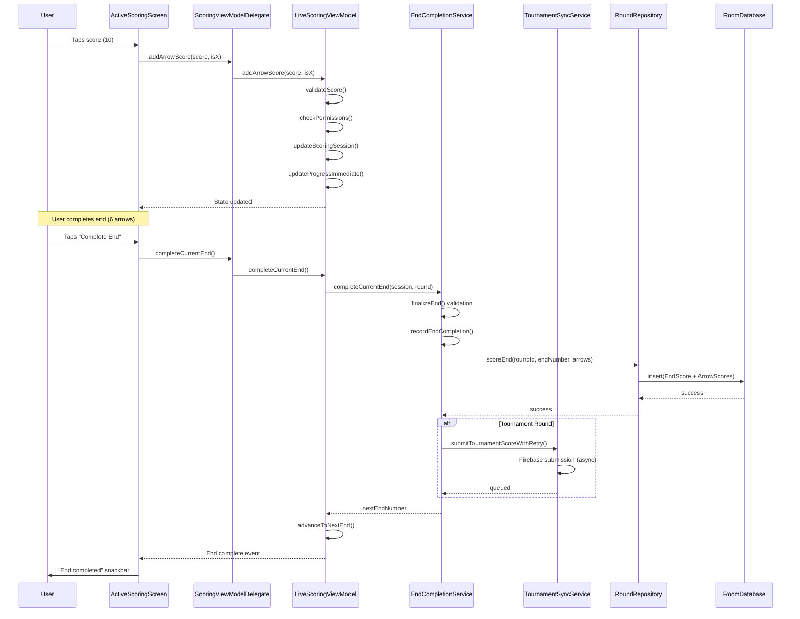

# Scoring Flow: Arrow to Database

## Overview

This flow documents how arrow scores travel from user input through the UI layer, ViewModel, services, repository, and finally to the database. It covers both single-participant and multi-participant scenarios, including tournament sync.

## Entry Points

- **User Action**: Taps score button in ActiveScoringScreen
- **File**: `ActiveScoringScreen.kt:848`
- **Method**: `ScoreInputSection` → `onScoreSelected` callback

## Flow Diagram



## Detailed Code Call Chain

### 1. User Input → UI Layer

**ActiveScoringScreen.kt:848-868**
```kotlin
onScoreSelected = { score, isX ->
    // Current arrow number calculated
    val currentArrow = liveScoringViewModel.getCurrentArrowNumber()
    val canEdit = scoringDelegate.canEditArrow(currentArrow)
    
    if (canEdit) {
        // Editing existing arrow
        scoringDelegate.editArrowScore(currentArrow, score, isX)
    } else {
        // Adding new arrow
        scoringDelegate.addArrowScore(score, isX)
    }
}
```

**Component**: `ScoreInputSection` composable at line 825
**Trigger**: User taps numeric score button or visual target
**Paths**: 
- Numeric input → `onScoreSelected`
- Visual target → `onScoreSelectedWithCoordinate` (line 869)

### 2. UI → ViewModel Delegate

**ActiveScoringScreen.kt:250-253**
```kotlin
fun addArrowScore(score: Int, isX: Boolean) {
    android.util.Log.d("MP_DEBUG", "ScoringViewModelDelegate.addArrowScore called - score: $score, isX: $isX")
    liveScoringViewModel.addArrowScore(score, isX)
}
```

**Purpose**: Delegation layer routes to LiveScoringViewModel
**Design Pattern**: Facade pattern for ViewModel coordination

### 3. ViewModel → Score Validation & State Update

**LiveScoringViewModel.kt:177-299**
```kotlin
fun addArrowScoreWithCoordinate(
    score: Int,
    isX: Boolean = false,
    coordinate: Offset = Offset.Unspecified,
    source: UpdateSource = UpdateSource.NUMERIC_INPUT
) {
    // 1. Get current round
    val round = _currentRound.value ?: return
    
    // 2. Validate score (line 202)
    if (!round.isValidScore(score)) {
        _errorMessage.value = "Invalid score: $score"
        return
    }
    
    // 3. Check scoring permissions (line 216)
    if (!scoringPermissionService.canScoreFor(currentUser, targetParticipant)) {
        _errorMessage.value = "You don't have permission to score"
        return
    }
    
    // 4. Guard checks (line 231-239)
    if (isCurrentParticipantComplete()) return
    if (currentSession.isCurrentParticipantEndComplete) return
    
    // 5. Create updated session (line 244-290)
    val newArrowNumber = currentSession.currentEndArrows.size + 2
    val newCurrentEndArrows = currentSession.currentEndArrows + score
    val newCurrentEndXRings = currentSession.currentEndXRings + isX
    
    // CRITICAL: Update participant-specific maps for MP support (line 254-279)
    val updatedParticipantArrows = if (currentSession.isMultiParticipant) {
        currentSession.participantArrows.toMutableMap().apply {
            put(currentSession.currentParticipantId, newCurrentEndArrows)
        }
    } else {
        currentSession.participantArrows
    }
    
    // 6. Update session state (line 293)
    updateScoringSession(updatedSession, "addArrowScoreWithCoordinate")
    
    // 7. Update progress immediately (line 298)
    updateProgressImmediate(source)
}
```

**Key Methods**:
- `round.isValidScore()` - Validates against scoring system rules
- `scoringPermissionService.canScoreFor()` - Multi-participant permissions
- `updateScoringSession()` - Publishes to StateFlow
- `updateProgressImmediate()` - Recalculates progress/statistics

**StateFlows Updated**:
- `_scoringSession` - Current arrows, end state, participant data
- Triggers UI recomposition automatically

### 4. End Completion Flow

**User Action**: Taps "Complete End" button (ActiveScoringScreen.kt:889-900)

**ActiveScoringScreen.kt:889-900**
```kotlin
onCompleteEnd = {
    android.util.Log.d("END_COMPLETION", "=== Complete End button clicked ===")
    coroutineScope.launch {
        val success = scoringDelegate.completeCurrentEnd()
        if (success) {
            snackbarHostState.showSnackbar("End ${scoringSession.derivedCurrentEndNumber} completed")
        }
    }
}
```

**Delegate → ViewModel**:
```kotlin
// ActiveScoringScreen.kt:219
suspend fun completeCurrentEnd() = liveScoringViewModel.completeCurrentEnd()
```

### 5. EndCompletionService - Validation & Database

**EndCompletionService.kt:173-216** - Main completion flow
```kotlin
suspend fun completeCurrentEnd(
    session: ScoringSessionState,
    round: Round,
    onStatisticsCacheClear: () -> Unit
): Pair<Boolean, Int?>? {
    android.util.Log.d("END_COMPLETION", "=== EndCompletionService.completeCurrentEnd() called ===")
    
    val currentParticipantId = session.currentParticipantId
    
    // 1. Validate end can be finalized (line 187)
    val canFinalize = finalizeEnd(currentParticipantId, session.currentEndNumber, session, round)
    if (!canFinalize) {
        android.util.Log.e("END_COMPLETION", "FAILED: finalizeEnd validation failed")
        return null
    }
    
    try {
        // 2. Record end completion with repository (line 199)
        val nextEndNumber = recordEndCompletion(round, session)
        
        // 3. Clear statistics cache (line 208)
        onStatisticsCacheClear()
        
        return Pair(true, nextEndNumber)
    } catch (e: Exception) {
        android.util.Log.e("END_COMPLETION", "❌ Failed to complete end: ${e.message}", e)
        return null
    }
}
```

**EndCompletionService.kt:90-157** - Validation logic
```kotlin
fun finalizeEnd(
    participantId: String,
    endNumber: Int,
    session: ScoringSessionState,
    round: Round
): Boolean {
    // 1. Check if already finalized (idempotent) (line 100)
    if (session.endFinalized[participantId] == true) {
        return true
    }
    
    // 2. Validate end number bounds (line 106)
    if (endNumber < 1) return false
    
    // 3. Get participant's current end (line 112)
    val participantCurrentEnd = getParticipantCurrentEnd(participantId, session)
    
    // 4. Allow reasonable advancement (±1 end for MP) (line 123-129)
    val endDiff = endNumber - participantCurrentEnd
    if (endDiff > 1 || endDiff < -1) return false
    
    // 5. MP FIX: Sync currentEndArrows with participant arrows (line 132-147)
    val arrows = if (participantId == session.currentParticipantId) {
        val currentArrows = session.currentEndArrows
        val participantArrows = session.participantArrows[participantId] ?: emptyList()
        
        if (currentArrows.isEmpty() && participantArrows.isNotEmpty()) {
            participantArrows  // Use participant arrows if current is empty
        } else {
            currentArrows
        }
    } else {
        session.participantArrows[participantId] ?: emptyList()
    }
    
    // 6. Validate arrow count (line 150)
    if (arrows.size < round.numArrows) return false
    
    return true  // Validation passed
}
```

### 6. Database Persistence

**EndCompletionService.kt:226-290** - Record to database
```kotlin
suspend fun recordEndCompletion(
    round: Round,
    session: ScoringSessionState,
    onSyncStatusUpdate: (TournamentSyncStatus) -> Unit = {}
): Int? {
    return try {
        // 1. Validate arrow scores (line 234-253)
        val arrowScores = session.currentEndArrows
        if (arrowScores.isEmpty()) {
            throw IllegalStateException("Cannot complete end with no arrows")
        }
        
        val maxScore = when (round.scoringSystem) {
            ScoringSystem.STANDARD_10_RING -> 10
            ScoringSystem.FIELD_5_RING -> 5
            else -> 10
        }
        
        val invalidScores = arrowScores.filter { it < 0 || it > maxScore }
        if (invalidScores.isNotEmpty()) {
            throw IllegalArgumentException("Invalid arrow scores: $invalidScores")
        }
        
        // 2. Save to local database first (line 258)
        roundRepository.scoreEnd(
            roundId = round.id,
            endNumber = session.currentEndNumber,
            arrowScores = arrowScores,
            isXRing = session.currentEndXRings,
            coordinates = session.currentEndArrowCoordinates.map { it },
            participantId = session.currentParticipantId
        )
        
        // 3. If tournament round, submit to Firebase (line 270-279)
        if (!round.tournamentId.isNullOrBlank()) {
            submitTournamentEnd(
                round = round,
                session = session,
                arrowScores = arrowScores,
                isXFlags = session.currentEndXRings.toList(),
                endNumber = session.currentEndNumber,
                onSyncStatusUpdate = onSyncStatusUpdate
            )
        }
        
        // 4. Return next end number (line 283)
        session.currentEndNumber + 1
        
    } catch (e: Exception) {
        android.util.Log.e("RecordEndCompletion", "❌ Failed to record end: ${e.message}", e)
        throw e
    }
}
```

### 7. Tournament Sync (Async)

**EndCompletionService.kt:296-332** - Firebase submission
```kotlin
private fun submitTournamentEnd(
    round: Round,
    session: ScoringSessionState,
    arrowScores: List<Int>,
    isXFlags: List<Boolean>,
    endNumber: Int,
    onSyncStatusUpdate: (TournamentSyncStatus) -> Unit
) {
    // 1. Get device ID (line 304-307)
    val deviceId = android.provider.Settings.Secure.getString(
        application.contentResolver,
        android.provider.Settings.Secure.ANDROID_ID
    ) ?: "unknown_device"
    
    // 2. Launch async submission (non-blocking) (line 313)
    scope.launch {
        val success = tournamentSyncService.submitTournamentScoreWithRetry(
            tournamentId = round.tournamentId ?: return@launch,
            participantId = session.currentParticipantId,
            roundNumber = round.tournamentRoundNumber ?: 1,
            endNumber = endNumber,
            arrowScores = arrowScores,
            isXFlags = isXFlags,
            deviceId = deviceId,
            maxRetries = 3,
            onSyncStatusUpdate = onSyncStatusUpdate
        )
        
        if (success) {
            android.util.Log.d("RecordEndCompletion", "✅ Firebase sync completed successfully")
        } else {
            android.util.Log.w("RecordEndCompletion", "⚠️ Firebase sync failed, score saved locally")
        }
    }
}
```

**Key Points**:
- **Async**: Tournament sync doesn't block UI
- **Retry Logic**: TournamentSyncService handles retries (max 3)
- **Offline-First**: Local DB always saved first
- **Status Updates**: Callback updates UI sync status indicator

## State Changes

### StateFlow Properties Updated

**LiveScoringViewModel**:
- `_scoringSession` → `scoringSession` - Current arrows, end state, participant progress
- `_liveStatistics` - Real-time statistics (accuracy, totals, X-count)
- `_realTimeProgress` - Progress percentage per participant
- `_syncStatus` - Tournament sync status (Idle/Syncing/Success/Error)

**State Change Propagation**:
```kotlin
// LiveScoringViewModel.kt:88-93
private fun updateScoringSession(newSession: ScoringSessionState, source: String = "Unknown") {
    android.util.Log.d("MP_DEBUG", "SESSION UPDATE from $source")
    _scoringSession.value = newSession  // Publishes to StateFlow
}
```

**UI Recomposition**:
```kotlin
// ActiveScoringScreen.kt:422
val scoringSession by scoringDelegate.scoringSession.collectAsState()
// Triggers Compose recomposition when StateFlow emits new value
```

## Key Classes & Methods

### ViewModels
- **LiveScoringViewModel.kt** (2,808 lines)
  - `addArrowScore(score, isX)` - Main scoring entry point
  - `addArrowScoreWithCoordinate(score, isX, coordinate, source)` - With target coordinates
  - `completeCurrentEnd()` - End completion coordinator
  - `updateScoringSession()` - StateFlow publisher
  - `updateProgressImmediate()` - Real-time progress calculation

### Services
- **EndCompletionService.kt** (extracted service, ~400 lines)
  - `completeCurrentEnd()` - Main completion flow
  - `finalizeEnd()` - Validation logic
  - `recordEndCompletion()` - Database persistence + Firebase submission
  - `submitTournamentEnd()` - Async Firebase sync

- **TournamentSyncService.kt** (556 lines)
  - `submitTournamentScoreWithRetry()` - Retry logic with exponential backoff
  - See [[Data-Sync-Flow]] for details

### Repositories
- **RoundRepository.kt**
  - `scoreEnd(roundId, endNumber, arrowScores, isXRing, coordinates, participantId)` - Database insert

### DAOs
- **RoundDao.kt**
  - `insert(EndScore)` - Create end score record
  - `insert(ArrowScore)` - Create arrow score records

## Multi-Participant Support

### Participant-Specific State

**LiveScoringViewModel.kt:254-279** - MP state management
```kotlin
// CRITICAL FIX: Update participant arrows map for MP rounds
val updatedParticipantArrows = if (currentSession.isMultiParticipant) {
    currentSession.participantArrows.toMutableMap().apply {
        put(currentSession.currentParticipantId, newCurrentEndArrows)
    }
} else {
    currentSession.participantArrows
}

val updatedParticipantXRings = if (currentSession.isMultiParticipant) {
    currentSession.participantXRings.toMutableMap().apply {
        put(currentSession.currentParticipantId, newCurrentEndXRings)
    }
} else {
    currentSession.participantXRings
}
```

**Data Structures**:
- `participantArrows: Map<ParticipantId, List<Int>>` - Arrows per participant
- `participantXRings: Map<ParticipantId, List<Boolean>>` - X-rings per participant
- `participantCoordinates: Map<ParticipantId, List<Offset>>` - Coordinates per participant
- `participantProgress: Map<ParticipantId, ParticipantProgress>` - Progress tracking

### Permission Checks

**LiveScoringViewModel.kt:216-223**
```kotlin
if (!scoringPermissionService.canScoreFor(currentUser, targetParticipant)) {
    val message = scoringPermissionService.getScoringRestrictionMessage(currentUser, targetParticipant)
        ?: "You don't have permission to score for this participant"
    _errorMessage.value = message
    return
}
```

**Rules**:
- LocalUser can score for themselves
- LocalUser can score for GuestArchers they created
- LocalUser CANNOT score for NetworkUsers (tournament participants)

## Error Handling

### Validation Failures
- Invalid score value → Error message, early return
- Permission denied → Error message, early return
- End already complete → Early return (idempotent)
- Insufficient arrows → End completion fails

### Database Failures
```kotlin
try {
    roundRepository.scoreEnd(...)
} catch (e: Exception) {
    android.util.Log.e("RecordEndCompletion", "❌ Failed to record end: ${e.message}", e)
    throw e  // Propagate to UI for user feedback
}
```

### Tournament Sync Failures
- **Strategy**: Async, non-blocking
- **Fallback**: Score saved locally, queued for retry
- **UI Indicator**: Sync status shows error, manual retry button
- **Retry Logic**: TournamentSyncService handles 3 retries with exponential backoff

## Performance Considerations

### UI Thread Protection
- All database operations use `suspend` functions
- Repository calls run on IO dispatcher
- StateFlow updates trigger minimal recomposition

### Tournament Sync
- Async Firebase submission (non-blocking)
- Local-first strategy (DB write never blocked)
- Progressive retry with backoff

### State Optimization
- Single StateFlow publish per arrow score
- Batch updates for multi-participant state maps
- Progress calculation debounced

## Related Documentation

- [[Multi-Participant-Flow]] - Participant switching and progress tracking
- [[Tournament-Flow]] - Tournament creation to completion
- [[Data-Sync-Flow]] - Firebase sync and conflict resolution
- [[Service-Architecture]] - EndCompletionService extraction
- [[System-Architecture]] - Overall MVVM architecture
- [[LiveScoringVM-Analysis]] - LiveScoringViewModel deep dive (2,808 lines)

## Testing

### Key Test Files
- `LiveScoringViewModelTest.kt` - ViewModel scoring logic
- `EndCompletionServiceTest.kt` - End completion validation
- `EndCompletionServiceCompleteEndTest.kt` - Complete end flow
- `MPEndCompletionFlowValidationTest.kt` - Multi-participant end completion
- `TournamentSyncServiceTest.kt` - Firebase sync logic

### Critical Test Scenarios
- Single arrow scoring
- Complete end with 6 arrows
- Multi-participant participant switching
- Tournament score submission
- Offline score queuing
- Invalid score rejection
- Permission validation

---

*Last Updated: 2025-10-08*
*Code References: LiveScoringViewModel.kt, EndCompletionService.kt, ActiveScoringScreen.kt*
*Line Numbers: Current as of end-completion-service branch*