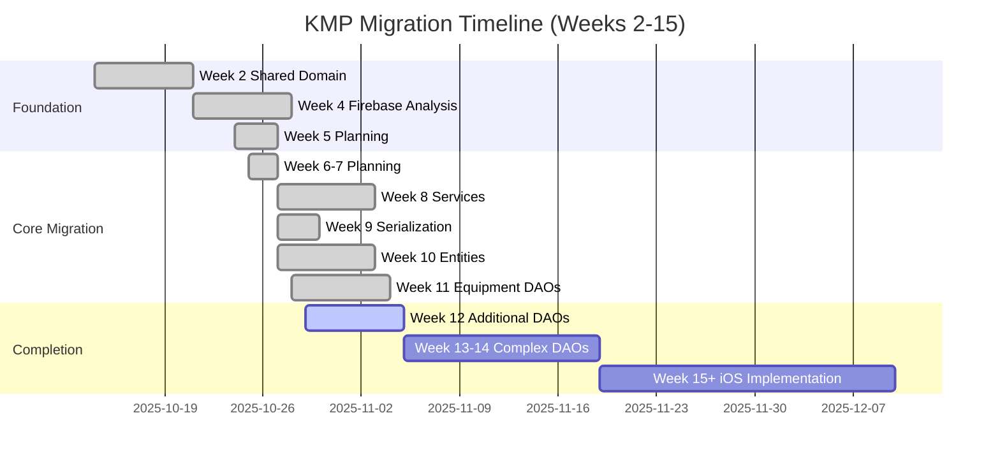
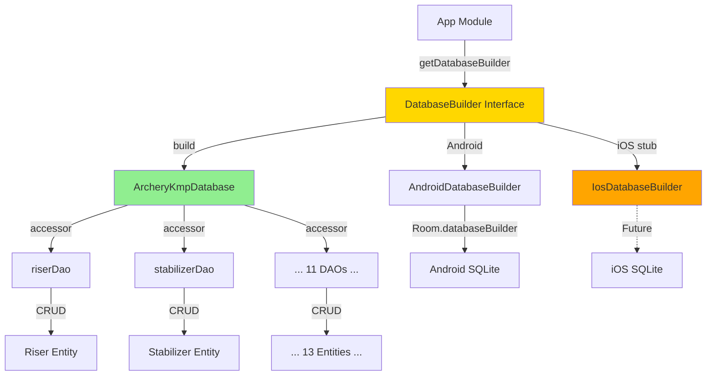
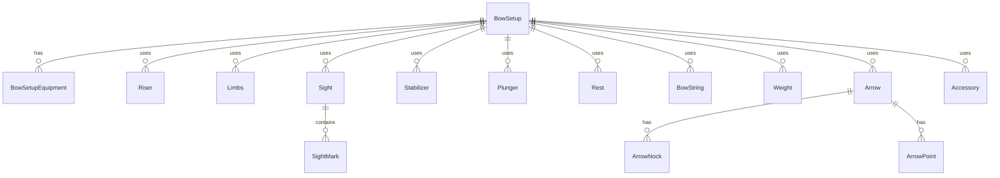

# Kotlin Multiplatform Migration Architecture

**Created:** 2025-10-28
**Status:** Week 11 Complete - Equipment DAOs Migrated ✅
**Purpose:** Comprehensive KMP migration architecture reference

---

## Table of Contents
- [Executive Summary](#executive-summary)
- [Migration Overview](#migration-overview)
- [Module Architecture](#module-architecture)
- [Migration Patterns](#migration-patterns)
- [Week-by-Week Progress](#week-by-week-progress)
- [Platform Abstractions](#platform-abstractions)
- [Database Architecture](#database-architecture)
- [Testing Strategy](#testing-strategy)
- [Known Issues & Solutions](#known-issues--solutions)
- [Future Roadmap](#future-roadmap)

---

## Executive Summary

### Migration Goal
Transform Archery Apprentice from Android-only to **Kotlin Multiplatform (KMP)**, enabling iOS support while maintaining Android functionality.

### Current Status (Week 11)
- ✅ **6 Shared Modules** operational
- ✅ **11 Equipment DAOs** migrated to Room KMP
- ✅ **13 Entities** in KMP database
- ✅ **4 Platform Abstractions** (Pattern 3)
- ✅ **19 Services** extracted from god classes
- 🟢 **Android** fully migrated and tested
- 🟡 **iOS** infrastructure ready (implementation Week 15+)

### Key Metrics
| Metric | Value | Status |
|--------|-------|--------|
| **Shared Code** | ~40% of codebase | 🟢 On track |
| **God Class Reduction** | 28% (6,798 → 4,891 lines) | 🟢 Good |
| **Platform Abstractions** | 4/4 complete | ✅ Done |
| **Equipment DAOs Migrated** | 11/11 | ✅ Done |
| **Test Coverage** | 2051+ tests passing | ✅ Excellent |
| **iOS Readiness** | Infrastructure 100% | 🟡 Awaiting implementation |

---

## Migration Overview

### Timeline & Phases



### Architecture Transformation

**Before KMP (Pre-Week 8):**
```
archery-apprentice/
└── app/  # Monolithic Android app (all code)
    ├── ui/
    ├── viewmodels/
    ├── data/
    │   ├── db/
    │   ├── repositories/
    │   └── models/
    └── domain/
```

**After KMP (Week 11):**
```
archery-agent-platform/
├── app/                          # Android app (Compose UI only)
│   ├── src/main/kotlin/
│   │   ├── ui/                   # Compose screens
│   │   ├── viewmodels/           # Android-specific VMs
│   │   └── ArcheryApplication.kt
│   └── build.gradle.kts
├── shared/
│   ├── common/                   # Platform abstractions ✅
│   │   ├── commonMain/
│   │   │   └── abstractions/     # Pattern 3 interfaces
│   │   └── androidMain/
│   │       └── implementations/  # Android implementations
│   ├── domain/                   # Domain models ✅
│   │   └── commonMain/
│   │       └── models/           # Core entities
│   ├── database/                 # Room KMP ✅
│   │   ├── commonMain/
│   │   │   ├── dao/              # 11 DAOs
│   │   │   ├── entities/         # 13 entities
│   │   │   ├── converters/       # KmpConverters
│   │   │   └── ArcheryKmpDatabase.kt
│   │   ├── androidMain/
│   │   │   └── DatabaseBuilder.android.kt
│   │   └── iosMain/
│   │       └── DatabaseBuilder.ios.kt (stub)
│   ├── data/                     # Repositories 🟡
│   │   └── commonMain/
│   │       └── repositories/     # Data layer
│   ├── presentation/             # Shared UI logic 🟡
│   │   └── commonMain/
│   └── di/                       # Dependency injection 🟡
│       └── commonMain/
└── iosApp/ (future)              # iOS app
    └── iosApp/
        └── ContentView.swift
```

**Legend:**
- ✅ Fully migrated and operational
- 🟡 Partially migrated / In progress
- 📋 Planned / Not started

---

## Module Architecture

### Shared Modules Detail

#### 1. shared:common - Platform Abstractions ✅
**Purpose:** Pattern 3 context-dependent service abstractions

**Structure:**
```kotlin
// commonMain - Interface definitions
interface PreferenceStorage {
    fun getString(key: String, default: String?): String?
    fun putString(key: String, value: String)
}

// androidMain - Android implementations
class AndroidPreferenceStorage(
    private val context: Context
) : PreferenceStorage {
    private val prefs = context.getSharedPreferences(...)
    override fun getString(key: String, default: String?) = prefs.getString(key, default)
}
```

**Abstractions Implemented (Week 8):**
1. **PreferenceStorage** - SharedPreferences abstraction
2. **ResourceProvider** - Android Resources (strings, dimensions)
3. **FileSystemProvider** - File I/O operations
4. **LoggingProvider** - Platform logging (android.util.Log)

**Benefits:**
- ✅ Services can use abstractions without Android dependencies
- ✅ Testable with fake implementations
- ✅ iOS can provide different implementations later

**Reference:** [[Architecture/Platform-Abstractions-Status]]

---

#### 2. shared:domain - Domain Models ✅
**Purpose:** Core business entities and domain logic

**Entities:**
- `Archer.kt`, `Equipment.kt`, `Tournament.kt`, `TournamentParticipant.kt`
- `ArcherEquipmentSnapshot.kt`
- All annotated with `@Serializable` (kotlinx.serialization)

**Dependencies:** None (pure Kotlin)

**Status:** Complete (Week 2)

---

#### 3. shared:database - Room KMP Database ✅
**Purpose:** Cross-platform database access layer (Week 11)

**Key Components:**

**ArcheryKmpDatabase.kt:**
```kotlin
@Database(
    entities = [
        Riser::class, Stabilizer::class, Plunger::class, Rest::class,
        Limbs::class, Sight::class, SightMark::class, BowString::class,
        Weight::class, Arrow::class, Accessory::class,
        BowSetup::class, BowSetupEquipment::class
    ],
    version = 1,
    exportSchema = false
)
@ConstructedBy(ArcheryKmpDatabaseConstructor::class)
@TypeConverters(KmpConverters::class)
abstract class ArcheryKmpDatabase : RoomDatabase() {
    abstract fun riserDao(): RiserDao
    abstract fun stabilizerDao(): StabilizerDao
    // ... 11 DAO accessors total
}
```

**DatabaseBuilder.kt (expect/actual pattern):**
```kotlin
// commonMain
interface DatabaseBuilder {
    fun build(): ArcheryKmpDatabase
}

expect fun getDatabaseBuilder(): DatabaseBuilder

// androidMain
actual fun getDatabaseBuilder(): DatabaseBuilder = AndroidDatabaseBuilder

object AndroidDatabaseBuilder : DatabaseBuilder {
    fun initialize(context: Context) { ... }
    override fun build(): ArcheryKmpDatabase { ... }
}

// iosMain (stub)
actual fun getDatabaseBuilder(): DatabaseBuilder {
    throw NotImplementedError("iOS database not yet implemented (Week 15+)")
}
```

**11 DAOs Migrated:**
1. RiserDao, StabilizerDao, PlungerDao, RestDao
2. LimbsDao, SightDao, BowStringDao, WeightDao
3. ArrowDao, AccessoryDao
4. BowSetupDao

**Type Converters:**
- `KmpConverters.kt` - Simple string-based converters (66 lines)
  - EquipmentType enum ↔ String
  - List<Int> ↔ comma-separated
  - List<String> ↔ comma-separated

**Status:** Operational on Android, iOS stub ready

**Reference:** [[content/Agent-Work/Agent-1-AAP-Week-11-Infrastructure]], [[Architecture/expect-actual-Pattern]]

---

#### 4. shared:data - Data Layer 🟡
**Purpose:** Repositories, data sources, caching

**Current State:**
- Some repositories migrated
- Hybrid approach (Android + KMP coexist)
- HybridTournamentRepository (1,813 lines) - god class

**To Migrate:**
- Equipment repositories (use shared:database DAOs)
- Tournament repositories (Week 12-14)
- Offline sync logic

**Status:** Partial migration

---

#### 5. shared:presentation - Presentation Logic 🟡
**Purpose:** Shared UI logic, formatting, validation

**Current State:**
- Limited migration
- Most ViewModels still in app/ module

**To Migrate:**
- ViewModels (after repository migration)
- UI state management
- Business logic services

**Status:** Minimal migration

---

#### 6. shared:di - Dependency Injection 🟡
**Purpose:** DI configuration for shared modules

**Current State:**
- Manual DI (Factory pattern)
- Some DI in app/ module

**To Migrate:**
- Unified DI approach
- KMP-compatible DI framework evaluation

**Status:** Planning phase

---

## Migration Patterns

### Pattern 1: Simple Entity Migration
**Complexity:** Low | **Effort:** ~15 minutes

**Process:**
1. Move entity to `shared:domain` or `shared:database`
2. Add `@Serializable` annotation
3. Update imports in DAOs
4. Test

**Example:**
```kotlin
// Before (app/data/models/equipment/Riser.kt)
@Entity(tableName = "riser")
data class Riser(
    @PrimaryKey val id: String,
    val name: String
)

// After (shared/database/.../entities/equipment/Riser.kt)
@Entity(tableName = "riser")
@Serializable
data class Riser(
    @PrimaryKey val id: String,
    val name: String
)
```

---

### Pattern 2: Date → Long Conversion
**Complexity:** Medium | **Effort:** ~15 minutes

**Process:**
1. Replace `java.util.Date` with `Long` timestamp
2. Update database migration (if needed)
3. Update tests

**Example:**
```kotlin
// Before
import java.util.Date
val capturedAt: Date = Date()

// After
val capturedAt: Long = System.currentTimeMillis()
```

---

### Pattern 3: Context-Dependent Service Abstraction
**Complexity:** Medium | **Effort:** ~1-2 hours per abstraction

**Process:**
1. Define interface in `shared:common/commonMain`
2. Implement Android version in `shared:common/androidMain`
3. Create test fake in commonMain
4. Update services to use abstraction
5. Write tests (unit + integration)

**Example:**
```kotlin
// commonMain
interface PreferenceStorage {
    fun getString(key: String, default: String?): String?
}

// androidMain
class AndroidPreferenceStorage(context: Context) : PreferenceStorage {
    private val prefs = context.getSharedPreferences(...)
    override fun getString(key: String, default: String?) = prefs.getString(key, default)
}

// Service usage
class MyService(private val prefs: PreferenceStorage) {
    fun loadSetting() = prefs.getString("key", "default")
}
```

**Reference:** [[Architecture/Platform-Abstractions-Status]]

---

### Pattern 4: DAO Migration Workflow
**Complexity:** Low | **Effort:** ~30 minutes per DAO

**Process:**
1. Verify entity migrated to shared:database
2. Move DAO to `shared/database/src/commonMain/kotlin/.../dao/`
3. Update package declaration
4. Update entity imports
5. Add abstract accessor to ArcheryKmpDatabase
6. Test compilation
7. Commit

**Example:**
```kotlin
// Before (app/data/db/dao/RiserDao.kt)
package com.archeryapprentice.data.db.dao
import com.archeryapprentice.data.models.equipment.Riser

@Dao
interface RiserDao {
    @Query("SELECT * FROM riser") fun getAll(): Flow<List<Riser>>
}

// After (shared/database/.../dao/RiserDao.kt)
package com.archeryapprentice.database.dao
import com.archeryapprentice.database.entities.equipment.Riser

@Dao
interface RiserDao {
    @Query("SELECT * FROM riser") fun getAll(): Flow<List<Riser>>
}
```

**Reference:** Week 11 DAO migration (PR #187)

---

### Pattern 5: expect/actual Platform-Specific Implementation
**Complexity:** Medium-High | **Effort:** ~2-4 hours

**Process:**
1. Define `expect` declaration in commonMain
2. Provide `actual` implementation per platform (androidMain, iosMain)
3. Use in common code
4. Test each platform

**Example: DatabaseBuilder**
```kotlin
// commonMain
interface DatabaseBuilder { fun build(): ArcheryKmpDatabase }
expect fun getDatabaseBuilder(): DatabaseBuilder

// androidMain
actual fun getDatabaseBuilder(): DatabaseBuilder = AndroidDatabaseBuilder
object AndroidDatabaseBuilder : DatabaseBuilder { ... }

// iosMain
actual fun getDatabaseBuilder(): DatabaseBuilder = IosDatabaseBuilder
object IosDatabaseBuilder : DatabaseBuilder { ... }
```

**Reference:** [[Architecture/expect-actual-Pattern]]

---

## Week-by-Week Progress

### Week 2: Foundation (Oct 14) ✅
**Goal:** Establish KMP infrastructure

**Achievements:**
- ✅ Created `shared:domain` module
- ✅ Migrated 5 core entities (Archer, Equipment, Tournament, etc.)
- ✅ Gradle KMP setup
- ✅ kotlinx.serialization integrated

**Effort:** 1 day

---

### Week 4: Firebase Analysis (Oct 21) ✅
**Goal:** Understand Firebase authentication patterns

**Achievements:**
- ✅ Analyzed Firebase auth flow
- ✅ Documented sync architecture
- ✅ Identified platform dependencies

**Deliverable:** PR #145

---

### Week 5: Planning (Oct 24) ✅
**Goal:** Plan serialization & database migration

**Achievements:**
- ✅ SERIALIZATION_MIGRATION_PLAN.md (890 lines)
- ✅ DATABASE_MIGRATION_PLAN.md started
- ✅ Entity inventory (22 entities)

**Deliverable:** PR #146

---

### Week 6-7: Entity Migration Planning (Oct 25-26) ✅
**Goal:** Detailed entity migration execution plan

**Achievements:**
- ✅ DATABASE_MIGRATION_PLAN.md Section 7 (+789 lines)
- ✅ Entity complexity analysis
- ✅ Pattern 3 validation (PR #152)
- ✅ Migration patterns documented (4 patterns)

**Deliverables:** PR #150 (plan), PR #152 (Pattern 3 review)

---

### Week 8: Service Migrations (Oct 27) ✅
**Goal:** Migrate services to use Pattern 3 abstractions

**Achievements:**
- ✅ 4 Platform Abstractions implemented
- ✅ 19 Services extracted from god classes
- ✅ God class reduction: 28% (6,798 → 4,891 lines)
- ✅ 57 tests for abstractions

**Services Extracted:**
- TournamentSyncService (515 lines)
- EndCompletionService (366 lines)
- ScoreConflictResolutionService (267 lines)
- StatisticsAggregationService (254 lines)
- TournamentRoundLifecycleService (222 lines)
- ... 14 more services

**Deliverable:** Pattern 3 complete

**Reference:** [[Architecture/Pre-KMP-Architecture-State]]

---

### Week 9: kotlinx.serialization Migration (Oct 27) ✅
**Goal:** Replace Gson with kotlinx.serialization

**Achievements:**
- ✅ All entities annotated with @Serializable
- ✅ Gson removed from dependencies
- ✅ ArrowEquipmentSnapshot Date→Long conversion
- ✅ Entity tests updated

**Lead:** Agent 2 (Days 1-3)

**Effort:** 3 days

---

### Week 10: Entity Migrations (Oct 27) ✅
**Goal:** Migrate 17 entities to shared modules

**Achievements:**
- ✅ Simple entities (7): ~2 hours
- ✅ Medium entities (6): ~3 hours
- ✅ Complex entities (4): ~1 hour
- ✅ All entities KMP-compatible

**Migration Effort:** ~6 hours total

**Testing:** Comprehensive test suite passed (2051+ tests)

---

### Week 11: Equipment DAO Migration (Oct 28) ✅
**Goal:** Migrate 11 equipment DAOs to Room KMP

**Achievements:**

**Days 1-2 (Agent 1 - Infrastructure):**
- ✅ ArcheryKmpDatabase v1 created
- ✅ DatabaseBuilder expect/actual implemented
- ✅ KmpConverters (simple string-based, 66 lines)
- ✅ Build successful with Room KMP 2.8.1

**Days 3-7 (Agent 2 - DAO Migration):**
- ✅ 11 Equipment DAOs migrated
- ✅ 13 Entities in KMP database
- ✅ Pattern 4 workflow proven
- ✅ All DAO tests passing

**Build Fixes (Agent 1):**
- ✅ Duplicate files cleanup
- ✅ kspCommonMainMetadata disabled (Room KMP 2.8.1 limitation)
- ✅ @ConstructedBy documented as REQUIRED

**Effort:** ~6 hours DAO migration + 2 hours infrastructure

**Deliverables:**
- PR #187: DAO migration (Agent 2)
- PR #188: kotlinx-datetime dependency (Agent 1)
- PR #189: Duplicate files fix (Agent 1)

**Reference:** [[content/Agent-Work/Agent-1-AAP-Week-11-Infrastructure]]

---

### Week 12: Additional DAOs (Planned - Nov 4) 📋
**Goal:** Migrate 4-8 medium-complexity DAOs

**Target DAOs:**
- TournamentIdMappingDao
- OfflineScoreQueueDao
- EquipmentStatsDao
- Statistics/cache DAOs

**Estimated Effort:** ~4-6 hours

---

### Week 13-14: Complex DAOs (Planned - Nov 11-18) 📋
**Goal:** Evaluate high-risk DAOs, defer if needed

**Complex DAOs:**
- TournamentDao (15+ methods, high complexity)
- ScoringSessionDao (active development)
- HybridRoundDao (complex queries)

**Strategy:** Defer until tournament refactoring complete

---

### Week 15+: iOS Implementation (Planned - Nov 25+) 📋
**Goal:** Implement iOS database and cross-platform testing

**Tasks:**
- iOS DatabaseBuilder implementation
- iOS database location (NSHomeDirectory)
- iOS testing on simulator
- Cross-platform E2E tests

**Estimated Effort:** ~2-3 weeks

---

## Platform Abstractions

### Pattern 3 Implementation Status

#### 1. PreferenceStorage ✅
**Purpose:** SharedPreferences abstraction

**Interface:**
```kotlin
interface PreferenceStorage {
    fun getString(key: String, default: String?): String?
    fun putString(key: String, value: String)
    fun getInt(key: String, default: Int): Int
    fun putInt(key: String, value: Int)
    fun getBoolean(key: String, default: Boolean): Boolean
    fun putBoolean(key: String, value: Boolean)
    fun remove(key: String)
    fun clear()
}
```

**Usage:** Settings persistence, user preferences

---

#### 2. ResourceProvider ✅
**Purpose:** Android Resources abstraction

**Interface:**
```kotlin
interface ResourceProvider {
    fun getString(resId: Int): String
    fun getString(resId: Int, vararg formatArgs: Any): String
    fun getDimension(resId: Int): Float
    fun getColor(resId: Int): Int
}
```

**Usage:** String resources, dimensions, colors in services

---

#### 3. FileSystemProvider ✅
**Purpose:** File I/O abstraction

**Interface:**
```kotlin
interface FileSystemProvider {
    fun readFile(path: String): ByteArray?
    fun writeFile(path: String, data: ByteArray): Boolean
    fun deleteFile(path: String): Boolean
    fun fileExists(path: String): Boolean
    fun listFiles(directory: String): List<String>
}
```

**Usage:** Export/import, caching, file management

---

#### 4. LoggingProvider ✅
**Purpose:** Platform logging abstraction

**Interface:**
```kotlin
interface LoggingProvider {
    fun debug(tag: String, message: String)
    fun info(tag: String, message: String)
    fun warn(tag: String, message: String)
    fun error(tag: String, message: String, throwable: Throwable? = null)
}
```

**Usage:** Logging throughout shared modules

**Android Implementation:** Wraps `android.util.Log`

**Future iOS:** NSLog or custom logging

---

## Database Architecture

### Room KMP Structure (Week 11)

#### Database Flow


#### Entity Relationships


### Database Initialization

**Android App (Application.onCreate):**
```kotlin
class ArcheryApplication : Application() {
    override fun onCreate() {
        super.onCreate()

        // Initialize KMP database builder
        DatabaseBuilder.initialize(this)
    }
}
```

**Usage in Repositories:**
```kotlin
class EquipmentRepository {
    private val database = getDatabaseBuilder().build()
    private val riserDao = database.riserDao()

    suspend fun getAllRisers(): List<Riser> = riserDao.getAll().first()
}
```

---

## Testing Strategy

### Test Pyramid

```
         /\
        /  \       E2E Tests (5%)
       /----\      - TournamentLifecycleE2ETest
      /      \
     /--------\    Integration Tests (15%)
    /          \   - Repository tests
   /------------\  - DAO tests
  /              \
 /________________\ Unit Tests (80%)
                    - ViewModel tests
                    - Service tests
                    - Model tests
```

### Test Coverage

| Layer | Tests | Coverage | Status |
|-------|-------|----------|--------|
| **ViewModels** | 500+ | High | ✅ |
| **Repositories** | 300+ | High | ✅ |
| **DAOs** | 200+ | High | ✅ |
| **Services** | 400+ | Medium-High | 🟢 |
| **Domain Models** | 150+ | High | ✅ |
| **Platform Abstractions** | 57 | High | ✅ |
| **E2E** | 10+ | Critical paths | ✅ |
| **Total** | **2051+** | **Excellent** | ✅ |

### Testing Commands

```bash
# Unit tests (all)
./gradlew testDebugUnitTest

# Specific layer
./gradlew :app:testDebugUnitTest --tests="*Repository*"
./gradlew :app:testDebugUnitTest --tests="*Dao*"

# Shared module tests
./gradlew :shared:database:test
./gradlew :shared:common:test

# E2E tests (instrumented)
./gradlew :app:connectedAndroidTest

# Build verification
./gradlew build
```

---

## Known Issues & Solutions

### 1. kspCommonMainMetadata Disabled ✅ RESOLVED
**Issue:** Room KMP 2.8.1 generates duplicate implementations

**Symptom:**
```
e: Redeclaration: class ArcheryKmpDatabase_Impl
e: actual object ArcheryKmpDatabaseConstructor has no corresponding expected declaration
```

**Solution:** Disabled kspCommonMainMetadata in shared:database build.gradle.kts

```kotlin
dependencies {
    // Disabled: kspCommonMainMetadata causes errors
    // add("kspCommonMainMetadata", libs.androidx.room.compiler)

    // Android KSP works correctly
    add("kspAndroid", libs.androidx.room.compiler)
    add("kspIosX64", libs.androidx.room.compiler)
    // ...
}
```

**Impact:**
- ✅ Android builds and works correctly
- 🟡 iOS KSP deferred to Week 15+

**Monitoring:** Room KMP updates for fix

---

### 2. @ConstructedBy Required ✅ DOCUMENTED
**Issue:** Confusion about @ConstructedBy annotation

**Clarification:** @ConstructedBy is **REQUIRED** for Room KMP non-Android platforms

**Correct Usage:**
```kotlin
@Database(entities = [...], version = 1)
@ConstructedBy(ArcheryKmpDatabaseConstructor::class)  // REQUIRED!
abstract class ArcheryKmpDatabase : RoomDatabase()
```

**Why Required:**
- Room auto-generates `expect object ArcheryKmpDatabaseConstructor`
- Enables platform-specific database instantiation
- Compiler enforces for non-Android platforms

**Reference:** [[Architecture/expect-actual-Pattern]]

---

### 3. Duplicate Infrastructure Files ✅ RESOLVED
**Issue:** Old infrastructure conflicted with new structure

**Root Cause:**
- Old: `com/archeryapprentice/shared/database/`
- New: `com/archeryapprentice/database/`
- Room KSP processed BOTH packages

**Solution:** Removed old files, kept new structure

**Prevention:** Clear package structure, no duplicate database modules

---

### 4. God Classes Still Large 🟡 IN PROGRESS
**Issue:** LiveScoringViewModel (1,497 lines), RoundViewModel (1,581 lines)

**Progress:** 28% reduction (6,798 → 4,891 lines)

**Next Steps:**
- Extract remaining services
- Refactor tournament logic
- Target: <1,000 lines per ViewModel

**Reference:** [[Architecture/Pre-KMP-Architecture-State]]

---

## Future Roadmap

### Week 12-14: DAO Completion
**Goals:**
- Migrate remaining medium-complexity DAOs
- Evaluate high-risk DAOs (defer if needed)
- BowSetup DAO refinement

**Success Criteria:**
- 15-20 DAOs in KMP database
- All equipment DAOs operational
- Repository layer fully migrated

---

### Week 15-20: iOS Implementation
**Goals:**
- Implement iOS DatabaseBuilder
- iOS database persistence
- Cross-platform testing

**Tasks:**
1. iOS DatabaseBuilder implementation
   ```kotlin
   // iosMain
   actual fun getDatabaseBuilder(): DatabaseBuilder = IosDatabaseBuilder

   object IosDatabaseBuilder : DatabaseBuilder {
       override fun build(): ArcheryKmpDatabase {
           val dbPath = NSHomeDirectory() + "/archery_database.db"
           return Room.databaseBuilder<ArcheryKmpDatabase>(name = dbPath)
               .setDriver(BundledSQLiteDriver())
               .build()
       }
   }
   ```

2. iOS app UI (SwiftUI)
3. Cross-platform E2E tests
4. Performance testing

---

### Week 21-30: iOS Feature Parity
**Goals:**
- Full iOS feature implementation
- UI/UX refinement
- Production readiness

**Milestones:**
- Equipment management on iOS
- Tournament creation/scoring on iOS
- Statistics and analytics on iOS
- iOS App Store submission

---

### Week 31+: Maintenance & Enhancement
**Goals:**
- Bug fixes
- Performance optimization
- New features

**Focus Areas:**
- Cross-platform testing automation
- CI/CD for iOS
- User feedback integration

---

## Documentation Index

### Architecture Documentation
- [[Architecture/System-Architecture]] - Overall system design
- [[Architecture/Database-Migration-Status]] - Migration tracking
- [[Architecture/Pre-KMP-Architecture-State]] - Week 10 snapshot
- [[Architecture/Platform-Abstractions-Status]] - Pattern 3 details
- [[Architecture/expect-actual-Pattern]] - expect/actual guide
- [[Architecture/KMP-Migration-Architecture]] - This document

### Agent Work Documentation
- [[content/Agent-Work/Agent-1-AAP-Week-11-Infrastructure]] - Week 11 infrastructure
- [[content/Agent-Work/Agent-2-AAM-Week-11-DAOs]] - Week 11 DAO migration (when available)

### Code Repository Documentation
- `docs/kmp-migration/DATABASE_MIGRATION_PLAN.md` (2,109+ lines)
- `docs/kmp-migration/SERIALIZATION_MIGRATION_PLAN.md` (890 lines)
- `docs/kmp-migration/WEEK_11_INFRASTRUCTURE_HANDOFF.md` (1,968 lines)
- `docs/kmp-migration/PATTERN_4_DAO_MIGRATION_WORKFLOW.md`
- `docs/AGENT_CONTEXTS/AGENT_1_AAP.md` - Platform architecture
- `docs/AGENT_CONTEXTS/AGENT_2_AAM.md` - Modules & data layer

### Pull Requests
- PR #145: Firebase analysis
- PR #146: Serialization & database planning
- PR #150: Entity migration planning
- PR #152: Pattern 3 review
- PR #187: Week 11 Equipment DAO migration
- PR #188: kotlinx-datetime dependency fix
- PR #189: Duplicate files + kspCommonMainMetadata fix

---

*Last Updated: 2025-10-28*
*Status: Week 11 Complete | iOS Ready for Implementation*
*Next: Week 12 Additional DAOs*
