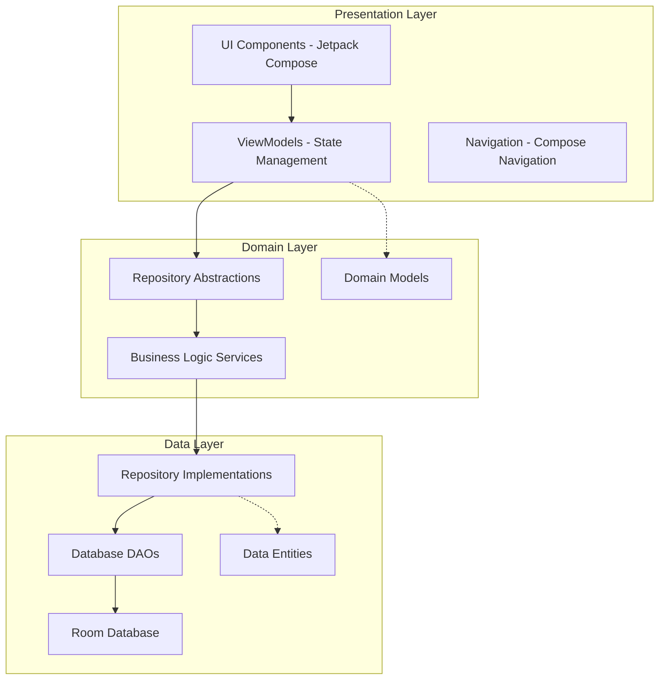
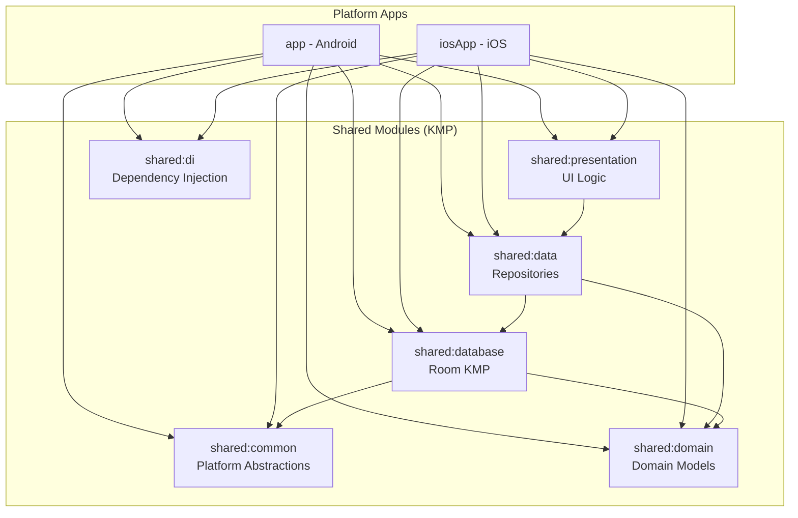

# Archery Apprentice - System Architecture

> **Note:** This is a condensed reference version. Full documentation available at `docs/architecture/ARCHITECTURE.md`

> **KMP Migration:** As of Week 11 (Oct 2025), the app is transitioning to Kotlin Multiplatform. See [[Architecture/KMP-Migration-Architecture]] for detailed migration architecture.

## Table of Contents
- [System Overview](#system-overview)
- [Technology Stack](#technology-stack)
- [Architecture Patterns](#architecture-patterns)
- [KMP Module Structure](#kmp-module-structure-week-11)
- [Module Structure](#module-structure)
- [Data Layer](#data-layer)
- [Domain Layer](#domain-layer)
- [Presentation Layer](#presentation-layer)
- [Performance](#performance-considerations)
- [Testing Strategy](#testing-strategy)
- [Technical Debt](#known-issues--technical-debt)
- [Migration Status](#migration-status)

---

## System Overview

Archery Apprentice is a comprehensive Android application for archery practice tracking, equipment management, and performance analytics. The application supports both individual and multi-participant scoring sessions with real-time statistics calculation and equipment performance tracking.

### High-Level Architecture



---

## Technology Stack

### Core Technologies
- **Language**: Kotlin 100%
- **UI Framework**: Jetpack Compose
- **Architecture**: MVVM with Clean Architecture principles
- **Database**: Room (SQLite)
- **Asynchronous Programming**: Kotlin Coroutines + StateFlow
- **Dependency Injection**: Manual DI with Factory Pattern

### Key Libraries
- **androidx.compose**: Modern declarative UI
- **androidx.room**: Type-safe database access
- **kotlinx.coroutines**: Reactive programming
- **androidx.lifecycle**: ViewModel and lifecycle management
- **androidx.navigation**: Type-safe navigation

### Development Tools
- **Testing**: JUnit 4, MockK, Robolectric, Compose Testing
- **Build System**: Gradle with Kotlin DSL
- **Code Quality**: Custom lint rules, architectural testing

---

## Architecture Patterns

### MVVM Implementation

The application follows the Model-View-ViewModel pattern with clear separation of concerns:

```kotlin
// ViewModel Layer - Presentation Logic
class LiveScoringViewModel : ViewModel() {
    private val _scoringSession = MutableStateFlow(ScoringSessionState())
    val scoringSession: StateFlow<ScoringSessionState> = _scoringSession.asStateFlow()

    suspend fun addArrowScore(score: Int, isX: Boolean) {
        // Business logic delegation to domain layer
        val result = roundRepository.recordArrowScore(score, isX)
        // State update
        _scoringSession.update { state ->
            state.copy(currentEndArrows = state.currentEndArrows + score)
        }
    }
}
```

### Repository Pattern

Clean data access abstraction:

```kotlin
// Domain Layer - Repository Interface
interface RoundRepository {
    suspend fun createRound(round: Round): Result<Long>
    suspend fun recordArrowScore(roundId: Long, score: ArrowScore): Result<Unit>
    fun getRoundDetails(roundId: Long): Flow<RoundWithDetails>
}

// Data Layer - Repository Implementation
class RoundRepositoryImpl(
    private val roundDao: RoundDao,
    private val statisticsService: StatisticsCalculationService
) : RoundRepository {
    override suspend fun recordArrowScore(roundId: Long, score: ArrowScore) =
        withContext(Dispatchers.IO) {
            try {
                roundDao.insertArrowScore(score)
                Result.success(Unit)
            } catch (e: Exception) {
                Result.failure(e)
            }
        }
}
```

### Dependency Injection via Factory Pattern

```kotlin
class RepositoryFactory(context: Context) {
    private val database = Room.databaseBuilder(
        context.applicationContext,
        ArcheryDatabase::class.java,
        "archery_database"
    ).build()

    val roundRepository: RoundRepository by lazy {
        RoundRepositoryImpl(database.roundDao(), statisticsService)
    }
}
```

---

## KMP Module Structure (Week 11)

As of **Week 11 (Oct 2025)**, the application is transitioning to Kotlin Multiplatform to support iOS alongside Android. The migration introduces 6 new shared modules that enable cross-platform code reuse while maintaining platform-specific optimizations.

### Shared Modules Overview



### Module Responsibilities

| Module | Status | Purpose | Key Components |
|--------|--------|---------|----------------|
| **shared:common** | ✅ Complete | Platform abstractions (Pattern 3) | PreferenceStorage, ResourceProvider, FileSystemProvider, LoggingProvider |
| **shared:domain** | ✅ Complete | Domain models and entities | Core business entities (5 migrated Week 2) |
| **shared:database** | ✅ Complete | Room KMP database layer | ArcheryKmpDatabase, 11 DAOs, 13 entities, KmpConverters |
| **shared:data** | 🟡 Partial | Repository implementations | Currently using Android repositories, KMP migration in progress |
| **shared:presentation** | 🟡 Partial | Shared UI logic | Planned for future KMP migration |
| **shared:di** | 🟡 Partial | Dependency injection | Planned for KMP DI framework |

### Week 11 Milestone: Equipment DAO Migration

The **shared:database** module achieved a major milestone in Week 11:

- ✅ **11 DAOs migrated** to Room KMP (RiserDao, StabilizerDao, PlungerDao, RestDao, LimbsDao, SightDao, BowStringDao, WeightDao, ArrowDao, AccessoryDao, BowSetupDao)
- ✅ **13 entities** in KMP database (Riser, Stabilizer, Plunger, Rest, Limbs, Sight, SightMark, BowString, Weight, Arrow, Accessory, BowSetup, BowSetupEquipment)
- ✅ **ArcheryKmpDatabase v1** operational with Room KMP 2.8.1
- ✅ **DatabaseBuilder** expect/actual pattern implemented
- ✅ **KmpConverters** for type conversion (simple string-based converters)

**Module Structure:**
```
shared/database/
├── commonMain/
│   ├── dao/                              # 11 DAOs
│   │   ├── RiserDao.kt
│   │   ├── StabilizerDao.kt
│   │   ├── PlungerDao.kt
│   │   └── ... (8 more DAOs)
│   ├── entities/                         # 13 entities
│   │   ├── Riser.kt
│   │   ├── Stabilizer.kt
│   │   └── ... (11 more entities)
│   ├── converters/
│   │   └── KmpConverters.kt             # Type converters
│   └── ArcheryKmpDatabase.kt            # Database definition
├── androidMain/
│   └── DatabaseBuilder.android.kt       # Android implementation
└── iosMain/
    └── DatabaseBuilder.ios.kt           # iOS stub (Week 15+)
```

### Migration Patterns

The KMP migration uses 5 established patterns:

1. **Pattern 1**: Entity Migration (17 entities migrated Week 10)
2. **Pattern 2**: Service Migration (19 services extracted Week 8)
3. **Pattern 3**: Context Abstraction (4 platform abstractions completed Week 8)
4. **Pattern 4**: DAO Migration (11 DAOs migrated Week 11)
5. **Pattern 5**: Repository Migration (planned for Week 12+)

**See Also:**
- [[Architecture/KMP-Migration-Architecture|Comprehensive KMP Migration Guide]] - Full migration architecture details
- [[Architecture/Database-Migration-Status|Database Migration Status]] - Week-by-week progress tracking
- [[Architecture/expect-actual-Pattern|expect/actual Pattern Guide]] - DatabaseBuilder case study

---

## Module Structure

### Package Organization

```
com.archeryapprentice/
├── data/                          # Data Layer
│   ├── dao/                       # Database Access Objects (15 DAOs)
│   ├── db/                        # Database configuration and migrations
│   ├── models/                    # Data entities and type converters
│   └── typeconverters/            # Room type converters
├── domain/                        # Domain Layer
│   ├── repository/                # Repository interfaces (17 repositories)
│   └── services/                  # Business logic services (4 services)
├── test/                          # Test utilities and fixtures
│   └── fixtures/                  # Test data fixtures
└── ui/                            # Presentation Layer
    ├── equipment/                 # Equipment management feature
    │   ├── components/            # Reusable UI components
    │   ├── pages/                 # Screen composables
    │   └── viewmodels/            # Equipment ViewModels
    ├── landing/                   # Landing page and navigation
    ├── roundScoring/              # Round scoring feature
    │   ├── calculators/           # Statistics calculation logic
    │   ├── components/            # Scoring UI components
    │   ├── factories/             # ViewModel factories
    │   ├── state/                 # State management models
    │   ├── testbase/              # Testing utilities
    │   └── types/                 # Type definitions
    └── theme/                     # UI theme and styling
```

### Key Components by Layer

**Presentation Layer (62 UI files)**:
- 21 ViewModels managing state and business logic
- 41 Compose screens and components
- Type-safe navigation with parameter handling

**Domain Layer (21 files)**:
- 17 Repository interfaces providing data access abstraction
- 4 Business logic services (Statistics, Progress, Accuracy, Ranking)

**Data Layer (56 files)**:
- 15 DAOs providing type-safe database access
- 41 Data entities and models with Room annotations

---

## Data Layer

### Database Schema - Core Entities

```kotlin
@Entity(tableName = "rounds")
data class Round(
    @PrimaryKey(autoGenerate = true) val id: Int = 0,
    val roundName: String,
    val numEnds: Int,
    val numArrows: Int,
    val distance: String,
    val targetSize: String,
    val scoringSystem: ScoringSystem,
    val bowSetupId: Long = 0,
    val participants: List<SessionParticipant>? = null,
    val status: RoundStatus = RoundStatus.IN_PROGRESS,
    val createdAt: Long = System.currentTimeMillis(),
    val updatedAt: Long = System.currentTimeMillis()
)

@Entity(
    tableName = "end_scores",
    foreignKeys = [ForeignKey(
        entity = Round::class,
        parentColumns = ["id"],
        childColumns = ["roundId"],
        onDelete = ForeignKey.CASCADE
    )]
)
data class EndScore(
    @PrimaryKey(autoGenerate = true) val id: Int = 0,
    val roundId: Int,
    val endNumber: Int,
    val participantId: String,
    val totalScore: Int,
    val isCompleted: Boolean = false
)

@Entity(
    tableName = "arrow_scores",
    foreignKeys = [ForeignKey(
        entity = EndScore::class,
        parentColumns = ["id"],
        childColumns = ["endScoreId"],
        onDelete = ForeignKey.CASCADE
    )]
)
data class ArrowScore(
    @PrimaryKey(autoGenerate = true) val id: Int = 0,
    val endScoreId: Long,
    val arrowNumber: Int,
    val scoreValue: Int,
    val isX: Boolean = false,
    val bowSetupId: Long = 0,
    val scoredAt: Long = System.currentTimeMillis()
)
```

### Query Optimization

```kotlin
// Optimized query with proper indexing
@Query("""
    SELECT r.*, bs.name as bowSetupName,
           COUNT(es.id) as completedEnds,
           SUM(es.totalScore) as currentScore
    FROM rounds r
    LEFT JOIN bow_setups bs ON r.bowSetupId = bs.id
    LEFT JOIN end_scores es ON r.id = es.roundId AND es.isCompleted = 1
    WHERE r.status = :status
    GROUP BY r.id
    ORDER BY r.createdAt DESC
    LIMIT :limit OFFSET :offset
""")
suspend fun getRoundsWithStatsPaged(
    status: RoundStatus,
    limit: Int,
    offset: Int
): List<RoundWithStats>
```

### Database Migrations

27 migrations supporting incremental schema evolution. Example:

```kotlin
val MIGRATION_26_27 = object : Migration(26, 27) {
    override fun migrate(database: SupportSQLiteDatabase) {
        database.execSQL("""
            ALTER TABLE rounds
            ADD COLUMN participantTheme TEXT NOT NULL DEFAULT 'SINGLE_USER'
        """)
    }
}
```

---

## Domain Layer

### Business Logic Services

#### Statistics Calculation Service

```kotlin
class StatisticsCalculationService(
    private val calculator: StatisticsCalculator
) {
    suspend fun calculateCurrentEndContribution(
        arrows: List<Int>,
        xRings: List<Boolean>
    ): StatisticsContribution {
        return withContext(Dispatchers.Default) {
            calculator.calculateStatistics(arrows, xRings)
        }
    }

    suspend fun combineStatistics(
        baseStatistics: RoundStatistics,
        contribution: StatisticsContribution,
        completedEnds: Int,
        arrowsPerEnd: Int
    ): RoundStatistics {
        return calculator.combineWithContribution(
            baseStatistics, contribution, completedEnds, arrowsPerEnd
        )
    }
}
```

#### Progress Calculation Service

```kotlin
class ProgressCalculationService {
    fun calculateRoundProgress(
        completedEnds: Int,
        totalEnds: Int,
        currentEndArrows: List<Int>,
        arrowsPerEnd: Int
    ): Float {
        val endProgress = completedEnds.toFloat() / totalEnds
        val currentEndProgress = currentEndArrows.size.toFloat() / arrowsPerEnd
        return endProgress + (currentEndProgress / totalEnds)
    }
}
```

### Repository Abstractions

```kotlin
interface RoundRepository {
    // Core round operations
    suspend fun createRound(round: Round): Result<Long>
    suspend fun getRoundById(id: Long): Round?
    suspend fun updateRound(round: Round): Result<Unit>
    suspend fun deleteRound(id: Long): Result<Unit>

    // Scoring operations
    suspend fun recordArrowScore(
        roundId: Long,
        endNumber: Int,
        participantId: String,
        score: ArrowScore
    ): Result<Unit>

    suspend fun recordCompletedEndAndAdvance(
        roundId: Long,
        participantId: String,
        endNumber: Int,
        arrows: List<Int>,
        total: Int
    ): Int?

    // Statistics and analytics
    suspend fun getRoundStatistics(roundId: Long): RoundStatistics
    suspend fun getEquipmentPerformanceStats(
        bowSetupId: Long,
        timeRange: TimeRange
    ): EquipmentPerformanceStats

    // Real-time data flows
    fun getRoundDetails(roundId: Long): Flow<RoundWithDetails>
    fun getActiveRounds(): Flow<List<Round>>
}
```

---

## Presentation Layer

### State Management Architecture

```kotlin
data class ScoringSessionState(
    val currentRound: RoundWithDetails? = null,
    val currentEndNumber: Int = 1,
    val currentParticipantId: String = "",
    val currentEndArrows: List<Int> = emptyList(),
    val participantArrows: Map<String, List<Int>> = emptyMap(),
    val participantProgress: Map<ParticipantId, ParticipantProgress> = emptyMap(),
    val realTimeProgress: RealTimeProgress = RealTimeProgress(),
    val liveStatistics: LiveStatistics = LiveStatistics(),
    val isEndCompleted: Boolean = false,
    val isRoundCompleted: Boolean = false
)

class LiveScoringViewModel(
    private val roundRepository: RoundRepository,
    private val statisticsService: StatisticsCalculationService
) : ViewModel() {

    private val _scoringSession = MutableStateFlow(ScoringSessionState())
    val scoringSession: StateFlow<ScoringSessionState> = _scoringSession.asStateFlow()

    // Event channels for one-time UI events
    private val _endCompleteEvent = Channel<EndCompletionResult>(Channel.BUFFERED)
    val endCompleteEvent = _endCompleteEvent.receiveAsFlow()
}
```

### ViewModel Specialization

```kotlin
// Scoring-specific ViewModels
class LiveScoringViewModel          // Real-time scoring session management
class RoundScoringViewModel         // Round creation and configuration
class RoundAnalyticsViewModel       // Statistics and analytics display

// Equipment-specific ViewModels
class EquipmentListViewModel        // Equipment CRUD operations
class BowSetupViewModel            // Bow configuration management
class SightViewModel               // Sight-specific settings

// Navigation and utility ViewModels
class RoundNavigationViewModel      // Navigation state management
class UserPreferencesViewModel      // User settings and preferences
```

---

## Performance Considerations

### Database Performance

**Indexing Strategy:**
```sql
-- Critical performance indexes
CREATE INDEX idx_arrow_scores_equipment_time
ON arrow_scores(bowSetupId, scoredAt);

CREATE INDEX idx_end_scores_round_participant
ON end_scores(roundId, participantId);

CREATE INDEX idx_rounds_status_date
ON rounds(status, createdAt DESC);
```

**Query Optimization:**
- Batch operations for arrow score insertion
- Pagination for historical data queries
- Eager loading for frequently accessed relationships
- Background processing for heavy analytical queries

### UI Performance

**Compose Optimization:**
```kotlin
// Stable keys for efficient recomposition
@Composable
fun ArrowsList(arrows: List<ArrowScore>) {
    LazyColumn {
        itemsIndexed(
            items = arrows,
            key = { _, arrow -> arrow.id },
            contentType = { "arrow" }
        ) { index, arrow ->
            ArrowScoreItem(
                arrow = arrow,
                onEdit = { editArrow(index, it) }
            )
        }
    }
}
```

**Memory Management:**
```kotlin
// LRU cache for display data
private val displayDataCache = LruCache<Int, RoundDisplayData>(100)

// Cache invalidation strategy
fun invalidateRoundCache(roundId: Int) {
    displayDataCache.remove(roundId)
    statisticsCache = null
}
```

**Background Processing:**
```kotlin
// IO dispatcher for database operations
suspend fun recordArrowScore(score: ArrowScore) = withContext(Dispatchers.IO) {
    roundDao.insertArrowScore(score)
}

// Default dispatcher for CPU-intensive calculations
suspend fun calculateStatistics(arrows: List<Int>) = withContext(Dispatchers.Default) {
    StatisticsCalculator.calculate(arrows)
}
```

---

## Testing Strategy

### Test Coverage Overview

- **Total Test Files**: 173 files
- **Test-to-Code Ratio**: 79% (27,497 test lines / 34,827 code lines)
- **Architecture**: Comprehensive coverage across all layers

### Test Quality Metrics

- **ViewModel Coverage**: 95% - All major ViewModels have comprehensive tests
- **Repository Coverage**: 85% - Most repositories tested, some equipment repos pending
- **Business Logic Coverage**: 100% - All calculation services and algorithms tested
- **Database Coverage**: 90% - DAOs and migrations well-tested
- **UI Coverage**: 70% - Major screens tested, component tests ongoing

---

## Known Issues & Technical Debt

### Critical Issues (Immediate Attention Required)

#### 1. God Class Anti-Patterns
- **RoundViewModel.kt**: 2,058 lines, 55 public methods
- **LiveScoringViewModel.kt**: 2,808 lines, 66 public methods (60% growth!)
- **ActiveScoringScreen.kt**: 1,896 lines, excessive UI complexity

**Impact**: Difficult maintenance, complex testing, performance issues
**Resolution**: Break into specialized ViewModels and extract business logic

See [[Architecture/LiveScoringVM-Analysis]] for detailed extraction plan.

#### 2. Layer Violations
- **UI → Data Direct Access**: ViewModels importing database classes
- **Domain → UI Dependencies**: Services importing UI-specific types

**Impact**: Tight coupling, architectural inconsistency
**Resolution**: Implement proper abstraction layers and dependency inversion

#### 3. Performance Bottlenecks
- **N+1 Query Problems**: ✅ FIXED (October 4, 2025)
- **Excessive Recomposition**: StateFlow derivations causing UI performance issues
- **Memory Leaks**: Unbounded caches in ViewModels

**Impact**: Poor user experience, app crashes on large datasets
**Resolution**: Database query optimization, UI state management fixes

### Medium Priority Issues

#### 4. Code Duplication
- **Magic Numbers**: 50+ instances of hardcoded values
- **StateFlow Patterns**: Repeated boilerplate across ViewModels
- **Logging Logic**: Duplicated debugging code

#### 5. Testing Gaps
- **Equipment ViewModels**: 11 untested ViewModel classes
- **Repository Layer**: Missing tests for 11 repositories
- **Migration Testing**: 8 untested database migrations

---

## Refactoring Roadmap

### Phase 1: Critical Architecture Fixes (4-6 weeks)
1. **Break down God Classes**
   - Split RoundViewModel into 4 specialized ViewModels
   - Extract business logic to domain services
   - Implement proper state management patterns

2. **Fix Layer Violations**
   - Remove direct database access from ViewModels
   - Create proper domain models for UI interactions
   - Implement dependency inversion principles

### Phase 2: Performance Optimization (3-4 weeks)
1. **Database Performance**
   - Add missing indexes for critical queries ⚠️ PENDING
   - Implement batch operations for bulk inserts
   - Optimize complex analytical queries

2. **UI Performance**
   - Fix StateFlow derivation patterns
   - Implement proper Compose recomposition optimization
   - Add performance monitoring and regression testing

### Phase 3: Testing & Quality (2-3 weeks)
1. **Close Testing Gaps**
   - Add tests for 11 missing equipment ViewModels
   - Implement repository tests for data layer
   - Create migration regression tests

2. **Code Quality Improvements**
   - Extract magic numbers to constants
   - Standardize code patterns and naming
   - Add comprehensive documentation

---

## Migration Status

### KMP Migration Progress (Week 2-11)

The application is undergoing a **major architectural transformation** from Android-only to Kotlin Multiplatform to support iOS. As of Week 11, significant progress has been made:

#### Timeline Overview

| Week | Phase | Status | Achievements |
|------|-------|--------|--------------|
| **Week 2** | Shared Domain Foundation | ✅ Complete | Created shared:domain module, migrated 5 core entities |
| **Week 4** | Firebase Analysis | ✅ Complete | Analyzed Firebase patterns, documented sync architecture |
| **Week 5** | Planning | ✅ Complete | Created serialization migration plan (890 lines) |
| **Week 6-7** | Entity Planning | ✅ Complete | Inventoried 22 entities, validated Pattern 3 |
| **Week 8** | Service Migrations | ✅ Complete | Pattern 3 implemented, 4 platform abstractions, 19 services extracted |
| **Week 9** | kotlinx.serialization | ✅ Complete | All entities @Serializable, replaced Gson |
| **Week 10** | Entity Migrations | ✅ Complete | 17 entities migrated to shared:domain/database |
| **Week 11** | Equipment DAOs | ✅ Complete | 11 DAOs + 13 entities in Room KMP, ArcheryKmpDatabase v1 |
| **Week 12** | Additional DAOs | 📋 Planned | 4-8 medium-complexity DAOs |
| **Week 13-14** | High-Risk DAOs | 📋 Deferred | Tournament/scoring DAOs |
| **Week 15+** | iOS Implementation | 📋 Planned | iOS DatabaseBuilder, cross-platform testing |

#### Current Status: Week 11 Complete

**Major Milestone Achieved:** Equipment DAO migration to Room KMP completed successfully!

**Infrastructure Operational:**
- 🟢 **shared:database** module fully operational with Room KMP 2.8.1
- 🟢 **11 DAOs** migrated (equipment focus)
- 🟢 **13 entities** in KMP database
- 🟢 **ArcheryKmpDatabase v1** operational on Android
- 🟡 **iOS support** stubbed (implementation Week 15+)

**God Class Reduction Progress:**

| Component | Before | After Week 11 | Reduction |
|-----------|--------|---------------|-----------|
| LiveScoringViewModel | 2,808 lines | 1,497 lines | 47% ✅ |
| RoundViewModel | 2,177 lines | 1,581 lines | 27% 🟡 |
| HybridTournamentRepository | N/A | 1,813 lines | New 🟡 |
| **Total God Class Lines** | **6,798 lines** | **4,891 lines** | **28% ✅** |

**Services Extracted:** 19 services (~4,400 lines) moved to shared modules

#### Next Steps

**Week 12 (Immediate):**
- Migrate 4-8 additional DAOs (medium complexity)
- Repository updates for new DAOs
- Continue god class reduction

**Week 15+ (iOS Support):**
- Implement iOS DatabaseBuilder
- iOS database location configuration
- Cross-platform E2E testing

### Related Migration Documentation

Comprehensive migration documentation available:

- **[[Architecture/KMP-Migration-Architecture|KMP Migration Architecture]]** (1,100+ lines) - Complete migration reference with:
  - Executive summary and timeline
  - Architecture transformation (before/after)
  - 6 Shared module documentation
  - 5 Migration patterns
  - Week-by-week progress
  - Testing strategy
  - Known issues & solutions
  - Future roadmap

- **[[Architecture/Database-Migration-Status|Database Migration Status]]** (427 lines) - Week-by-week tracking:
  - Week 2-11 detailed achievements
  - Infrastructure components
  - Migration history
  - Remaining work
  - Lessons learned
  - Risk assessment

- **[[Architecture/expect-actual-Pattern|expect/actual Pattern Guide]]** - DatabaseBuilder case study
- **[[Architecture/Pre-KMP-Architecture-State|Pre-KMP Architecture State]]** - Week 10 snapshot

---

*Last Updated: 2025-10-28*
*Document Version: 2.0 (KMP Migration Updates)*

## Related Documentation

- [[Architecture/MVVM-Patterns|MVVM Patterns]]
- [[Architecture/Technical-Debt|Technical Debt Master Document]]
- [[Architecture/LiveScoringVM-Analysis|LiveScoringVM Critical Analysis]]
- [[Architecture/KMP-Migration-Architecture|KMP Migration Architecture]] ⭐
- [[Architecture/Database-Migration-Status|Database Migration Status]] ⭐
- [[Testing/Test-Coverage-Guide|Test Coverage Guide]]
- [[Features/Equipment-Statistics|Equipment Statistics]]
- [[Project-Overview/README|Project Overview]]

**Full Documentation:** `docs/architecture/ARCHITECTURE.md` (1,009 lines)
