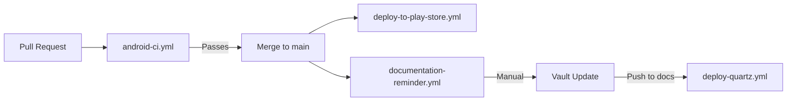

# GitHub Actions Workflows Overview

**Last Updated:** 2025-10-24
**Status:** Active - All workflows using hybrid runner system
**Total Workflows:** 4 (3 main repo, 1 docs repo)

---

## Quick Reference

| Workflow | Repository | Trigger | Purpose | Runner Strategy |
|----------|------------|---------|---------|-----------------|
| [android-ci.yml](#android-ciyml) | archery-apprentice | PR to main | Build, test, lint, coverage | Hybrid (quick checks GitHub, tests on selected) |
| [deploy-to-play-store.yml](#deploy-to-play-storeyml) | archery-apprentice | Push to main | Release AAB to Play Store | Hybrid |
| [documentation-reminder.yml](#documentation-reminderyml) | archery-apprentice | PR merged | Remind to update docs | Hybrid |
| [deploy-quartz.yml](#deploy-quartzyml) | archery-apprentice-docs | Push to main | Deploy Obsidian docs | Hybrid |

---

## android-ci.yml

**Location:** `.github/workflows/android-ci.yml` (main repo)
**Purpose:** Validate pull requests with comprehensive testing and quality checks

### Triggers

```yaml
on:
  pull_request:
    branches: [main]
    paths-ignore:
      - '**.md'
      - 'docs/**'
      - '.github/workflows/deploy-to-play-store.yml'
      - '.github/workflows/documentation-reminder.yml'
  workflow_dispatch:
    inputs:
      runner_mode:
        options: [auto, self-hosted, github, skip]
```

**Trigger logic:**
- Automatically on PR to main (unless only docs changed)
- Manual via Actions UI with runner override

### Job Structure

#### 1. decide_runner (always self-hosted, ~4s)

**Purpose:** Select which runner to use for heavy work

**Logic:**
- Check commit message or workflow input for flags
- If no override, use day-based heuristic (days 1-21 GitHub, 22-31 self-hosted)
- Output `runner_label` and `should_skip` for downstream jobs

**Outputs:**
- `runner_label`: "ubuntu-latest" or "self-hosted"
- `should_skip`: "true" if [skip-ci] flag detected

#### 2. quick_checks (always GitHub-hosted, ~3-5 min)

**Purpose:** Fast validation that doesn't need quota conservation

**Steps:**
1. Checkout code
2. Set up JDK 17
3. Setup Gradle with caching
4. Generate google-services.json
5. Verify google-services.json (OAuth clients, SHA-1 hashes)
6. Run lint (continue-on-error: true)
7. Upload lint reports (7-day retention)

**Why always GitHub?**
- Fast execution (~5 minutes)
- Minimal quota impact (~5-8 minutes charged)
- Provides quick feedback while heavier jobs run

#### 3. test_and_coverage (selected runner, ~15-20 min)

**Purpose:** Comprehensive testing with coverage analysis

**Steps:**
1. Checkout code
2. Set up JDK 17
3. Setup Gradle with dependency caching
4. Cache Robolectric dependencies (~500MB)
5. Generate google-services.json
6. Run unit tests (testDebugUnitTest)
7. Generate JaCoCo coverage report
8. Upload coverage to Codecov (continue-on-error: true on Windows)
9. Parse coverage summary
10. Upload coverage reports as artifacts (2-day retention)
11. Upload test results as artifacts (7-day retention)
12. Comment coverage on PR (if changed files)

**Coverage thresholds:**
- Overall: 70%
- Changed files: 80% (reported in PR comment)

**Codecov handling:**
- Fails silently on Windows (sh dependency issue)
- Coverage still available via HTML artifacts and PR comment

#### 4. build_artifacts (selected runner, PR only, ~10-15 min)

**Purpose:** Verify builds complete successfully

**Steps:**
1. Checkout code
2. Set up JDK 17
3. Setup Gradle with caching
4. Generate google-services.json
5. Build debug APK (assembleDebug)
6. Build release AAB (assembleRelease with minification)
7. Run debug unit tests (testDebugUnitTest)
8. Upload APK and AAB as artifacts (7-day retention)

**Why PR only?**
- Validates release builds work before merge
- Not needed on main (deploy workflow handles this)

### Caching Strategy

**Gradle dependencies:**
```yaml
key: ${{ runner.os }}-gradle-${{ hashFiles('**/*.gradle*', '**/gradle-wrapper.properties') }}
```

**Robolectric dependencies:**
```yaml
paths:
  - ~/.m2/repository/org/robolectric/
  - ~/.robolectric/
  - .robolectric/
```

### Artifacts Produced

| Artifact | Retention | Size | Purpose |
|----------|-----------|------|---------|
| lint-reports | 7 days | ~100KB | HTML/XML lint results |
| coverage-reports | 2 days | ~10MB | JaCoCo HTML + XML reports |
| test-results | 7 days | ~500KB | Unit test XML results |
| build-artifacts (PR only) | 7 days | ~50MB | Debug APK + Release AAB |

### Common Issues

**Windows Codecov failure:**
- Symptom: `sh: command not found`
- Impact: None (covered by artifacts + PR comment)
- Fix: continue-on-error: true

**Robolectric download timeout:**
- Symptom: Test failures with network errors
- Fix: Caching prevents re-downloads
- Manual: Delete ~/.robolectric/ and retry

---

## deploy-to-play-store.yml

**Location:** `.github/workflows/deploy-to-play-store.yml` (main repo)
**Purpose:** Build and deploy release AAB to Google Play Store Internal Testing

### Triggers

```yaml
on:
  push:
    branches: [main]
  workflow_dispatch:
    inputs:
      runner_mode:
        options: [auto, self-hosted, github, skip]
```

**Trigger logic:**
- Automatically on merge to main
- Manual via Actions UI
- Respects [skip-ci] commit flag

### Job Structure

#### 1. decide_runner (always self-hosted, ~4s)

Same logic as android-ci.yml - see above.

#### 2. deploy (selected runner, ~20-30 min)

**Purpose:** Build signed release AAB and deploy to Play Store

**Steps:**

1. **Setup** (5 min)
   - Checkout code
   - Set up JDK 17
   - Setup Gradle with caching
   - Cache Robolectric dependencies

2. **Configuration** (1 min)
   - Generate google-services.json (platform-specific)
   - Verify google-services.json (OAuth clients, Linux only)

3. **Versioning** (1 min)
   - Auto-increment version code: `BASE_VERSION + ${{ github.run_number }}`
   - Update app/build.gradle.kts (platform-specific sed/PowerShell)

4. **Signing** (1 min)
   - Decode keystore from base64 secret (platform-specific)
   - Set keystore environment variables

5. **Build** (10-15 min)
   - Run bundleRelease with -x testReleaseUnitTest (skip flaky Compose tests)
   - Use CI environment variables:
     ```
     CI=true
     GRADLE_OPTS="-Dorg.gradle.daemon=false -Xmx6g -XX:MaxMetaspaceSize=2g -XX:+UseG1GC"
     JAVA_OPTS="-Djava.awt.headless=true"
     ```

6. **Verification** (1 min, Linux only)
   - Extract upload keystore SHA-1
   - Compare with Firebase registered SHA-1s
   - Remind to verify Play Console app signing certificate

7. **Cleanup** (always runs)
   - Remove keystore.jks file (security)

8. **Deployment** (2-5 min)
   - Upload AAB to Play Store Internal Testing
   - Set release status to "completed"
   - Set in-app update priority to 2

9. **Notifications** (platform-specific)
   - **Linux/macOS:** curl with JSON payload
   - **Windows:** Invoke-RestMethod with PowerShell hashtable
   - Send to Discord webhook with:
     - Version code
     - Commit SHA + link
     - Triggered by user

### Environment Variables

```yaml
BASE_VERSION: 4  # Incremented with each major release
NEW_VERSION_CODE: BASE_VERSION + github.run_number
```

**Example:** Run #123 → Version code 127

### Secrets Required

| Secret | Purpose | Format |
|--------|---------|--------|
| GOOGLE_SERVICES_JSON | Firebase configuration | Complete JSON file |
| KEYSTORE_BASE64 | Upload signing certificate | Base64-encoded JKS |
| KEYSTORE_PASSWORD | Keystore password | String |
| KEY_ALIAS | Key alias in keystore | String |
| KEY_PASSWORD | Key password | String |
| PLAY_SERVICE_ACCOUNT_JSON | Play Console API access | JSON credentials |
| DISCORD_WEBHOOK_URL | Deployment notifications | HTTPS URL |

### Certificate Management

**Upload Certificate:**
- Stored in KEYSTORE_BASE64 secret
- Used to sign AAB locally
- SHA-1 extracted for verification

**App Signing Certificate:**
- Managed by Google Play (different from upload cert)
- Find at: Play Console → App Integrity → App signing
- **This SHA-1 must be registered in Firebase!**

### Common Issues

**Google Sign-In fails after deployment:**
- Cause: App signing SHA-1 not in Firebase
- Solution: Get SHA-1 from Play Console → Register in Firebase Console

**Version code conflict:**
- Cause: Manual upload with same version
- Solution: Increment BASE_VERSION in workflow

---

## documentation-reminder.yml

**Location:** `.github/workflows/documentation-reminder.yml` (main repo)
**Purpose:** Post PR comment reminding to update Obsidian vault after merges

### Triggers

```yaml
on:
  pull_request:
    types: [closed]
    branches: [main]
  workflow_dispatch:
    inputs:
      runner_mode:
        options: [auto, self-hosted, github, skip]
```

**Trigger logic:**
- Runs when PR is closed (checks if merged inside workflow)
- Manual testing via workflow dispatch

### Job Structure

#### 1. decide_runner (always self-hosted, ~4s)

Same hybrid runner logic as other workflows.

#### 2. remind-docs-update (selected runner, ~30s)

**Purpose:** Analyze PR impact and post appropriate reminder

**Steps:**

1. **Check if PR requires vault update (platform-specific)**

   **Windows (PowerShell):**
   ```powershell
   $keywords = "ViewModel|Repository|Service|Architecture|Migration|Refactor"
   if ($title -match $keywords) { "impact=high" }
   ```

   **Linux/macOS (Bash):**
   ```bash
   KEYWORDS="ViewModel|Repository|Service|Architecture|Migration|Refactor"
   if echo "$title" | grep -iE "$KEYWORDS"; then impact=high; fi
   ```

2. **Post documentation reminder**

   Uses `actions/github-script` to post comment with impact assessment:

   **High Impact:**
   - ⚠️ HIGH IMPACT PR warning
   - Architecture changes detected
   - Update Architecture/ or Flows/ sections
   - Review cross-agent impacts

   **Medium Impact:**
   - 📝 MEDIUM IMPACT PR notice
   - Check if data flows changed
   - Update Code-Graph/ if file structure changed
   - Update project status if milestone reached

   **Low Impact:**
   - ✅ LOW IMPACT PR
   - Likely no vault update needed (bug fix/test/minor change)
   - Can skip individual update
   - Will be included in weekly rollup

### Impact Detection Logic

**Keywords triggering HIGH:**
- ViewModel, Repository, Service, Architecture, Migration, Refactor (in title)

**Keywords triggering MEDIUM:**
- Same keywords in PR body (but not title)

**Everything else:**
- LOW impact

### Post-Merge Checklist (Generated)

**All PRs:**
- [ ] Pull latest main
- [ ] Review merged changes in `docs/AGENT_CONTEXTS/`

**High/Medium PRs:**
- [ ] Update Obsidian vault (see AGENT_O_ORCHESTRATOR.md)
- [ ] Run `cd ~/Documents/ArcheryApprentice-Docs && .\deploy.ps1`
- [ ] Verify deployment at https://blamechris.github.io/archery-apprentice-docs/

**All PRs (continued):**
- [ ] Update orchestrator context with completion status

### Usage Pattern

1. Developer merges PR #142
2. Workflow runs automatically
3. PR title/body analyzed for keywords
4. Impact-appropriate comment posted
5. Developer follows checklist based on impact level

---

## deploy-quartz.yml

**Location:** `.github/workflows/deploy-quartz.yml` (docs repo)
**Purpose:** Build and deploy Obsidian vault as static site to GitHub Pages

### Triggers

```yaml
on:
  push:
    branches: [main]
  workflow_dispatch:
    inputs:
      runner_mode:
        options: [auto, self-hosted, github, skip]
```

**Trigger logic:**
- Automatically on push to main (vault updates)
- Manual deploy via Actions UI

### Job Structure

#### 1. decide_runner (always self-hosted, ~4s)

Same hybrid runner logic as other workflows.

#### 2. deploy (selected runner, ~5-8 min)

**Purpose:** Build Quartz site from Obsidian vault and deploy to GitHub Pages

**Steps:**

1. **Setup** (1 min)
   - Checkout repository (fetch-depth: 0 for git info)
   - Setup Node.js 20

2. **Dependencies** (1-2 min)
   - npm install (Quartz and dependencies)

3. **Update deployment timestamp (platform-specific)**

   **Windows (PowerShell):**
   ```powershell
   $TIMESTAMP = Get-Date -Format "yyyy-MM-dd hh:mm tt PT"
   (Get-Content content/index.md) -replace '**📅 Last Updated:** .*', "**📅 Last Updated:** $TIMESTAMP" | Set-Content content/index.md
   ```

   **Linux/macOS (Bash):**
   ```bash
   TIMESTAMP=$(TZ='America/Los_Angeles' date '+%Y-%m-%d %I:%M %p PT')
   sed -i "s/\*\*📅 Last Updated:\*\* .*/\*\*📅 Last Updated:\*\* $TIMESTAMP/" content/index.md
   ```

4. **Build** (2-3 min)
   - Run `npx quartz build`
   - Generates static site in ./public/

5. **Deploy** (1-2 min)
   - Uses peaceiris/actions-gh-pages@v4
   - Publishes ./public/ to gh-pages branch
   - Force orphan commit (clean history)
   - Commit message: `deploy: Quartz site deployment from ${{ github.sha }}`

6. **Notify Discord of successful deployment (platform-specific)**

   **Linux/macOS (curl):**
   ```bash
   curl -H "Content-Type: application/json" -d "{...}" "$DISCORD_WEBHOOK_URL"
   ```

   **Windows (Invoke-RestMethod):**
   ```powershell
   $payload = @{...} | ConvertTo-Json -Depth 10
   Invoke-RestMethod -Uri $env:DISCORD_WEBHOOK_URL -Method Post -Body $payload
   ```

   **Embed fields:**
   - Commit (SHA + message)
   - Author
   - Site (link to https://blamechris.github.io/archery-apprentice-docs/)
   - Timestamp

7. **Notify Discord of deployment failure (platform-specific)**

   Same platform split as success notification, but with:
   - Red color (15158332)
   - Commit SHA
   - Workflow logs link

### Deployment Configuration

```yaml
publish_dir: ./public
publish_branch: gh-pages
force_orphan: true  # Clean history each deploy
user_name: 'github-actions[bot]'
user_email: 'github-actions[bot]@users.noreply.github.com'
```

### Quartz Configuration

**Location:** `quartz.config.ts` (in docs repo)

**Key settings:**
- baseUrl: "blamechris.github.io/archery-apprentice-docs"
- Theme: Dark mode by default
- Plugins: Graph view, backlinks, table of contents

### Common Operations

**Force rebuild:**
```bash
# Trigger workflow manually
gh workflow run deploy-quartz.yml
```

**Local preview:**
```bash
cd ~/Documents/ArcheryApprentice-Docs
npx quartz build --serve
# Opens http://localhost:8080
```

**Vault structure expected:**
```
content/
  index.md                  # Homepage (timestamp updated here)
  Development/
    CI-CD/
      Hybrid-Runner-System.md
      Workflows-Overview.md
      ...
  Architecture/
  Code-Graph/
  Flows/
  projects/
```

### Permissions Required

```yaml
permissions:
  contents: write  # Required to push to gh-pages branch
```

### Secrets Required

| Secret | Purpose |
|--------|---------|
| GITHUB_TOKEN | Automatic (provided by GitHub Actions) |
| DISCORD_WEBHOOK_URL | Deployment notifications |

### Deployment URL

**Production:** https://blamechris.github.io/archery-apprentice-docs/

**Deployment time:** ~2-3 minutes from push to live

---

## Cross-Workflow Patterns

### Hybrid Runner System

**Shared logic across all workflows:**

1. **decide_runner job** - Always runs on self-hosted to avoid quota
2. **Day-based heuristic** - Days 1-21 GitHub, 22-31 self-hosted
3. **Manual overrides** - workflow_dispatch with runner_mode input
4. **Commit flags** - [self-hosted], [github], [skip-ci]
5. **Platform detection** - `runner.os` for cross-platform steps

### Platform-Specific Steps

**Pattern:**
```yaml
- name: Task (Windows)
  if: runner.os == 'Windows'
  shell: powershell
  run: |
    # PowerShell syntax

- name: Task (Linux/macOS)
  if: runner.os != 'Windows'
  run: |
    # Bash syntax
```

**Common platform splits:**
1. File manipulation (sed vs PowerShell -replace)
2. HTTP requests (curl vs Invoke-RestMethod)
3. JSON generation (jq/echo vs ConvertTo-Json)
4. Environment variables ($VAR vs $env:VAR)

### Caching Strategy

**Gradle (Android workflows):**
```yaml
- uses: gradle/actions/setup-gradle@v4
  # Automatically caches:
  # - ~/.gradle/caches/
  # - ~/.gradle/wrapper/
  # - .gradle/
```

**Robolectric (Android workflows):**
```yaml
- uses: actions/cache@v4
  with:
    path: |
      ~/.m2/repository/org/robolectric/
      ~/.robolectric/
      .robolectric/
    key: ${{ runner.os }}-robolectric-${{ hashFiles('**/*.gradle*') }}
```

**Node modules (Quartz workflow):**
```yaml
- uses: actions/setup-node@v4
  # Automatically caches node_modules/
```

### Artifact Naming

**Pattern:** `{type}-{descriptor}` with consistent retention

**Examples:**
- `lint-reports` (7 days)
- `coverage-reports` (2 days)
- `test-results` (7 days)
- `build-artifacts` (7 days)

### Discord Notifications

**Success pattern:**
- Green color: 3447003 (android), 3066993 (deploy)
- Commit SHA + message
- Author/triggering user
- Link to result (docs site, Play Store)

**Failure pattern:**
- Red color: 15158332
- Commit SHA
- Link to workflow logs

---

## Workflow Dependencies



**Flow:**
1. Developer creates PR
2. android-ci.yml validates (lint, tests, coverage, builds)
3. PR reviewed and merged to main
4. deploy-to-play-store.yml builds and deploys to Play Store
5. documentation-reminder.yml posts checklist comment
6. Developer updates Obsidian vault based on impact
7. Vault changes pushed to docs repo
8. deploy-quartz.yml deploys updated documentation

---

## Monitoring and Debugging

### Check Workflow Status

```bash
# List recent runs
gh run list --workflow=android-ci.yml --limit 10

# View specific run
gh run view 12345678

# Watch run in real-time
gh run watch
```

### Download Artifacts

```bash
# List artifacts from a run
gh run view 12345678 --log

# Download specific artifact
gh run download 12345678 -n coverage-reports
```

### Quota Monitoring

**Check usage:**
1. GitHub → Settings → Billing
2. Actions → View usage
3. Check minutes used vs. 3000 limit

**Expected usage (with hybrid system):**
- Days 1-21: ~150-200 minutes/day
- Days 22-31: ~0-50 minutes/day (mostly decide_runner)
- Monthly total: ~3,150 minutes (just over quota, acceptable)

### Common Debugging Commands

```bash
# Re-run failed workflow
gh run rerun 12345678

# Re-run failed jobs only
gh run rerun 12345678 --failed

# View logs for failed step
gh run view 12345678 --log-failed

# Trigger manual run with specific runner
gh workflow run android-ci.yml -f runner_mode=self-hosted
```

---

## Best Practices

### Commit Messages

**Force specific runner:**
```bash
git commit -m "feat: Add new feature [self-hosted]"
git commit -m "fix: Quick fix [github]"
git commit -m "docs: Update README [skip-ci]"
```

### Workflow Modifications

**Testing changes:**
1. Create feature branch with workflow changes
2. Add [github] flag to use free quota for testing
3. Verify workflow succeeds
4. Switch to [self-hosted] to test self-hosted runner
5. Merge when both pass

**Validation:**
- Use `gh workflow view <workflow-name>` to check syntax
- Use GitHub Actions UI validator (push to check)
- Test on GitHub-hosted first (fail fast, cheap)

### Artifact Management

**When to download:**
- Coverage drops unexpectedly (check coverage-reports)
- Lint warnings need review (check lint-reports)
- Test failures need investigation (check test-results)

**Retention policy:**
- 2 days: Large artifacts (coverage HTML)
- 7 days: Debug artifacts (APK, test results)
- Automatic cleanup after retention period

---

## Related Documentation

- [[Hybrid-Runner-System|Hybrid Runner System]] - Runner selection logic and setup
- [[Troubleshooting-Guide|Troubleshooting Guide]] - Common issues and solutions
- [[Maintenance-Tasks|Maintenance Tasks]] - Regular workflow maintenance

**Code Repositories:**
- [archery-apprentice/.github/workflows/](https://github.com/blamechris/archery-apprentice/tree/main/.github/workflows)
- [archery-apprentice-docs/.github/workflows/](https://github.com/blamechris/archery-apprentice-docs/tree/main/.github/workflows)

---

**Tags:** #ci-cd #github-actions #workflows #android-ci #deployment #documentation
**Status:** ✅ All workflows active and using hybrid runner system
**Last Review:** 2025-10-24
