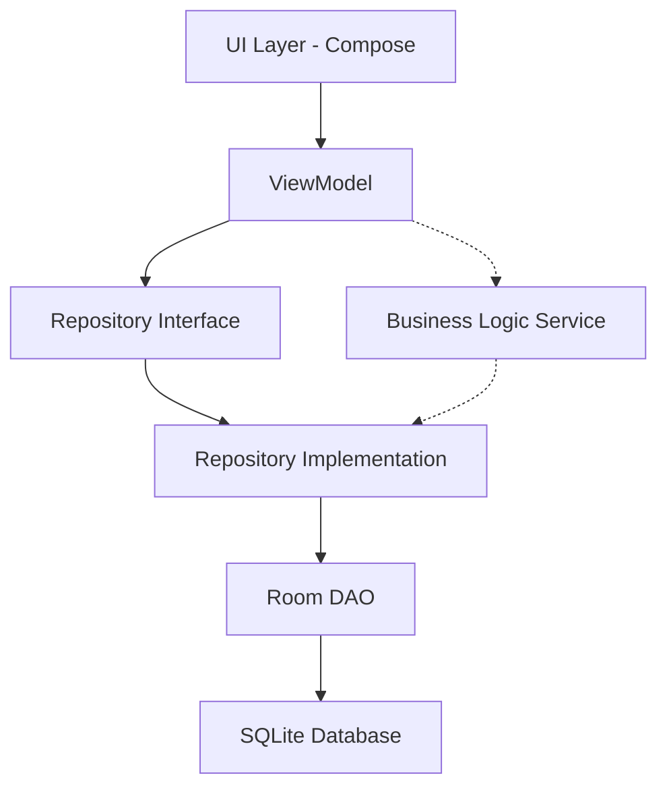

# Getting Started with Archery Apprentice Development

Welcome to Archery Apprentice! This guide will help you set up your development environment and make your first contribution.

---

## Prerequisites

Before you begin, ensure you have the following installed:

### Required Software

- **Android Studio**: Hedgehog (2023.1.1) or newer
  - Download from [developer.android.com](https://developer.android.com/studio)
  - Includes Android SDK, Gradle, and emulator

- **Java Development Kit (JDK)**: Version 17 or higher
  - Usually bundled with Android Studio
  - Verify: `java -version` in terminal

- **Git**: Version control system
  - Download from [git-scm.com](https://git-scm.com/)
  - Verify: `git --version` in terminal

### Recommended Tools

- **GitHub CLI** (`gh`): For creating PRs and managing issues
  - Download from [cli.github.com](https://cli.github.com/)
  - Authenticate: `gh auth login`

- **Obsidian**: For documentation editing (optional)
  - This documentation is an Obsidian vault
  - Download from [obsidian.md](https://obsidian.md/)

---

## Project Setup

### 1. Clone the Repository

```bash
# Clone the main application repository
git clone https://github.com/blamechris/archery-apprentice.git
cd archery-apprentice

# Clone the documentation repository (optional)
cd ..
git clone https://github.com/blamechris/archery-apprentice-docs.git
```

### 2. Open in Android Studio

1. Launch Android Studio
2. Select **File → Open**
3. Navigate to the `archery-apprentice` directory
4. Click **OK**

Android Studio will:
- Sync Gradle dependencies (first time takes 5-10 minutes)
- Index the project
- Build the project

### 3. Configure Android SDK

If prompted:
1. Accept SDK licenses when asked
2. Install required SDK platforms (API 26-34)
3. Install Android build tools

Manual SDK configuration:
1. **File → Settings → Appearance & Behavior → System Settings → Android SDK**
2. Install:
   - Android 13.0 (API 33) - Target SDK
   - Android 8.0 (API 26) - Min SDK
   - Android SDK Build-Tools
   - Android SDK Platform-Tools

### 4. Run the App

**Using an Emulator:**
1. **Tools → Device Manager**
2. Create a virtual device (Pixel 6 recommended)
3. Choose system image: Android 13 (API 33)
4. Click the green play button ▶️ in the toolbar
5. Select your emulator

**Using a Physical Device:**
1. Enable Developer Options on your Android device
2. Enable USB Debugging
3. Connect via USB
4. Click the green play button ▶️
5. Select your device

**Expected:** App launches showing the main scoring screen

---

## Project Structure

Understanding the codebase organization:

```
archery-apprentice/
├── app/
│   ├── src/
│   │   ├── main/
│   │   │   ├── java/com/archeryapprentice/
│   │   │   │   ├── data/           # Data layer (Room, DAOs, Repositories)
│   │   │   │   ├── domain/         # Business logic (Services, Use Cases)
│   │   │   │   ├── ui/             # Presentation layer (Compose, ViewModels)
│   │   │   │   ├── navigation/     # App navigation
│   │   │   │   └── utils/          # Utilities and helpers
│   │   │   ├── res/                # Android resources
│   │   │   └── AndroidManifest.xml
│   │   ├── test/                   # Unit tests
│   │   └── androidTest/            # Instrumented tests
│   └── build.gradle.kts            # App module Gradle config
├── gradle/                         # Gradle wrapper
├── build.gradle.kts                # Root build configuration
└── settings.gradle.kts             # Project settings
```

### Key Directories

**Data Layer** (`app/src/main/java/com/archeryapprentice/data/`)
- `database/` - Room database setup
- `dao/` - Data Access Objects (15 DAOs)
- `entity/` - Room entities (database tables)
- `repository/` - Repository interfaces and implementations (17 repositories)

**Domain Layer** (`app/src/main/java/com/archeryapprentice/domain/`)
- `services/` - Business logic services (19 services)
- `models/` - Domain models

**UI Layer** (`app/src/main/java/com/archeryapprentice/ui/`)
- `screens/` - Compose UI screens
- `viewmodels/` - ViewModels for state management (21 ViewModels)
- `components/` - Reusable UI components
- `theme/` - Material Design theme

---

## Architecture Overview

Archery Apprentice follows **MVVM (Model-View-ViewModel)** architecture with Clean Architecture principles.

### Architecture Layers



**Data Flow:**
1. **UI (Compose)** - User interaction triggers events
2. **ViewModel** - Handles UI state and user actions
3. **Repository** - Abstracts data source
4. **DAO** - Database queries
5. **Database** - SQLite via Room

### Key Patterns

- **Repository Pattern**: Abstraction over data sources
- **Service Layer**: Business logic extraction
- **StateFlow**: Reactive state management
- **Dependency Injection**: Manual DI via factory pattern

**Read more:** [[architecture/system-architecture|System Architecture]]

---

## Running Tests

### Unit Tests

Run from Android Studio:
1. Right-click `app/src/test`
2. Select **Run 'Tests in 'app''**

Or from command line:
```bash
./gradlew testDebugUnitTest
```

### Instrumented Tests

Requires emulator or device:
```bash
./gradlew connectedAndroidTest
```

### Test Coverage

Generate coverage reports:
```bash
./gradlew testDebugUnitTest jacocoTestReport

# View report
open app/build/reports/jacoco/jacocoTestReport/html/index.html
```

**Read more:** [[testing/test-coverage-guide|Test Coverage Guide]]

---

## Making Your First Contribution

### 1. Find an Issue

Browse [Good First Issues](https://github.com/blamechris/archery-apprentice/labels/good-first-issue) on GitHub.

### 2. Create a Branch

```bash
git checkout main
git pull origin main
git checkout -b feature/your-feature-name
```

**Branch naming conventions:**
- `feature/` - New features
- `fix/` - Bug fixes
- `refactor/` - Code refactoring
- `test/` - Test additions
- `docs/` - Documentation updates

### 3. Make Your Changes

Follow the codebase patterns:
- Use existing component patterns
- Follow MVVM architecture
- Write tests for new functionality
- Update documentation if needed

### 4. Test Your Changes

```bash
# Run unit tests
./gradlew testDebugUnitTest

# Run app on emulator
./gradlew installDebug
```

### 5. Commit Your Changes

```bash
git add .
git commit -m "feat: Add feature description

Detailed explanation of changes:
- Change 1
- Change 2

Impact: Improves X functionality"
```

**Commit message format:**
- `feat:` - New feature
- `fix:` - Bug fix
- `refactor:` - Code refactoring
- `test:` - Test additions
- `docs:` - Documentation
- `chore:` - Maintenance

### 6. Push and Create PR

```bash
git push origin feature/your-feature-name

# Using GitHub CLI
gh pr create --title "Your PR title" --body "PR description"
```

**PR Requirements:**
- Description of changes
- Test results
- Screenshots (for UI changes)
- Linked issue

---

## Development Workflow

### Daily Development

```bash
# 1. Update main branch
git checkout main
git pull origin main

# 2. Create feature branch
git checkout -b feature/my-feature

# 3. Make changes and test
./gradlew testDebugUnitTest

# 4. Commit and push
git add .
git commit -m "feat: Description"
git push origin feature/my-feature

# 5. Create PR
gh pr create
```

### Before Creating PR

**Checklist:**
- [ ] Code compiles without errors
- [ ] Unit tests pass
- [ ] New code has test coverage
- [ ] Code follows existing patterns
- [ ] No lint warnings
- [ ] Documentation updated (if needed)

### After PR Approval

```bash
# Merge will be done by maintainer
# After merge, clean up:
git checkout main
git pull origin main
git branch -d feature/my-feature
```

---

## Useful Commands

### Gradle Tasks

```bash
# Clean build
./gradlew clean build

# Run unit tests
./gradlew testDebugUnitTest

# Generate test coverage
./gradlew jacocoTestReport

# Check code quality
./gradlew lint

# Install debug build
./gradlew installDebug
```

### Git Commands

```bash
# Check status
git status

# View commit history
git log --oneline --graph

# Stash changes
git stash
git stash pop

# Reset changes
git reset --hard HEAD
```

### Android Studio Shortcuts

| Action | Windows/Linux | Mac |
|--------|---------------|-----|
| Build project | Ctrl + F9 | Cmd + F9 |
| Run app | Shift + F10 | Ctrl + R |
| Run tests | Ctrl + Shift + F10 | Ctrl + Shift + R |
| Find file | Ctrl + Shift + N | Cmd + Shift + O |
| Search everywhere | Double Shift | Double Shift |
| Reformat code | Ctrl + Alt + L | Cmd + Option + L |

---

## Common Issues

### Gradle Sync Failed

**Problem:** Gradle dependencies won't sync

**Solutions:**
1. **File → Invalidate Caches → Invalidate and Restart**
2. Delete `.gradle` and `.idea` folders, restart Android Studio
3. Check internet connection (Gradle downloads dependencies)

### Emulator Won't Start

**Problem:** AVD fails to launch

**Solutions:**
1. Check virtualization is enabled in BIOS
2. Install Intel HAXM or AMD virtualization
3. Use a physical device instead

### Build Errors

**Problem:** `Cannot resolve symbol` errors

**Solutions:**
1. Sync Gradle: **File → Sync Project with Gradle Files**
2. Clean and rebuild: **Build → Clean Project** then **Build → Rebuild Project**
3. Delete build folders: `rm -rf app/build .gradle`

### Test Failures

**Problem:** Tests fail locally

**Solutions:**
1. Check Java version: `java -version` (should be 17+)
2. Clean test caches: `./gradlew cleanTest`
3. Run specific test: Right-click test class → Run

---

## Next Steps

Now that you're set up:

1. **Explore the codebase:**
   - Read [[architecture/system-architecture|System Architecture]]
   - Browse [[technical-reference/flows/|Flow Documentation]]
   - Study [[testing/test-coverage-guide|Testing Guide]]

2. **Understand key concepts:**
   - [[architecture/mvvm-patterns|MVVM Patterns]]
   - [[guides/firebase-firebase-overview|Firebase Integration]]
   - [[technical-reference/flows/scoring-flow|Scoring Flow]]

3. **Find your first issue:**
   - Browse [Good First Issues](https://github.com/blamechris/archery-apprentice/labels/good-first-issue)
   - Join [Discussions](https://github.com/blamechris/archery-apprentice/discussions)
   - Ask questions in issues

---

## Getting Help

**Documentation:**
- [[developer-guide/index|Developer Guide Index]]
- [[technical-reference/flows/|Flow Documentation]]
- [[testing/|Testing Documentation]]

**Community:**
- [GitHub Issues](https://github.com/blamechris/archery-apprentice/issues)
- [GitHub Discussions](https://github.com/blamechris/archery-apprentice/discussions)

**Code Examples:**
- Browse existing features for patterns
- Check test files for usage examples
- Review flow documentation for architecture

---

**Welcome to the team! Happy coding! 🎯**
