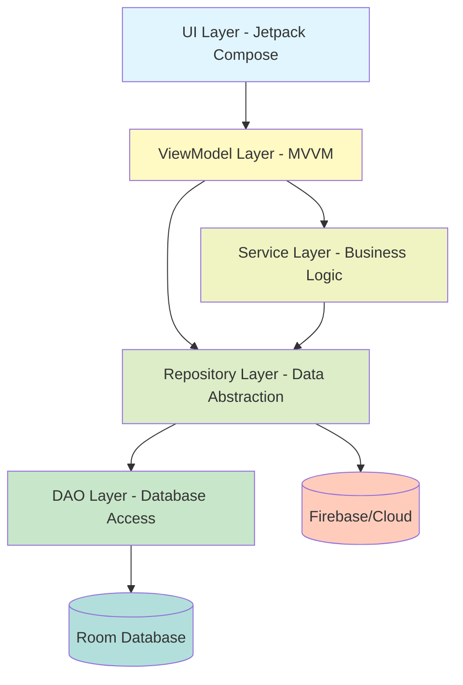
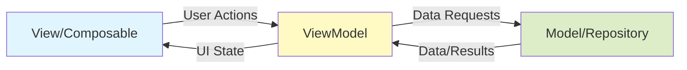
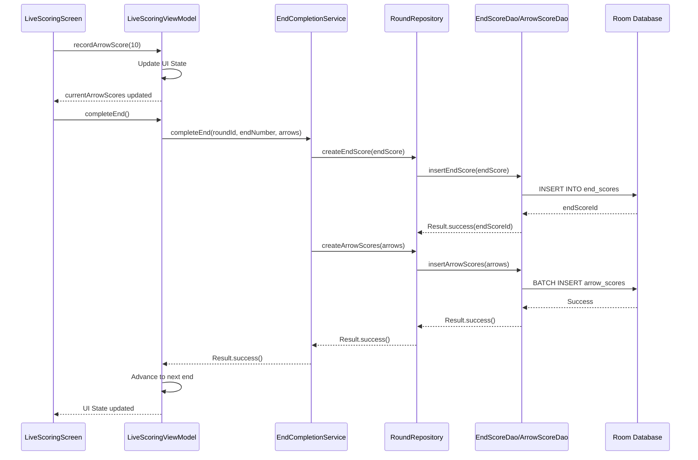
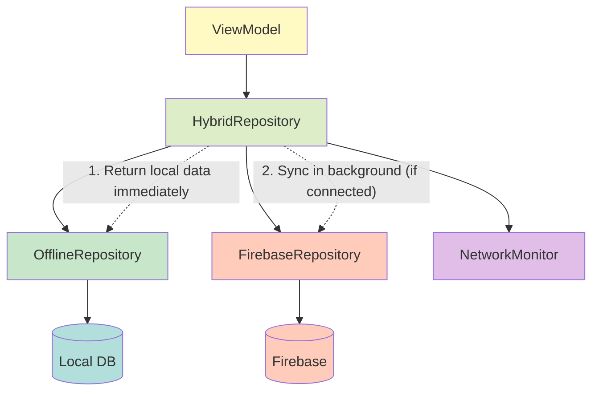
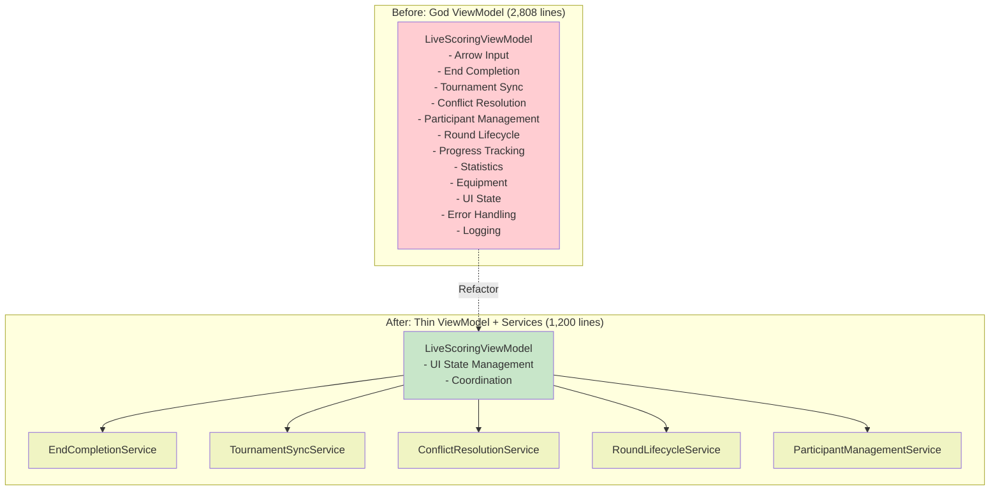
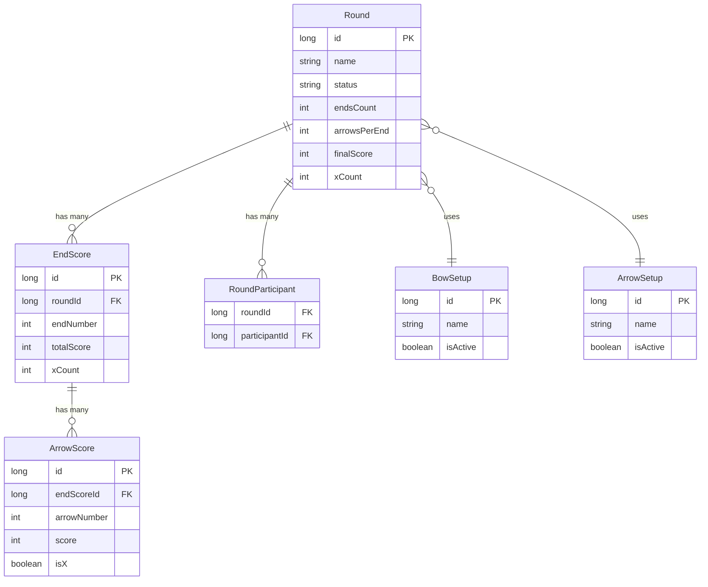
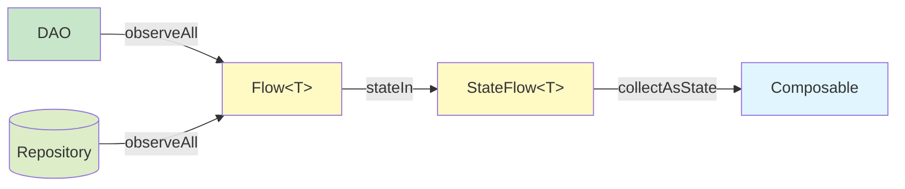
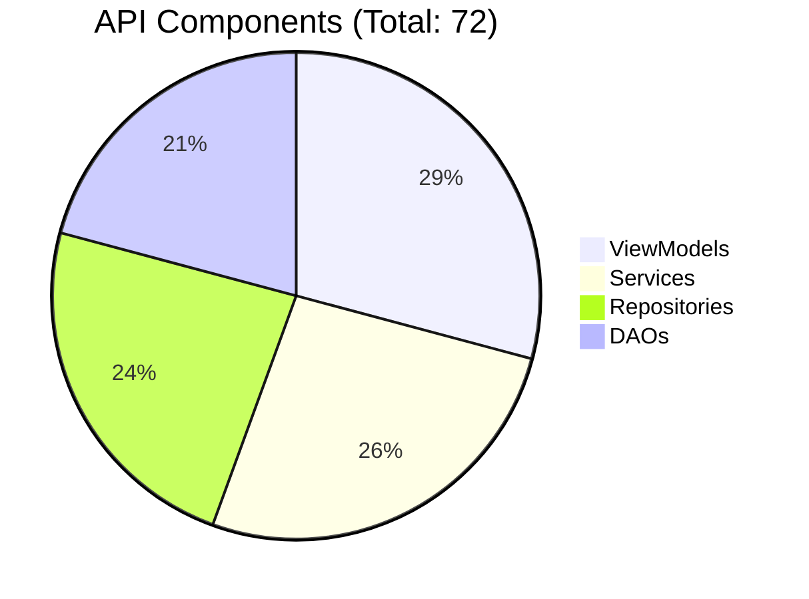
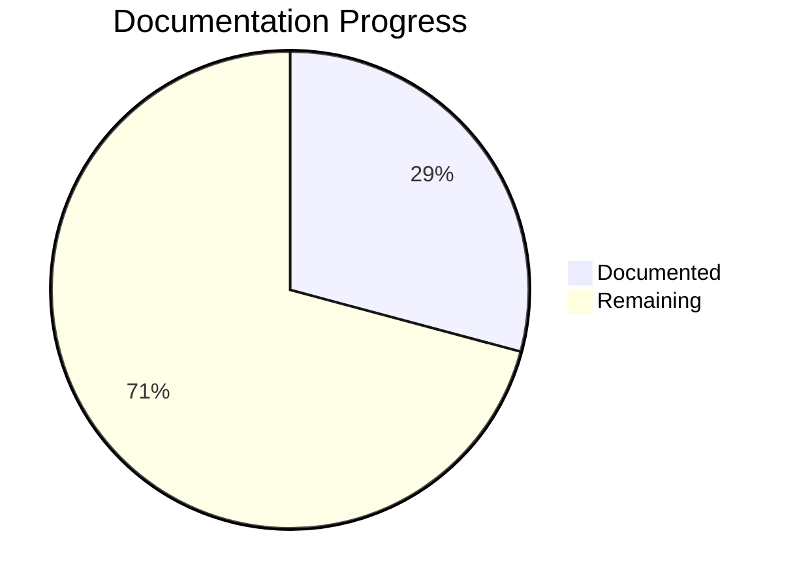

# API Architecture Diagrams

Visual reference for understanding the Archery Apprentice API architecture.

---

## Layer Architecture

---

## MVVM Pattern

---

## Scoring Flow Architecture

---

## Repository Pattern with Offline-First

---

## Service Extraction Pattern

---

## Equipment Component Relationships

```mermaid
graph TB
    BowSetup[BowSetup]
    Sight[SightConfiguration]
    Rest[RestConfiguration]
    Stab[StabilizerConfiguration]
    Plunger[PlungerConfiguration]
    String[StringConfiguration]
    Limbs[LimbsConfiguration]
    Riser[RiserConfiguration]
    Tab[TabConfiguration]
    Clicker[ClkrConfiguration]
    ReleaseAid[ReleaseAidConfiguration]

    BowSetup -->|hasOne| Sight
    BowSetup -->|hasOne| Rest
    BowSetup -->|hasOne| Stab
    BowSetup -->|hasOne| Plunger
    BowSetup -->|hasOne| String
    BowSetup -->|hasOne| Limbs
    BowSetup -->|hasOne| Riser
    BowSetup -->|hasOne| Tab
    BowSetup -->|hasOne| Clicker
    BowSetup -->|hasOne| ReleaseAid

    style BowSetup fill:#fff9c4
    style Sight fill:#e1f5fe
    style Rest fill:#e1f5fe
    style Stab fill:#e1f5fe
    style Plunger fill:#e1f5fe
    style String fill:#e1f5fe
    style Limbs fill:#e1f5fe
    style Riser fill:#e1f5fe
    style Tab fill:#e1f5fe
    style Clicker fill:#e1f5fe
    style ReleaseAid fill:#e1f5fe
```

---

## Round Data Relationships

---

## State Flow Pattern

---

## Component Count Overview

---

## Documentation Coverage

**Current Coverage:**
- ViewModels: 6/21 (29%)
- Repositories: 5/17 (29%)
- Services: 6/19 (32%)
- DAOs: 4/15 (27%)

---

## Related Documentation

**Architecture:**
- [[../../../architecture/system-architecture|System Architecture]]
- [[../../../architecture/mvvm-patterns|MVVM Patterns]]
- [[../../../architecture/service-architecture|Service Architecture]]

**API Reference:**
- [[index|API Reference Home]]
- [[viewmodels/index|ViewModels]]
- [[repositories/index|Repositories]]
- [[services/index|Services]]
- [[daos/index|DAOs]]

**Flows:**
- [[../../flows/scoring-flow|Scoring Flow]]
- [[../../flows/data-sync-flow|Data Sync Flow]]
- [[../../flows/equipment-management-end-to-end-flow|Equipment Management Flow]]

---

**Last Updated:** 2025-11-01
