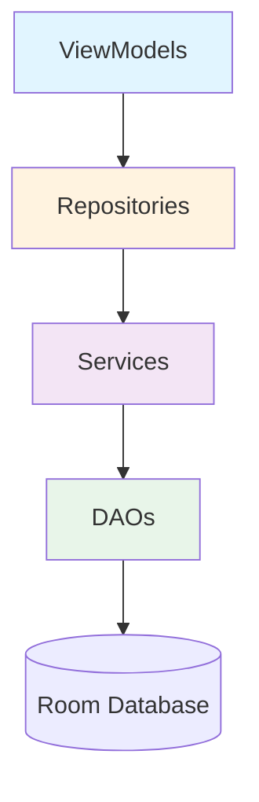

# API Reference

Complete reference documentation for Archery Apprentice components.

---

## Quick Navigation

### Core Components

- **[[viewmodels/index|ViewModels]]** - UI state management (21 ViewModels)
- **[[repositories/index|Repositories]]** - Data access layer (17 Repositories)
- **[[services/index|Services]]** - Business logic services (19 Services)
- **[[daos/index|DAOs]]** - Database access objects (15 DAOs)

---

## Architecture Overview



### Component Responsibilities

**ViewModels** - Presentation Layer
- Manage UI state with StateFlow
- Handle user interactions
- Coordinate repository calls
- Transform data for UI display

**Repositories** - Data Layer Abstraction
- Abstract data sources
- Implement business data operations
- Handle data mapping
- Provide reactive data streams

**Services** - Business Logic
- Encapsulate complex business rules
- Coordinate multiple repositories
- Perform calculations and transformations
- Implement domain-specific logic

**DAOs** - Database Access
- Define database queries
- Provide type-safe database access
- Handle CRUD operations
- Implement Room annotations

---

## Finding What You Need

### By Feature Area

**Scoring:**
- [[viewmodels/live-scoring-view-model|LiveScoringViewModel]]
- [[viewmodels/round-view-model|RoundViewModel]]
- [[repositories/round-repository|RoundRepository]]
- [[services/end-completion-service|EndCompletionService]]
- [[daos/round-dao|RoundDao]]

**Equipment:**
- [[repositories/bow-setup-repository|BowSetupRepository]]
- [[daos/bow-setup-dao|BowSetupDao]]
- Multiple equipment-specific DAOs and repositories

**Tournament:**
- [[services/tournament-sync-service|TournamentSyncService]]
- [[services/score-conflict-resolution-service|ScoreConflictResolutionService]]
- Firebase-based tournament management

**Statistics:**
- [[services/statistics-calculation-service|StatisticsCalculationService]]
- [[services/progress-calculation-service|ProgressCalculationService]]
- Performance analytics

### By Layer

**Presentation Layer:**
- [[viewmodels/index|All ViewModels →]]

**Data Layer:**
- [[repositories/index|All Repositories →]]
- [[daos/index|All DAOs →]]

**Business Logic:**
- [[services/index|All Services →]]

---

## Documentation Conventions

### Method Signatures

```kotlin
suspend fun methodName(
    param1: Type,
    param2: Type
): Result<ReturnType>
```

### StateFlow Properties

```kotlin
val uiState: StateFlow<UiState>
private val _uiState = MutableStateFlow(UiState.initial())
```

### Repository Pattern

```kotlin
interface Repository {
    suspend fun operation(): Result<Data>
    fun observeData(): Flow<Data>
}
```

---

## Code Examples

### Using a ViewModel

```kotlin
@Composable
fun MyScreen(
    viewModel: MyViewModel = viewModel()
) {
    val uiState by viewModel.uiState.collectAsState()

    MyScreenContent(
        state = uiState,
        onAction = viewModel::handleAction
    )
}
```

### Using a Repository

```kotlin
class MyRepository(
    private val dao: MyDao
) {
    suspend fun getData(): Result<Data> = try {
        Result.success(dao.fetchData())
    } catch (e: Exception) {
        Result.failure(e)
    }

    fun observeData(): Flow<Data> =
        dao.observeData()
}
```

### Using a Service

```kotlin
class MyService(
    private val repository: MyRepository
) {
    suspend fun performBusinessLogic(): Result<Output> {
        val data = repository.getData()
            .getOrElse { return Result.failure(it) }

        // Business logic
        val output = processData(data)

        return Result.success(output)
    }
}
```

---

## Related Documentation

**Architecture:**
- [[../../../architecture/system-architecture|System Architecture]]
- [[../../../architecture/mvvm-patterns|MVVM Patterns]]
- [[../../../architecture/service-architecture|Service Architecture]]

**Flows:**
- [[../flows/scoring-flow|Scoring Flow]]
- [[../flows/equipment-management-end-to-end-flow|Equipment Flow]]
- [[../flows/round-lifecycle-flow|Round Lifecycle]]

**Testing:**
- [[../../../testing/test-coverage-guide|Test Coverage Guide]]
- [[../../../testing/test-quality-standards|Testing Standards]]

---

## Contributing to API Docs

API documentation follows this template:

```markdown
# ComponentName

## Overview
Brief description of purpose

## Location
File path: `path/to/File.kt`

## Dependencies
- Dependency 1
- Dependency 2

## Public API
### Methods
Method signatures with descriptions

### Properties
StateFlow and public properties

## Usage Examples
Code examples showing common use cases

## Related
Links to related components
```

**Contribute:** Help us document remaining components!

---

**Last Updated:** 2025-11-01
**Coverage:** Foundation established, top components documented
