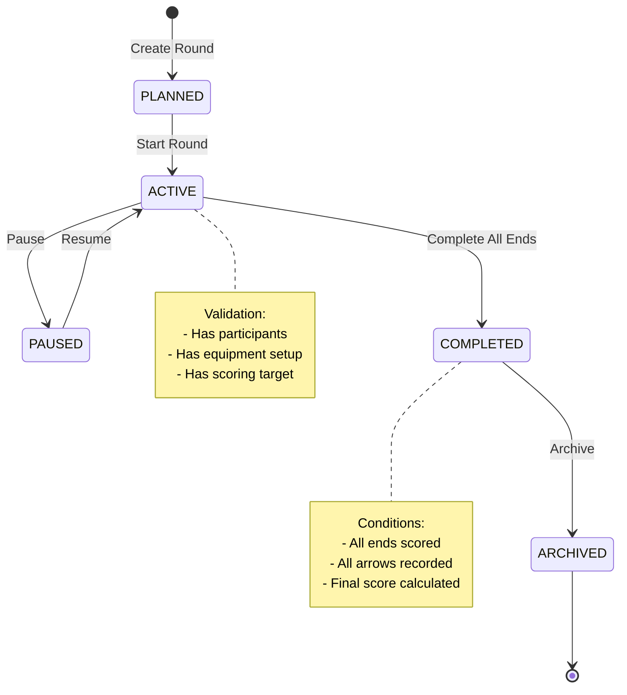

# RoundLifecycleService API Reference

Complete API reference for the RoundLifecycleService - managing round state transitions and lifecycle validation.

---

## Overview

**File:** `domain/services/RoundLifecycleService.kt` (Recommended)
**Lines:** ~200 lines (estimated after extraction)
**Status:** 📝 **RECOMMENDED FOR EXTRACTION** from LiveScoringViewModel/RoundViewModel

### Purpose

RoundLifecycleService should encapsulate round state management logic, handling:
- Round status transitions (PLANNED → ACTIVE → COMPLETED → ARCHIVED)
- State transition validation
- Completion condition checking
- Status event propagation
- Round lifecycle rules enforcement

### Current State

⚠️ **Not Yet Extracted:** Round lifecycle logic is currently embedded in:
- LiveScoringViewModel (~200 lines of status management)
- RoundViewModel (~150 lines of completion logic)

**See:** [[../../../../architecture/live-scoring-vm-analysis#4-roundlifecycleservice-200-lines|Extraction Analysis]]

---

## Recommended API Design

### Round Status Enum

```kotlin
enum class RoundStatus {
    PLANNED,    // Round created, not started
    ACTIVE,     // Round in progress
    PAUSED,     // Round temporarily paused
    COMPLETED,  // Round finished, all ends scored
    ARCHIVED    // Round archived for historical storage
}
```

### State Transition Diagram



---

## Proposed API Methods

### 1. Status Transition Methods

#### Start Round

```kotlin
suspend fun startRound(roundId: Long): Result<Unit>
```

**Purpose:** Transitions round from PLANNED to ACTIVE

**Validations:**
- Round exists
- Round is in PLANNED status
- Has at least one participant
- Has equipment setup (optional but warned)
- Has valid scoring configuration

**Example:**
```kotlin
val result = service.startRound(roundId = 123L)

result.fold(
    onSuccess = {
        println("Round started successfully")
        navigateToScoring()
    },
    onFailure = { error ->
        when (error) {
            is NoParticipantsException ->
                showError("Add participants before starting")
            is InvalidStatusException ->
                showError("Round already started")
            else -> showError(error.message)
        }
    }
)
```

**Implementation:**
```kotlin
suspend fun startRound(roundId: Long): Result<Unit> = try {
    val round = repository.getRoundById(roundId).getOrThrow()
        ?: return Result.failure(RoundNotFoundException(roundId))

    // Validate current status
    if (round.status != RoundStatus.PLANNED) {
        return Result.failure(InvalidStatusException(
            "Cannot start round in ${round.status} status"
        ))
    }

    // Validate participants
    val participants = repository.getParticipantsForRound(roundId).getOrThrow()
    if (participants.isEmpty()) {
        return Result.failure(NoParticipantsException())
    }

    // Validate scoring configuration
    if (round.endsCount <= 0 || round.arrowsPerEnd <= 0) {
        return Result.failure(InvalidConfigurationException(
            "Invalid scoring configuration"
        ))
    }

    // Update status
    val updatedRound = round.copy(
        status = RoundStatus.ACTIVE,
        startedAt = System.currentTimeMillis()
    )
    repository.updateRound(updatedRound).getOrThrow()

    // Emit event
    eventBus.emit(RoundStartedEvent(roundId))

    Result.success(Unit)
} catch (e: Exception) {
    LogConfig.e("RoundLifecycleService", "Failed to start round", e)
    Result.failure(e)
}
```

#### Complete Round

```kotlin
suspend fun completeRound(roundId: Long): Result<Unit>
```

**Purpose:** Transitions round from ACTIVE to COMPLETED

**Validations:**
- Round is in ACTIVE status
- All ends are scored
- All arrows are recorded
- Final score calculated

**Example:**
```kotlin
suspend fun onFinishRound(roundId: Long) {
    val result = service.completeRound(roundId)

    result.fold(
        onSuccess = {
            showCompletionScreen()
            calculateStatistics()
        },
        onFailure = { error ->
            when (error) {
                is IncompleteRoundException ->
                    showError("${error.endsRemaining} ends remaining")
                else ->
                    showError(error.message)
            }
        }
    )
}
```

**Implementation:**
```kotlin
suspend fun completeRound(roundId: Long): Result<Unit> = try {
    val round = repository.getRoundById(roundId).getOrThrow()
        ?: return Result.failure(RoundNotFoundException(roundId))

    // Validate current status
    if (round.status != RoundStatus.ACTIVE) {
        return Result.failure(InvalidStatusException(
            "Can only complete active rounds"
        ))
    }

    // Check completion conditions
    val endScores = repository.getEndScoresForRound(roundId).getOrThrow()

    if (endScores.size < round.endsCount) {
        val remaining = round.endsCount - endScores.size
        return Result.failure(IncompleteRoundException(remaining))
    }

    // Calculate final score
    val totalScore = endScores.sumOf { it.totalScore }
    val totalXCount = endScores.sumOf { it.xCount }

    // Update round
    val completedRound = round.copy(
        status = RoundStatus.COMPLETED,
        finalScore = totalScore,
        xCount = totalXCount,
        completedAt = System.currentTimeMillis()
    )
    repository.updateRound(completedRound).getOrThrow()

    // Emit event
    eventBus.emit(RoundCompletedEvent(
        roundId = roundId,
        finalScore = totalScore,
        xCount = totalXCount
    ))

    Result.success(Unit)
} catch (e: Exception) {
    LogConfig.e("RoundLifecycleService", "Failed to complete round", e)
    Result.failure(e)
}
```

#### Pause Round

```kotlin
suspend fun pauseRound(roundId: Long): Result<Unit>
```

**Purpose:** Temporarily pauses an active round

**Example:**
```kotlin
// Pause for weather delay, equipment adjustment, etc.
val result = service.pauseRound(roundId)
```

#### Resume Round

```kotlin
suspend fun resumeRound(roundId: Long): Result<Unit>
```

**Purpose:** Resumes a paused round

**Example:**
```kotlin
val result = service.resumeRound(roundId)
```

#### Archive Round

```kotlin
suspend fun archiveRound(roundId: Long): Result<Unit>
```

**Purpose:** Archives a completed round

**Validations:**
- Round is in COMPLETED status
- Round is older than minimum age (e.g., 30 days)

**Example:**
```kotlin
// Archive old completed rounds for storage
val completedRounds = repository.getRoundsByStatus(RoundStatus.COMPLETED)
    .getOrThrow()
    .filter { it.completedAt < thirtyDaysAgo }

completedRounds.forEach { round ->
    service.archiveRound(round.id)
}
```

---

### 2. Validation Methods

#### Can Start Round

```kotlin
fun canStartRound(round: Round): ValidationResult
```

**Purpose:** Validates whether a round can be started

**Returns:** ValidationResult with success/failure and reasons

**Example:**
```kotlin
data class ValidationResult(
    val isValid: Boolean,
    val errors: List<String> = emptyList(),
    val warnings: List<String> = emptyList()
)

val validation = service.canStartRound(round)

if (!validation.isValid) {
    validation.errors.forEach { error ->
        println("ERROR: $error")
    }
} else {
    validation.warnings.forEach { warning ->
        println("WARNING: $warning")
    }
    // Proceed with start
}

// Output:
// ERROR: No participants added
// WARNING: No equipment setup configured
```

#### Can Complete Round

```kotlin
suspend fun canCompleteRound(roundId: Long): ValidationResult
```

**Purpose:** Validates whether a round can be completed

**Example:**
```kotlin
val validation = service.canCompleteRound(roundId)

if (validation.isValid) {
    service.completeRound(roundId)
} else {
    showValidationErrors(validation.errors)
}
```

#### Is Round Complete

```kotlin
suspend fun isRoundComplete(roundId: Long): Boolean
```

**Purpose:** Checks if all scoring is complete

**Example:**
```kotlin
if (service.isRoundComplete(roundId)) {
    showCompleteButton()
} else {
    val progress = service.getRoundProgress(roundId)
    showProgress(progress)
}
```

---

### 3. Progress Tracking

#### Get Round Progress

```kotlin
suspend fun getRoundProgress(roundId: Long): RoundProgress
```

**Purpose:** Calculates round completion progress

**Returns:** Progress information

**Example:**
```kotlin
data class RoundProgress(
    val endsCompleted: Int,
    val endsTotal: Int,
    val arrowsCompleted: Int,
    val arrowsTotal: Int,
    val percentageComplete: Double,
    val estimatedTimeRemaining: Duration?
)

val progress = service.getRoundProgress(roundId)

println("Progress: ${progress.endsCompleted}/${progress.endsTotal} ends")
println("Completion: ${"%.1f".format(progress.percentageComplete)}%")
progress.estimatedTimeRemaining?.let { time ->
    println("Estimated time: $time")
}
```

#### Get Next End Number

```kotlin
suspend fun getNextEndNumber(roundId: Long): Int
```

**Purpose:** Determines next end to be scored

**Example:**
```kotlin
val nextEnd = service.getNextEndNumber(roundId)
println("Ready to score end #$nextEnd")
```

---

### 4. Event Handling

#### Round Lifecycle Events

```kotlin
sealed class RoundLifecycleEvent {
    data class RoundStarted(val roundId: Long, val timestamp: Long)
    data class RoundPaused(val roundId: Long, val timestamp: Long)
    data class RoundResumed(val roundId: Long, val timestamp: Long)
    data class RoundCompleted(
        val roundId: Long,
        val finalScore: Int,
        val xCount: Int,
        val timestamp: Long
    )
    data class RoundArchived(val roundId: Long, val timestamp: Long)
}
```

**Usage:**
```kotlin
class RoundViewModel(
    private val lifecycleService: RoundLifecycleService
) : ViewModel() {
    init {
        viewModelScope.launch {
            lifecycleService.events.collect { event ->
                when (event) {
                    is RoundStarted -> handleRoundStarted(event)
                    is RoundCompleted -> handleRoundCompleted(event)
                    else -> {}
                }
            }
        }
    }
}
```

---

## Usage Examples

### Complete Round Lifecycle

```kotlin
class RoundLifecycleExample(
    private val service: RoundLifecycleService,
    private val repository: RoundRepository
) {
    suspend fun demonstrateLifecycle() {
        // 1. Create round (PLANNED)
        val round = Round(
            name = "Practice Round",
            distance = 18,
            endsCount = 10,
            arrowsPerEnd = 6,
            status = RoundStatus.PLANNED
        )
        val roundId = repository.createRound(round).getOrThrow()

        // 2. Add participant
        repository.addParticipant(roundId, userId).getOrThrow()

        // 3. Validate and start
        val validation = service.canStartRound(round)
        if (validation.isValid) {
            service.startRound(roundId).getOrThrow()
        }

        // 4. Score ends (ACTIVE)
        repeat(10) { endNumber ->
            scoreEnd(roundId, endNumber + 1)

            val progress = service.getRoundProgress(roundId)
            println("Progress: ${"%.1f".format(progress.percentageComplete)}%")
        }

        // 5. Complete round
        if (service.isRoundComplete(roundId)) {
            service.completeRound(roundId).getOrThrow()
        }

        // 6. Later: Archive
        delay(30.days.inWholeMilliseconds)
        service.archiveRound(roundId).getOrThrow()
    }
}
```

### Error Handling

```kotlin
suspend fun safeStartRound(roundId: Long) {
    val result = service.startRound(roundId)

    result.fold(
        onSuccess = {
            println("Round started successfully")
        },
        onFailure = { error ->
            when (error) {
                is RoundNotFoundException ->
                    showError("Round not found")
                is InvalidStatusException ->
                    showError("Round cannot be started: ${error.message}")
                is NoParticipantsException ->
                    showError("Add at least one participant")
                is InvalidConfigurationException ->
                    showError("Invalid round configuration: ${error.message}")
                else ->
                    showError("Failed to start round: ${error.message}")
            }
        }
    )
}
```

---

## Testing

### Unit Test Examples

```kotlin
class RoundLifecycleServiceTest {
    private lateinit var service: RoundLifecycleService
    private lateinit var mockRepository: RoundRepository

    @Before
    fun setup() {
        mockRepository = mockk()
        service = RoundLifecycleService(mockRepository)
    }

    @Test
    fun `startRound succeeds with valid round`() = runTest {
        // Arrange
        val round = Round(
            id = 1L,
            status = RoundStatus.PLANNED,
            endsCount = 10,
            arrowsPerEnd = 6
        )
        coEvery { mockRepository.getRoundById(1L) } returns Result.success(round)
        coEvery { mockRepository.getParticipantsForRound(1L) } returns
            Result.success(listOf(Participant(id = 1L)))
        coEvery { mockRepository.updateRound(any()) } returns Result.success(Unit)

        // Act
        val result = service.startRound(1L)

        // Assert
        assertTrue(result.isSuccess)
        coVerify {
            mockRepository.updateRound(
                withArg { it.status == RoundStatus.ACTIVE }
            )
        }
    }

    @Test
    fun `startRound fails without participants`() = runTest {
        // Arrange
        val round = Round(id = 1L, status = RoundStatus.PLANNED, ...)
        coEvery { mockRepository.getRoundById(1L) } returns Result.success(round)
        coEvery { mockRepository.getParticipantsForRound(1L) } returns
            Result.success(emptyList())

        // Act
        val result = service.startRound(1L)

        // Assert
        assertTrue(result.isFailure)
        assertTrue(result.exceptionOrNull() is NoParticipantsException)
    }

    @Test
    fun `completeRound fails with incomplete ends`() = runTest {
        // Arrange
        val round = Round(
            id = 1L,
            status = RoundStatus.ACTIVE,
            endsCount = 10
        )
        val endScores = List(7) { EndScore(...) }  // Only 7 of 10 ends

        coEvery { mockRepository.getRoundById(1L) } returns Result.success(round)
        coEvery { mockRepository.getEndScoresForRound(1L) } returns
            Result.success(endScores)

        // Act
        val result = service.completeRound(1L)

        // Assert
        assertTrue(result.isFailure)
        val exception = result.exceptionOrNull() as IncompleteRoundException
        assertEquals(3, exception.endsRemaining)
    }

    @Test
    fun `isRoundComplete returns true when all ends scored`() = runTest {
        // Arrange
        val round = Round(id = 1L, endsCount = 10, ...)
        val endScores = List(10) { EndScore(...) }

        coEvery { mockRepository.getRoundById(1L) } returns Result.success(round)
        coEvery { mockRepository.getEndScoresForRound(1L) } returns
            Result.success(endScores)

        // Act
        val isComplete = service.isRoundComplete(1L)

        // Assert
        assertTrue(isComplete)
    }
}
```

---

## Exception Types

```kotlin
sealed class RoundLifecycleException(message: String) : Exception(message)

class RoundNotFoundException(roundId: Long) :
    RoundLifecycleException("Round not found: $roundId")

class InvalidStatusException(message: String) :
    RoundLifecycleException(message)

class NoParticipantsException :
    RoundLifecycleException("Round must have at least one participant")

class InvalidConfigurationException(message: String) :
    RoundLifecycleException(message)

class IncompleteRoundException(val endsRemaining: Int) :
    RoundLifecycleException("Round incomplete: $endsRemaining ends remaining")
```

---

## Related Documentation

**Architecture:**
- [[../../../../architecture/service-architecture|Service Architecture]]
- [[../../../../architecture/live-scoring-vm-analysis#4-roundlifecycleservice-200-lines|Extraction Analysis]]

**Flows:**
- [[../../../flows/round-lifecycle-flow|Round Lifecycle Flow]]

**Related Components:**
- [[../viewmodels/live-scoring-view-model|LiveScoringViewModel]] (contains current logic)
- [[../viewmodels/round-view-model|RoundViewModel]] (contains current logic)
- [[../repositories/round-repository|RoundRepository]]

**Related Services:**
- [[end-completion-service|EndCompletionService]]
- [[progress-calculation-service|ProgressCalculationService]]

---

## Contributing

When implementing RoundLifecycleService:

1. **Extract from ViewModels** - Move logic from LiveScoringViewModel and RoundViewModel
2. **Use state machine** - Implement proper state transition validation
3. **Emit events** - Use event bus for lifecycle events
4. **Add comprehensive tests** - Test all state transitions
5. **Document business rules** - Clearly document all validation rules

---

**Status:** 📝 **RECOMMENDED FOR EXTRACTION**
**Estimated Lines:** ~200 lines
**Priority:** High - Core business logic
**Benefit:** Reduces ViewModels by ~350 lines (57% of extraction goal)
**Last Updated:** 2025-11-01
