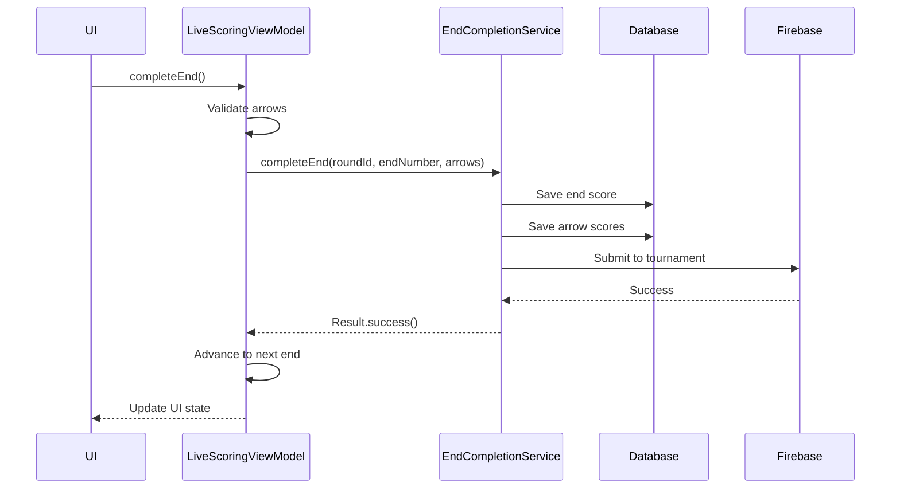

# LiveScoringViewModel API Reference

Complete API reference for the LiveScoringViewModel - the central ViewModel for active round scoring.

---

## Overview

**File:** `ui/viewmodels/LiveScoringViewModel.kt`
**Lines:** 2,808 lines
**Status:** ✅ Production | ⚠️ **God Class - Needs Refactoring**

### Purpose

LiveScoringViewModel manages all UI state and logic for active round scoring. It handles:
- Real-time arrow score input
- End completion and validation
- Tournament synchronization
- Live leaderboard updates
- Conflict resolution
- Multi-participant scoring
- Equipment tracking
- Statistics calculation

### Critical Status

⚠️ **God Class Warning:** At 2,808 lines with 66 methods handling 12 distinct domains, this is the largest ViewModel in the codebase.

**Recommended Refactoring:** Extract to 5 services (~1,600 lines, 57% reduction)

**See:** [[../../../../architecture/live-scoring-vm-analysis|Complete Architecture Analysis]]

---

## UI State

### Core State

```kotlin
data class LiveScoringUiState(
    // Round info
    val roundId: Long? = null,
    val roundName: String = "",
    val roundStatus: RoundStatus = RoundStatus.PLANNED,

    // Current end
    val currentEndNumber: Int = 1,
    val currentArrowNumber: Int = 1,
    val currentArrowScores: List<Int> = emptyList(),
    val isEndComplete: Boolean = false,

    // Progress
    val endsCompleted: Int = 0,
    val endsTotal: Int = 0,
    val progressPercentage: Float = 0f,

    // Participants
    val participants: List<Participant> = emptyList(),
    val activeParticipantId: Long? = null,

    // Tournament
    val isTournamentRound: Boolean = false,
    val tournamentId: Long? = null,
    val syncStatus: SyncStatus = SyncStatus.SYNCED,
    val leaderboard: List<LeaderboardEntry> = emptyList(),

    // Conflicts
    val hasConflicts: Boolean = false,
    val pendingConflicts: List<ScoreConflict> = emptyList(),

    // UI state
    val isLoading: Boolean = false,
    val error: String? = null,
    val showEndCompleteDialog: Boolean = false
)
```

---

## Key Responsibilities

### 1. Arrow Score Input

#### Record Arrow Score

```kotlin
fun recordArrowScore(score: Int, isX: Boolean = false)
```

**Purpose:** Records a single arrow score during active scoring

**Validation:**
- Score must be 0-10 (or M for miss)
- Cannot exceed arrows per end
- Round must be ACTIVE status

**Example:**
```kotlin
@Composable
fun ScoringButtons(viewModel: LiveScoringViewModel) {
    val state by viewModel.uiState.collectAsState()

    Row {
        (0..10).forEach { score ->
            Button(
                onClick = { viewModel.recordArrowScore(score) },
                enabled = !state.isEndComplete
            ) {
                Text("$score")
            }
        }

        // X-ring button (inner 10)
        Button(
            onClick = { viewModel.recordArrowScore(10, isX = true) }
        ) {
            Text("X")
        }
    }
}
```

#### Edit Arrow Score

```kotlin
fun editArrowScore(arrowNumber: Int, newScore: Int)
```

**Purpose:** Modifies a previously recorded arrow score

**Example:**
```kotlin
@Composable
fun ArrowScoreChips(viewModel: LiveScoringViewModel) {
    val state by viewModel.uiState.collectAsState()

    Row {
        state.currentArrowScores.forEachIndexed { index, score ->
            Chip(
                onClick = {
                    // Show edit dialog
                    showEditDialog(
                        arrowNumber = index + 1,
                        currentScore = score,
                        onConfirm = { newScore ->
                            viewModel.editArrowScore(index + 1, newScore)
                        }
                    )
                }
            ) {
                Text("$score")
            }
        }
    }
}
```

#### Clear Last Arrow

```kotlin
fun clearLastArrow()
```

**Purpose:** Removes the most recently recorded arrow

**Example:**
```kotlin
Button(
    onClick = { viewModel.clearLastArrow() },
    enabled = state.currentArrowScores.isNotEmpty()
) {
    Icon(Icons.Default.Backspace)
    Text("Undo")
}
```

---

### 2. End Completion

#### Complete End

```kotlin
fun completeEnd()
```

**Purpose:** Finalizes the current end and saves scores to database

**Process:**
1. Validates all arrows scored
2. Calculates end total and X-count
3. Saves to database via EndCompletionService
4. Submits to tournament (if applicable)
5. Advances to next end
6. Updates statistics

**Example:**
```kotlin
@Composable
fun EndCompleteButton(viewModel: LiveScoringViewModel) {
    val state by viewModel.uiState.collectAsState()

    Button(
        onClick = { viewModel.completeEnd() },
        enabled = state.currentArrowScores.size == state.arrowsPerEnd
    ) {
        Text("Complete End")
        Text("${state.currentArrowScores.sum()}")
    }
}
```

**Flow:**


---

### 3. Tournament Synchronization

#### Sync with Tournament

```kotlin
fun syncWithTournament()
```

**Purpose:** Manually triggers tournament data synchronization

**Automatic Sync:**
- On end completion
- Every 30 seconds during active round
- On app resume

**Example:**
```kotlin
@Composable
fun TournamentSyncIndicator(viewModel: LiveScoringViewModel) {
    val state by viewModel.uiState.collectAsState()

    when (state.syncStatus) {
        SyncStatus.SYNCED -> Icon(Icons.Default.CloudDone, tint = Color.Green)
        SyncStatus.SYNCING -> CircularProgressIndicator()
        SyncStatus.PENDING -> Icon(Icons.Default.CloudQueue, tint = Color.Orange)
        SyncStatus.ERROR -> {
            IconButton(onClick = { viewModel.syncWithTournament() }) {
                Icon(Icons.Default.CloudOff, tint = Color.Red)
            }
        }
    }
}
```

#### Observe Leaderboard

```kotlin
val leaderboard: StateFlow<List<LeaderboardEntry>>
```

**Purpose:** Real-time tournament leaderboard

**Example:**
```kotlin
@Composable
fun TournamentLeaderboard(viewModel: LiveScoringViewModel) {
    val leaderboard by viewModel.leaderboard.collectAsState()

    LazyColumn {
        itemsIndexed(leaderboard) { index, entry ->
            LeaderboardRow(
                rank = index + 1,
                participantName = entry.name,
                score = entry.totalScore,
                xCount = entry.xCount,
                isCurrentUser = entry.participantId == currentUserId
            )
        }
    }
}
```

---

### 4. Conflict Resolution

#### Resolve Conflict

```kotlin
fun resolveConflict(
    conflictId: String,
    resolution: ConflictResolution
)
```

**Purpose:** Resolves scoring conflicts between local and remote data

**Conflict Types:**
- Local vs Remote score mismatch
- Version conflicts
- Timestamp conflicts

**Example:**
```kotlin
@Composable
fun ConflictResolutionDialog(
    conflict: ScoreConflict,
    viewModel: LiveScoringViewModel
) {
    AlertDialog(
        title = { Text("Score Conflict Detected") },
        text = {
            Column {
                Text("Local score: ${conflict.localScore}")
                Text("Remote score: ${conflict.remoteScore}")
                Text("Which version to keep?")
            }
        },
        confirmButton = {
            Button(onClick = {
                viewModel.resolveConflict(
                    conflict.id,
                    ConflictResolution.LOCAL_WINS
                )
            }) {
                Text("Keep Local")
            }
        },
        dismissButton = {
            Button(onClick = {
                viewModel.resolveConflict(
                    conflict.id,
                    ConflictResolution.REMOTE_WINS
                )
            }) {
                Text("Keep Remote")
            }
        }
    )
}
```

---

### 5. Multi-Participant Scoring

#### Switch Active Participant

```kotlin
fun switchActiveParticipant(participantId: Long)
```

**Purpose:** Changes which participant is currently scoring

**Example:**
```kotlin
@Composable
fun ParticipantSelector(viewModel: LiveScoringViewModel) {
    val state by viewModel.uiState.collectAsState()

    Row {
        state.participants.forEach { participant ->
            FilterChip(
                selected = participant.id == state.activeParticipantId,
                onClick = { viewModel.switchActiveParticipant(participant.id) },
                label = { Text(participant.name) }
            )
        }
    }
}
```

#### Get Participant Score

```kotlin
fun getParticipantScore(participantId: Long): Int
```

**Purpose:** Retrieves current total score for a participant

---

## Complete Scoring Screen Example

```kotlin
@Composable
fun LiveScoringScreen(
    roundId: Long,
    viewModel: LiveScoringViewModel = viewModel()
) {
    LaunchedEffect(roundId) {
        viewModel.loadRound(roundId)
    }

    val state by viewModel.uiState.collectAsState()

    Scaffold(
        topBar = {
            TopAppBar(
                title = { Text(state.roundName) },
                actions = {
                    // Sync indicator
                    TournamentSyncIndicator(viewModel)

                    // Conflict warning
                    if (state.hasConflicts) {
                        IconButton(onClick = { showConflictDialog() }) {
                            Badge(badgeContent = { Text("${state.pendingConflicts.size}") }) {
                                Icon(Icons.Default.Warning)
                            }
                        }
                    }
                }
            )
        }
    ) { padding ->
        Column(modifier = Modifier.padding(padding)) {
            // Progress indicator
            LinearProgressIndicator(
                progress = state.progressPercentage,
                modifier = Modifier.fillMaxWidth()
            )

            Text("End ${state.currentEndNumber} / ${state.endsTotal}")

            // Participant selector (if multi-participant)
            if (state.participants.size > 1) {
                ParticipantSelector(viewModel)
            }

            // Current end scores
            Card {
                Text("Current End", style = MaterialTheme.typography.h6)

                Row {
                    state.currentArrowScores.forEachIndexed { index, score ->
                        ArrowScoreChip(
                            score = score,
                            arrowNumber = index + 1,
                            onClick = {
                                showEditDialog(index + 1, score) { newScore ->
                                    viewModel.editArrowScore(index + 1, newScore)
                                }
                            }
                        )
                    }
                }

                Text("Total: ${state.currentArrowScores.sum()}")
            }

            // Score input buttons
            ScoringButtons(viewModel)

            // Action buttons
            Row {
                Button(
                    onClick = { viewModel.clearLastArrow() },
                    enabled = state.currentArrowScores.isNotEmpty()
                ) {
                    Icon(Icons.Default.Backspace)
                    Text("Undo")
                }

                Spacer(Modifier.weight(1f))

                Button(
                    onClick = { viewModel.completeEnd() },
                    enabled = state.currentArrowScores.size == state.arrowsPerEnd
                ) {
                    Text("Complete End")
                }
            }

            // Leaderboard (if tournament)
            if (state.isTournamentRound) {
                Card {
                    Text("Leaderboard", style = MaterialTheme.typography.h6)
                    TournamentLeaderboard(viewModel)
                }
            }
        }
    }
}
```

---

## God Class Issues

### Current Problems

**Size:** 2,808 lines (7x recommended size)
**Methods:** 66 methods
**Domains:** 12 distinct responsibilities

### Domains Identified

1. **Arrow Input** (8 methods, ~200 lines)
2. **End Completion** (12 methods, ~400 lines)
3. **Tournament Sync** (10 methods, ~600 lines)
4. **Conflict Resolution** (8 methods, ~400 lines)
5. **Participant Management** (6 methods, ~200 lines)
6. **Round Lifecycle** (5 methods, ~200 lines)
7. **Progress Tracking** (4 methods, ~150 lines)
8. **Statistics** (4 methods, ~150 lines)
9. **Equipment** (3 methods, ~100 lines)
10. **UI State** (3 methods, ~100 lines)
11. **Error Handling** (2 methods, ~50 lines)
12. **Logging** (1 method, ~50 lines)

### Recommended Extractions

**Priority Services to Extract (1,600 lines, 57% reduction):**

1. **TournamentSyncService** (~600 lines) - ✅ **Already Extracted**
2. **ConflictResolutionService** (~400 lines) - ✅ **Already Extracted**
3. **EndCompletionService** (~400 lines) - ✅ **Already Extracted**
4. **RoundLifecycleService** (~200 lines) - 📝 **Recommended, Documented**
5. **ParticipantManagementService** (~200 lines) - 📝 **Recommended**

**After Extraction:**
- LiveScoringViewModel: ~1,200 lines (57% reduction)
- Focused on UI state and coordination
- Single responsibility: Scoring UI management

**See:** [[../../../../architecture/live-scoring-vm-analysis|Full Analysis & Extraction Plan]]

---

## Testing

### Unit Test Example

```kotlin
class LiveScoringViewModelTest {
    private lateinit var viewModel: LiveScoringViewModel
    private lateinit var mockRepository: RoundRepository
    private lateinit var mockEndCompletionService: EndCompletionService

    @Before
    fun setup() {
        mockRepository = mockk()
        mockEndCompletionService = mockk()
        viewModel = LiveScoringViewModel(mockRepository, mockEndCompletionService)
    }

    @Test
    fun `recordArrowScore adds score to current end`() = runTest {
        // Arrange
        viewModel.loadRound(testRoundId)
        advanceUntilIdle()

        // Act
        viewModel.recordArrowScore(10)
        viewModel.recordArrowScore(9)
        viewModel.recordArrowScore(10, isX = true)

        // Assert
        val state = viewModel.uiState.value
        assertEquals(listOf(10, 9, 10), state.currentArrowScores)
        assertEquals(3, state.currentArrowNumber)
    }

    @Test
    fun `completeEnd saves to database and advances`() = runTest {
        // Arrange
        coEvery { mockEndCompletionService.completeEnd(any(), any(), any()) } returns
            Result.success(Unit)

        viewModel.loadRound(testRoundId)
        repeat(6) { viewModel.recordArrowScore(10) }  // Fill end

        // Act
        viewModel.completeEnd()
        advanceUntilIdle()

        // Assert
        val state = viewModel.uiState.value
        assertEquals(2, state.currentEndNumber)  // Advanced to next end
        assertEquals(emptyList(), state.currentArrowScores)  // Cleared
        coVerify { mockEndCompletionService.completeEnd(any(), 1, listOf(10,10,10,10,10,10)) }
    }
}
```

---

## Performance Considerations

### State Updates

```kotlin
// GOOD: Single state update
private fun updateStateAfterEndComplete(nextEndNumber: Int) {
    _uiState.update { state ->
        state.copy(
            currentEndNumber = nextEndNumber,
            currentArrowScores = emptyList(),
            currentArrowNumber = 1,
            endsCompleted = state.endsCompleted + 1,
            progressPercentage = calculateProgress(nextEndNumber)
        )
    }
}

// BAD: Multiple state updates (causes multiple recompositions)
private fun updateStateAfterEndComplete(nextEndNumber: Int) {
    _uiState.update { it.copy(currentEndNumber = nextEndNumber) }
    _uiState.update { it.copy(currentArrowScores = emptyList()) }
    _uiState.update { it.copy(currentArrowNumber = 1) }
    // ...
}
```

### Flow Collection

```kotlin
// Collect tournament updates in viewModelScope
init {
    viewModelScope.launch {
        tournamentSyncService.syncStatus.collect { status ->
            _uiState.update { it.copy(syncStatus = status) }
        }
    }
}
```

---

## Related Documentation

**Architecture:**
- [[../../../../architecture/live-scoring-vm-analysis|Complete Architecture Analysis]]
- [[../../../../architecture/mvvm-patterns|MVVM Patterns]]
- [[../../../../architecture/service-extraction-pattern|Service Extraction]]

**Related Components:**
- [[../services/end-completion-service|EndCompletionService]]
- [[../services/tournament-sync-service|TournamentSyncService]]
- [[../services/score-conflict-resolution-service|ScoreConflictResolutionService]]
- [[../services/round-lifecycle-service|RoundLifecycleService]]
- [[../repositories/round-repository|RoundRepository]]

**Flows:**
- [[../../../flows/scoring-flow|Scoring Flow]]
- [[../../../flows/data-sync-flow|Data Sync Flow]]

---

## Contributing

When modifying LiveScoringViewModel:

1. **Consider extraction first** - This ViewModel is too large
2. **Use service layer** - Delegate business logic to services
3. **Single state updates** - Minimize recompositions
4. **Add tests** - Critical path needs comprehensive testing
5. **Document changes** - This is the most complex ViewModel

**Recommended:** Before adding new features, extract existing services to reduce complexity.

---

**Status:** ✅ Production | ⚠️ God Class - Needs Refactoring
**Priority:** Critical - Most used ViewModel
**Lines:** 2,808 (7x too large)
**Extraction Potential:** 57% reduction (1,600 lines to services)
**Last Updated:** 2025-11-01
