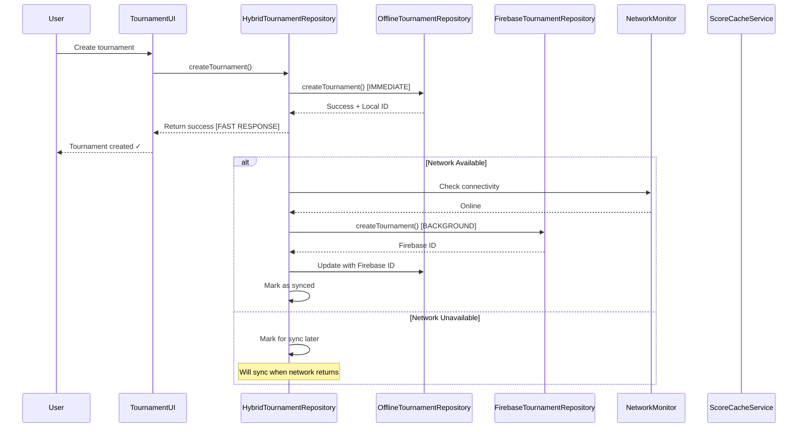

[Home](/) > [Technical Reference](/Technical-Reference/) > [Flows](/Technical-Reference/Flows/) > [System Flows](/Technical-Reference/Flows/System-Flows/) > Data Sync Flow

---


# Data Sync Flow

---
tags: #flow #data-sync #firebase #offline-first #conflict-resolution #real-time
created: 2025-10-08
related:
  - "[[Flows/Tournament-Flow]]"
  - "[[Flows/Scoring-Flow]]"
  - "[[Architecture/MVVM-Architecture]]"
  - "[[Architecture/Hybrid-Tournament-Architecture]]"
---

## Overview

The Data Sync Flow describes how tournament data synchronizes between local storage and Firebase for real-time collaboration and offline support. This flow implements an offline-first architecture with automatic sync, conflict resolution, and network monitoring.

### Architecture Components

**Sync Layer:**
- Hybrid repository pattern (offline-first with Firebase sync)
- TournamentSyncService for real-time Firebase listeners
- ScoreConflictResolutionService for conflict detection
- Network connectivity monitoring
- Exponential backoff retry logic
- Smart caching with TTL

### Offline-First Strategy

```
User Action → Local Storage (Immediate) → Background Sync → Firebase
                    ↓
               UI Update
```

**Key Principles:**
1. **Local First**: All operations complete locally immediately
2. **Background Sync**: Firebase sync happens asynchronously
3. **Network Independent**: App fully functional offline
4. **Automatic Recovery**: Sync retries when network available
5. **Conflict Resolution**: Handle simultaneous edits gracefully

---

## Tournament Sync Architecture

### Entry Point: HybridTournamentRepository

**Purpose:** Seamless offline/online tournament functionality

**Call Chain:**
1. `HybridTournamentRepository.kt:58` - Primary sync coordinator
2. `OfflineTournamentRepository` - Local Room database
3. `FirebaseTournamentRepository` - Firebase Firestore operations
4. `TournamentScoreCacheService` - Smart caching layer

### Hybrid Repository Pattern



### Network Connectivity Monitoring

**Code:** `HybridTournamentRepository.kt:70`

```kotlin
private val networkCallback = object : ConnectivityManager.NetworkCallback() {
    override fun onAvailable(network: Network) {
        isNetworkAvailable = true
        // Trigger background sync when network becomes available
        syncScope.launch {
            syncPendingTournaments()
        }
    }

    override fun onLost(network: Network) {
        isNetworkAvailable = false
    }
}

init {
    // Register network monitoring
    val networkRequest = NetworkRequest.Builder()
        .addCapability(NetworkCapabilities.NET_CAPABILITY_INTERNET)
        .build()
    connectivityManager.registerNetworkCallback(networkRequest, networkCallback)
    
    // Check initial network state
    isNetworkAvailable = connectivityManager.activeNetwork != null
}
```

**Network Detection:**
- Continuous monitoring via `NetworkCallback`
- Automatic sync trigger on connectivity restoration
- Initial state check on repository creation
- Graceful degradation when offline

---

## Tournament Creation Sync Flow

### Offline-First Tournament Creation

**Entry Point:** User creates tournament

**Call Chain:**
1. `HybridTournamentRepository.kt:218` - `createTournament()` - Hybrid logic
2. `OfflineTournamentRepository.createTournament()` - Immediate local storage
3. `FirebaseTournamentRepository.createTournament()` - Background Firebase sync

### Tournament Creation Process

```mermaid
sequenceDiagram
    participant User
    participant UI
    participant Hybrid as HybridTournamentRepository
    participant Local as OfflineTournamentRepository
    participant Firebase as FirebaseTournamentRepository
    participant DB as Room Database

    User->>UI: Fill tournament details, tap Create
    UI->>Hybrid: createTournament(tournament)
    
    Hybrid->>Local: createTournament(tournament)
    Local->>DB: INSERT INTO tournaments
    DB-->>Local: Tournament ID (local_123)
    Local-->>Hybrid: Success(local_123)
    
    Hybrid-->>UI: Success(local_123) [IMMEDIATE RESPONSE]
    UI-->>User: Tournament created! (local_123)
    
    Note over Hybrid,Firebase: Background sync starts
    
    alt Online & Authenticated
        Hybrid->>Firebase: createTournament(tournament)
        Firebase->>Firebase: Anonymous sign-in if needed
        Firebase->>Firebase: Create Firestore document
        Firebase->>Firebase: Set security subcollections
        Firebase-->>Hybrid: Success(firebase_abc123)
        
        Hybrid->>Local: Update tournament with Firebase ID
        Hybrid->>Hybrid: handleTournamentIdMapping(local_123, firebase_abc123)
        
        Hybrid->>Local: Delete old local ID record
        Hybrid->>Local: Create new record with Firebase ID
    else Offline or Anonymous
        Hybrid->>Hybrid: markTournamentForSync(local_123)
        Note over Hybrid: Will sync when network available
    end
</mermaid>

### Creation Sync Logic

**Code:** `HybridTournamentRepository.kt:218`

```kotlin
override suspend fun createTournament(tournament: Tournament): Result<TournamentId> {
    LogConfig.tournamentSync("HybridTournamentRepository", 
        "🏆 Creating tournament: '${tournament.name}', isLocal: ${tournament.isLocal}")

    // Always create locally first for immediate response
    val localResult = offlineRepository.createTournament(tournament)
    LogConfig.tournamentSync("HybridTournamentRepository", 
        "📱 Local creation: ${localResult.isSuccess}, ID=${localResult.getOrNull()}")

    if (localResult.isSuccess && isNetworkAvailable) {
        // Sync to Firebase in background
        syncScope.launch {
            try {
                val tournamentId = localResult.getOrNull()!!
                val localTournament = offlineRepository.getTournament(tournamentId)
                    .getOrNull()
                
                if (localTournament != null) {
                    val currentUser = FirebaseAuth.getInstance().currentUser
                    val isAnonymousUser = currentUser == null || currentUser.isAnonymous

                    if (!localTournament.isLocal && !isAnonymousUser) {
                        LogConfig.tournamentSync("HybridTournamentRepository", 
                            "🔄 Syncing to Firebase...")
                        
                        val firebaseResult = firebaseRepository
                            .createTournament(localTournament)
                        
                        if (firebaseResult.isSuccess) {
                            val firebaseId = firebaseResult.getOrNull()!!
                            LogConfig.tournamentSync("HybridTournamentRepository", 
                                "✅ Synced to Firebase: $firebaseId")
                            
                            if (firebaseId != tournamentId) {
                                handleTournamentIdMapping(tournamentId, firebaseId)
                            }
                        }
                    }
                }
            } catch (e: Exception) {
                LogConfig.e("HybridTournamentRepository", 
                    "💥 Firebase sync failed", e)
            }
        }
    } else if (localResult.isSuccess) {
        LogConfig.tournamentSync("HybridTournamentRepository", 
            "🌐 Network unavailable, created locally only")
    }

    return localResult
}
```

---

## Real-Time Score Sync Flow

### Entry Point: TournamentSyncService

**Purpose:** Real-time Firebase listeners for tournament updates

**Call Chain:**
1. `TournamentSyncService.kt:142` - `setupTournamentSync()` - Establish listeners
2. `FirebaseTournamentRepository.getTournamentLeaderboard()` - Leaderboard Flow
3. `FirebaseTournamentRepository.observeTournamentScores()` - Detailed scores Flow

### Real-Time Sync Setup

```mermaid
sequenceDiagram
    participant ViewModel as LiveScoringViewModel
    participant SyncSvc as TournamentSyncService
    participant Firebase as FirebaseTournamentRepository
    participant Firestore as Firebase Firestore
    participant Conflict as ScoreConflictResolutionService

    ViewModel->>SyncSvc: setupTournamentSync(tournamentId, roundNumber)
    
    Note over SyncSvc: Launch 3 concurrent listeners
    
    par Leaderboard Listener
        SyncSvc->>Firebase: getTournamentLeaderboard(tournamentId)
        Firebase->>Firestore: Observe leaderboard collection
        Firestore-->>Firebase: Flow<List<LeaderboardEntry>>
        Firebase-->>SyncSvc: Leaderboard updates
        SyncSvc->>SyncSvc: _liveLeaderboard.value = entries
        SyncSvc-->>ViewModel: Observe liveLeaderboard StateFlow
    and Participants Listener
        SyncSvc->>Firebase: getTournamentParticipants(tournamentId)
        Firebase->>Firestore: Observe participants collection
        Firestore-->>Firebase: Flow<List<TournamentParticipant>>
        Firebase-->>SyncSvc: Participant updates
        SyncSvc->>SyncSvc: _tournamentParticipants.value = participants
    and Detailed Scores Listener
        SyncSvc->>Firebase: observeTournamentScores(tournamentId, roundNumber)
        Firebase->>Firestore: Observe scores subcollection
        Firestore-->>Firebase: Flow<List<TournamentScore>>
        Firebase-->>SyncSvc: Score updates
        SyncSvc->>SyncSvc: _incomingTournamentScores.value = scores
        
        ViewModel->>ViewModel: Observe incomingTournamentScores
        ViewModel->>Conflict: detectConflicts(scores, localEnds)
        Conflict-->>ViewModel: Map of conflicts
        
        alt Conflicts Detected
            Conflict->>Conflict: determineConflictResolution()
            Conflict-->>ViewModel: Resolution strategy
            ViewModel->>UI: Show conflict UI
        else No Conflicts
            ViewModel->>ViewModel: Update remote participant scores
        end
    end
</mermaid>

### Sync Service Setup

**Code:** `TournamentSyncService.kt:142`

```kotlin
fun setupTournamentSync(tournamentId: String, currentRoundNumber: Int = 1) {
    scope.launch {
        try {
            android.util.Log.d("TournamentSync", 
                "🏆 Setting up real-time sync for tournament $tournamentId")
            val tournamentRepository = getTournamentRepository()

            // Setup leaderboard observation for overall standings
            leaderboardListenerJob = launch {
                tournamentRepository.getTournamentLeaderboard(tournamentId)
                    .collect { leaderboardEntries ->
                        android.util.Log.d("TournamentSync", 
                            "📊 Received ${leaderboardEntries.size} leaderboard updates")
                        
                        // Store leaderboard data for UI consumption
                        _liveLeaderboard.value = leaderboardEntries
                        syncTournamentScores(leaderboardEntries)
                    }
            }

            // Setup tournament participants observation
            participantsListenerJob = launch {
                tournamentRepository.getTournamentParticipants(tournamentId)
                    .collect { participants ->
                        android.util.Log.d("TournamentSync", 
                            "👥 Received ${participants.size} participant updates")
                        _tournamentParticipants.value = participants
                    }
            }

            // Setup detailed score observation
            launch {
                tournamentRepository.observeTournamentScores(
                    tournamentId, 
                    currentRoundNumber
                ).collect { tournamentScores ->
                    android.util.Log.d("TournamentSync", 
                        "🎯 Received ${tournamentScores.size} detailed score updates")
                    syncDetailedTournamentScores(tournamentScores)
                }
            }

        } catch (e: Exception) {
            android.util.Log.e("TournamentSync", 
                "❌ Failed to setup tournament sync", e)
            _syncStatus.value = TournamentSyncStatus.Error(
                "Failed to sync tournament scores: ${e.message}"
            )
        }
    }
}
```

---

## Score Submission with Retry Logic

### Entry Point: Submit Tournament Score

**User Action:** Complete an end in tournament round

**Call Chain:**
1. `EndCompletionService.kt:296` - `submitTournamentEnd()` - Initiate async submission
2. `TournamentSyncService.kt:240` - `submitTournamentScoreWithRetry()` - Retry logic
3. `FirebaseTournamentRepository.submitScore()` - Firebase write

### Score Submission Process

```mermaid
sequenceDiagram
    participant User
    participant EndSvc as EndCompletionService
    participant SyncSvc as TournamentSyncService
    participant Firebase as FirebaseTournamentRepository
    participant Firestore as Firebase Firestore

    User->>EndSvc: Complete end
    EndSvc->>EndSvc: Validate and save locally
    
    EndSvc->>SyncSvc: submitTournamentScoreWithRetry() [ASYNC]
    Note over EndSvc,User: User continues immediately
    
    SyncSvc->>SyncSvc: Update status: Syncing
    
    loop Max 3 attempts
        SyncSvc->>Firebase: submitScore(tournamentId, scores)
        Firebase->>Firestore: Write to scores subcollection
        
        alt Success
            Firestore-->>Firebase: Success
            Firebase-->>SyncSvc: Result.success
            SyncSvc->>SyncSvc: Update status: Success
            Note over SyncSvc: Exit retry loop
        else Failure
            Firestore-->>Firebase: Error (network/timeout/etc)
            Firebase-->>SyncSvc: Result.failure
            
            alt Attempt < Max
                SyncSvc->>SyncSvc: Exponential backoff delay
                Note over SyncSvc: Wait 100ms, 200ms, 400ms...
            else Max attempts reached
                SyncSvc->>SyncSvc: Classify error type
                SyncSvc->>SyncSvc: Update status: Error(type, message)
                SyncSvc-->>EndSvc: false (score saved locally)
            end
        end
    end
</mermaid>

### Retry Logic with Exponential Backoff

**Code:** `TournamentSyncService.kt:240`

```kotlin
suspend fun submitTournamentScoreWithRetry(
    tournamentId: String,
    participantId: String,
    roundNumber: Int,
    endNumber: Int,
    arrowScores: List<Int>,
    isXFlags: List<Boolean> = emptyList(),
    deviceId: String,
    maxRetries: Int = 3,
    onSyncStatusUpdate: ((TournamentSyncStatus) -> Unit)? = null
): Boolean {
    // Validation
    if (arrowScores.isEmpty()) {
        android.util.Log.w("TournamentScoreSync", 
            "⚠️ Cannot submit empty arrow scores")
        return false
    }

    val tournamentRepository = getTournamentRepository()

    // Update sync status
    val syncingStatus = TournamentSyncStatus.Syncing
    _syncStatus.value = syncingStatus
    onSyncStatusUpdate?.invoke(syncingStatus)
    
    android.util.Log.d("TournamentScoreSync", 
        "🔄 Starting score submission: End $endNumber, ${arrowScores.size} arrows")

    var attempt = 0
    var lastException: Exception? = null

    while (attempt < maxRetries) {
        try {
            android.util.Log.d("TournamentScoreSync", 
                "🏆 Attempt ${attempt + 1}/$maxRetries")

            val result = tournamentRepository.submitScore(
                tournamentId = tournamentId,
                participantId = participantId,
                roundNumber = roundNumber,
                arrowScores = arrowScores,
                isXFlags = isXFlags, // CRITICAL: X-ring flags for tie-breaking
                endNumber = endNumber,
                deviceId = deviceId
            )

            if (result.isSuccess) {
                android.util.Log.d("TournamentScoreSync", 
                    "✅ Score submitted successfully on attempt ${attempt + 1}")

                val successStatus = TournamentSyncStatus.Success(
                    participantCount = 1,
                    message = "End $endNumber synced"
                )
                _syncStatus.value = successStatus
                onSyncStatusUpdate?.invoke(successStatus)

                return true
            } else {
                lastException = result.exceptionOrNull() as? Exception 
                    ?: Exception("Unknown error")
                android.util.Log.w("TournamentScoreSync", 
                    "⚠️ Attempt ${attempt + 1} failed: ${lastException.message}")
            }
        } catch (e: Exception) {
            lastException = e
            android.util.Log.w("TournamentScoreSync", 
                "⚠️ Attempt ${attempt + 1} exception: ${e.message}")
        }

        attempt++
        if (attempt < maxRetries) {
            // Exponential backoff: 100ms, 200ms, 400ms...
            val delayMs = 100L * (1 shl (attempt - 1))
            android.util.Log.d("TournamentScoreSync", 
                "🕒 Waiting ${delayMs}ms before retry...")
            kotlinx.coroutines.delay(delayMs)
        }
    }

    android.util.Log.e("TournamentScoreSync", 
        "❌ Failed after $maxRetries attempts: ${lastException?.message}", 
        lastException)

    // Enhanced error reporting with error types
    val errorType = when {
        lastException?.message?.contains("network", ignoreCase = true) == true -> 
            SyncErrorType.NETWORK_ERROR
        lastException?.message?.contains("timeout", ignoreCase = true) == true -> 
            SyncErrorType.TIMEOUT
        lastException?.message?.contains("permission", ignoreCase = true) == true -> 
            SyncErrorType.PERMISSION_DENIED
        lastException?.message?.contains("validation", ignoreCase = true) == true -> 
            SyncErrorType.VALIDATION_ERROR
        else -> SyncErrorType.UNKNOWN
    }

    val errorMessage = when (errorType) {
        SyncErrorType.NETWORK_ERROR -> 
            "No internet connection. Score saved locally."
        SyncErrorType.TIMEOUT -> 
            "Request timed out. Score saved locally."
        SyncErrorType.PERMISSION_DENIED -> 
            "Permission denied. Check tournament settings."
        SyncErrorType.VALIDATION_ERROR -> 
            "Invalid score data. Please check your scores."
        else -> 
            "Failed to sync end $endNumber. Score saved locally."
    }

    val errorStatus = TournamentSyncStatus.Error(
        message = errorMessage,
        errorType = errorType,
        retryable = errorType != SyncErrorType.PERMISSION_DENIED,
        retryCount = maxRetries
    )
    _syncStatus.value = errorStatus
    onSyncStatusUpdate?.invoke(errorStatus)

    // Score is saved locally - don't fail the entire operation
    return false
}
```

### Error Classification

**Code:** `TournamentSyncService.kt:36`

```kotlin
enum class SyncErrorType {
    NETWORK_ERROR,       // No internet connection
    TIMEOUT,             // Request timed out
    PERMISSION_DENIED,   // User doesn't have permission
    VALIDATION_ERROR,    // Score validation failed
    CONFLICT,            // Score conflict detected
    SERVER_ERROR,        // Firebase server error
    UNKNOWN              // Unknown error
}
```

---

## Conflict Resolution Flow

### Entry Point: Detect Score Conflicts

**Trigger:** Incoming Firebase score differs from local score

**Call Chain:**
1. `TournamentSyncService._incomingTournamentScores` - StateFlow updates
2. `LiveScoringViewModel` - Observes incoming scores
3. `ScoreConflictResolutionService.kt:69` - `detectConflicts()` - Conflict detection
4. `ScoreConflictResolutionService.kt:178` - `resolveConflict()` - Apply resolution

### Conflict Detection Process

```mermaid
sequenceDiagram
    participant Firebase
    participant SyncSvc as TournamentSyncService
    participant ViewModel as LiveScoringViewModel
    participant Conflict as ScoreConflictResolutionService
    participant UI as ConflictDialog

    Firebase->>SyncSvc: Score update (remote=25, version=2)
    SyncSvc->>SyncSvc: _incomingTournamentScores.value = [scores]
    
    ViewModel->>ViewModel: Observe incomingTournamentScores
    ViewModel->>ViewModel: Get local editable IDs
    ViewModel->>ViewModel: Get local ends map
    
    ViewModel->>Conflict: detectConflicts(scores, editableIds, localEnds)
    
    loop For each remote score
        Conflict->>Conflict: Find corresponding local end
        
        alt Local end exists
            Conflict->>Conflict: Compare local vs remote total
            
            alt Scores differ
                Conflict->>Conflict: determineConflictResolution()
                
                alt Remote version > Local version
                    Conflict-->>Conflict: Strategy: REMOTE_WINS
                else Local version > Remote version
                    Conflict-->>Conflict: Strategy: LOCAL_WINS
                else Same version, recent update (<5min)
                    Conflict-->>Conflict: Strategy: MANUAL
                else Same version, old update (>5min)
                    Conflict-->>Conflict: Strategy: LOCAL_WINS
                end
                
                Conflict->>Conflict: Create ScoreConflict object
                Conflict->>Conflict: Add to conflicts map
            end
        end
    end
    
    Conflict->>Conflict: Update _scoreConflicts StateFlow
    Conflict-->>ViewModel: Map of conflicts
    
    alt Conflicts detected
        ViewModel->>UI: Show conflict notification
        UI-->>User: "Score conflict detected for End 3"
        
        User->>UI: Review conflict
        UI->>Conflict: resolveConflict(participantId, endNumber, strategy)
        
        alt Strategy = LOCAL_WINS
            Conflict->>Conflict: Keep local score
        else Strategy = REMOTE_WINS
            Conflict->>Conflict: Accept remote score
            Conflict->>ViewModel: Update local end with remote data
        else Strategy = HIGHEST_WINS
            Conflict->>Conflict: Use max(local, remote)
        else Strategy = MANUAL
            Conflict->>UI: Require user selection
        end
        
        Conflict->>Conflict: Mark conflict as resolved
        Conflict-->>ViewModel: Resolved score
    end
</mermaid>

### Conflict Detection Logic

**Code:** `ScoreConflictResolutionService.kt:69`

```kotlin
fun detectConflicts(
    tournamentScores: List<TournamentScore>,
    localEditableIds: Set<String>,
    localEndsMap: Map<String, List<EndScoreWithArrows>>
): Map<String, ScoreConflict> {
    val conflicts = mutableMapOf<String, ScoreConflict>()

    // Group scores by participant
    val scoresByParticipant = tournamentScores.groupBy { it.participantId }

    scoresByParticipant.forEach { (participantId, scores) ->
        // Check for conflicts on locally editable participants only
        if (participantId in localEditableIds) {
            val localEnds = localEndsMap[participantId] ?: emptyList()

            scores.forEach { remoteScore ->
                val localEnd = localEnds.find { 
                    it.endScore.endNumber == remoteScore.endNumber 
                }

                if (localEnd != null && 
                    localEnd.endScore.totalScore != remoteScore.endTotal) {
                    
                    val conflictKey = "${participantId}_${remoteScore.endNumber}"

                    // Determine resolution strategy
                    val strategy = determineConflictResolution(
                        localScore = localEnd.endScore.totalScore,
                        remoteScore = remoteScore.endTotal,
                        localVersion = 1, // TODO: Add version tracking
                        remoteVersion = remoteScore.version,
                        remoteTimestamp = remoteScore.timestamp
                    )

                    conflicts[conflictKey] = ScoreConflict(
                        participantId = participantId,
                        endNumber = remoteScore.endNumber,
                        localScore = localEnd.endScore.totalScore,
                        remoteScore = remoteScore.endTotal,
                        localVersion = 1,
                        remoteVersion = remoteScore.version,
                        remoteTimestamp = remoteScore.timestamp,
                        localTimestamp = localEnd.endScore.scoredAt,
                        resolutionStrategy = strategy
                    )

                    android.util.Log.w("ConflictDetection",
                        "⚠️ Conflict detected: $participantId end ${remoteScore.endNumber} " +
                        "(local: ${localEnd.endScore.totalScore}, " +
                        "remote: ${remoteScore.endTotal}, strategy: $strategy)")
                }
            }
        }
    }

    // Update state
    if (conflicts.isNotEmpty()) {
        _scoreConflicts.value = conflicts
        android.util.Log.w("ConflictResolution", 
            "⚠️ ${conflicts.size} score conflicts detected")
    } else if (_scoreConflicts.value.isNotEmpty()) {
        _scoreConflicts.value = emptyMap()
    }

    return conflicts
}
```

### Conflict Resolution Strategies

**Code:** `ScoreConflictResolutionService.kt:138`

```kotlin
private fun determineConflictResolution(
    localScore: Int,
    remoteScore: Int,
    localVersion: Int,
    remoteVersion: Int,
    remoteTimestamp: Long
): ConflictResolutionStrategy {
    // Version-based resolution: Higher version wins
    return when {
        remoteVersion > localVersion -> {
            android.util.Log.d("ConflictResolution", 
                "Remote version newer (remote v$remoteVersion > local v$localVersion)")
            ConflictResolutionStrategy.REMOTE_WINS
        }
        remoteVersion < localVersion -> {
            android.util.Log.d("ConflictResolution", 
                "Local version newer (local v$localVersion > remote v$remoteVersion)")
            ConflictResolutionStrategy.LOCAL_WINS
        }
        else -> {
            // Same version - use timestamp-based resolution
            val now = System.currentTimeMillis()
            val ageMinutes = (now - remoteTimestamp) / (1000 * 60)

            // If remote update is recent (<5 minutes), suggest manual resolution
            if (ageMinutes < 5) {
                android.util.Log.d("ConflictResolution", 
                    "Recent remote update (${ageMinutes}min ago) - suggest MANUAL")
                ConflictResolutionStrategy.MANUAL
            } else {
                // Remote update is old - local has authority
                android.util.Log.d("ConflictResolution", 
                    "Old remote update (${ageMinutes}min ago) - suggest LOCAL_WINS")
                ConflictResolutionStrategy.LOCAL_WINS
            }
        }
    }
}
```

**Resolution Strategies:** `ScoreConflictResolutionService.kt:34`

```kotlin
enum class ConflictResolutionStrategy {
    LOCAL_WINS,      // Keep local score (default - local authority)
    REMOTE_WINS,     // Accept remote score
    HIGHEST_WINS,    // Use highest score
    LATEST_WINS,     // Use most recently updated score
    MANUAL           // Requires user intervention
}
```

---

## Smart Caching Strategy

### Entry Point: Participant Score Fetch

**Purpose:** Reduce Firebase reads with intelligent caching

**Call Chain:**
1. `HybridTournamentRepository.kt:742` - `getParticipantRoundArrows()` - Check cache
2. `TournamentScoreCacheService.hasFreshCache()` - Cache freshness check
3. `TournamentScoreCacheService.getCachedScores()` - Retrieve from cache
4. `FirebaseTournamentRepository.getParticipantRoundArrows()` - Fetch from Firebase

### Smart Cache Process

```mermaid
sequenceDiagram
    participant UI
    participant Hybrid as HybridTournamentRepository
    participant Cache as ScoreCacheService
    participant Firebase as FirebaseTournamentRepository
    participant Firestore

    UI->>Hybrid: getParticipantRoundArrows(tournamentId, participantId, round)
    
    alt Feature flag enabled
        Hybrid->>Hybrid: Get tournament status
        
        alt Tournament COMPLETED
            Hybrid->>Cache: hasFreshCache(id, round, participant, COMPLETED)
            Cache-->>Hybrid: true (indefinite TTL for completed)
            
            Hybrid->>Cache: getCachedScores()
            Cache-->>Hybrid: Cached EndScoreWithArrows
            Hybrid-->>UI: Return cached data [NO FIREBASE READ]
            Note over UI: Cache hit - instant response
        else Tournament IN_PROGRESS
            Hybrid->>Cache: hasFreshCache(id, round, participant, IN_PROGRESS)
            
            alt Cache fresh (< 5 minutes)
                Cache-->>Hybrid: true
                Hybrid->>Cache: getCachedScores()
                Cache-->>Hybrid: Cached data
                Hybrid-->>UI: Return cached data [INITIAL]
                
                Note over Hybrid,Firebase: Set up real-time listener for updates
                Hybrid->>Firebase: getParticipantRoundArrows() [Flow]
                Firebase->>Firestore: Real-time listener
                Firestore-->>Firebase: Updates
                Firebase-->>Hybrid: New scores
                Hybrid->>Cache: Update cache
                Hybrid-->>UI: Emit updates
            else Cache stale or miss
                Cache-->>Hybrid: false
                Hybrid->>Firebase: getParticipantRoundArrows() [Flow]
                Firebase->>Firestore: Fetch from Firebase
                Firestore-->>Firebase: EndScoreWithArrows
                Firebase-->>Hybrid: Scores
                
                Hybrid->>Cache: cacheScores(scores, status)
                Hybrid-->>UI: Return scores
            end
        end
    else Feature flag disabled
        Hybrid->>Firebase: getParticipantRoundArrows() [Always real-time]
        Firebase-->>Hybrid: Scores
        Hybrid-->>UI: Return scores
    end
</mermaid>

### Cache Implementation

**Code:** `HybridTournamentRepository.kt:742`

```kotlin
override fun getParticipantRoundArrows(
    tournamentId: TournamentId,
    participantId: String,
    roundNumber: Int
): Flow<List<EndScoreWithArrows>> {
    return if (isNetworkAvailable) {
        kotlinx.coroutines.flow.flow {
            // Smart caching - check feature flag
            if (CacheFeatureFlags.enableTournamentScoreCache && 
                CacheFeatureFlags.enableSmartListeners) {
                
                // Get tournament status for cache strategy
                val tournament = getTournament(tournamentId).getOrNull()
                val tournamentStatus = tournament?.status 
                    ?: TournamentStatus.IN_PROGRESS

                if (CacheFeatureFlags.logCacheMetrics) {
                    LogConfig.d("HybridTournamentRepo",
                        "🔍 Smart cache check: $tournamentId/$roundNumber/$participantId " +
                        "(status: $tournamentStatus)")
                }

                // Check if cache is fresh
                val hasFreshCache = scoreCacheService.hasFreshCache(
                    tournamentId,
                    roundNumber,
                    participantId,
                    tournamentStatus
                )

                if (hasFreshCache) {
                    // Cache hit - serve from cache
                    val cachedScores = scoreCacheService.getCachedScores(
                        tournamentId,
                        roundNumber,
                        participantId
                    )

                    if (cachedScores.isNotEmpty()) {
                        if (CacheFeatureFlags.logCacheMetrics) {
                            LogConfig.d("HybridTournamentRepo",
                                "✅ Cache hit: ${cachedScores.size} cached ends")
                        }
                        emit(cachedScores)

                        // For completed tournaments - we're done, no real-time updates
                        if (tournamentStatus == TournamentStatus.COMPLETED) {
                            return@flow
                        }
                    }
                } else {
                    // Cache miss - fetch from Firestore
                    if (CacheFeatureFlags.logCacheMetrics) {
                        LogConfig.d("HybridTournamentRepo", 
                            "❌ Cache miss: Fetching from Firestore")
                    }
                    CacheMetrics.recordFirestoreRead(
                        "$tournamentId:$roundNumber:$participantId"
                    )
                }

                // For IN_PROGRESS or cache miss: real-time Firestore listener
                emitAll(
                    firebaseRepository.getParticipantRoundArrows(
                        tournamentId, participantId, roundNumber
                    )
                    .onEach { arrows ->
                        // Cache the fetched data
                        if (arrows.isNotEmpty()) {
                            scoreCacheService.cacheScores(
                                tournamentId,
                                roundNumber,
                                participantId,
                                arrows,
                                tournamentStatus
                            )
                        }
                    }
                    .catch { error ->
                        LogConfig.w("HybridTournamentRepo", 
                            "Failed to get arrows from Firebase: ${error.message}")
                        emit(emptyList())
                    }
                )
            } else {
                // Feature flag disabled - use existing behavior
                emitAll(
                    firebaseRepository.getParticipantRoundArrows(
                        tournamentId, participantId, roundNumber
                    )
                    .catch { error ->
                        LogConfig.w("HybridTournamentRepo", 
                            "Failed to get arrows: ${error.message}")
                        emit(emptyList())
                    }
                )
            }
        }
    } else {
        // Offline mode: use local repository
        offlineRepository.getParticipantRoundArrows(
            tournamentId, participantId, roundNumber
        )
    }
}
```

### Cache TTL Strategy

**By Tournament Status:**

| Status | TTL | Rationale |
|--------|-----|-----------|
| **COMPLETED** | Indefinite | Immutable data, never invalidate |
| **IN_PROGRESS** | 5 minutes | Balance freshness vs Firebase reads |
| **PLANNED** | 10 minutes | Rarely changes before start |

**Cache Invalidation Triggers:**
- Tournament status changes to COMPLETED
- Manual refresh (pull-to-refresh)
- Push notification received
- Data integrity issue detected

---

## Batch Operations Optimization

### Entry Point: Batch Fetch Participant Scores

**Purpose:** Efficiently load multiple participant scores

**Call Chain:**
1. `HybridTournamentRepository.kt:846` - `batchFetchParticipantScores()` - Batch coordinator
2. `TournamentScoreCacheService` - Check cache for each participant
3. `FirebaseTournamentRepository.batchFetchParticipantScores()` - Batch fetch from Firebase

### Batch Fetch Process

```mermaid
sequenceDiagram
    participant UI as ParticipantSelector
    participant Hybrid as HybridTournamentRepository
    participant Cache as ScoreCacheService
    participant Firebase as FirebaseTournamentRepository
    participant Firestore

    UI->>Hybrid: batchFetchParticipantScores(tournamentId, roundNumber, [IDs])
    
    Hybrid->>Hybrid: Get tournament status
    
    loop For each participant ID
        Hybrid->>Cache: hasFreshCache(id, round, participantId, status)
        
        alt Cache hit
            Cache-->>Hybrid: true
            Hybrid->>Cache: getCachedScores(id, round, participantId)
            Cache-->>Hybrid: Cached scores
            Hybrid->>Hybrid: result[participantId] = cachedTotal
        else Cache miss
            Hybrid->>Hybrid: Add to participantsNeedingFetch list
        end
    end
    
    alt Participants need fetch
        Hybrid->>Firebase: batchFetchParticipantScores(id, round, [missing IDs])
        Firebase->>Firestore: Batch query
        Firestore-->>Firebase: Map<participantId, List<EndScoreWithArrows>>
        Firebase-->>Hybrid: Fetched scores
        
        loop For each fetched participant
            Hybrid->>Hybrid: Calculate total score
            Hybrid->>Hybrid: result[participantId] = total
            Hybrid->>Cache: cacheScores(scores, status)
        end
    end
    
    Hybrid-->>UI: Map<participantId, totalScore>
</mermaid>

### Batch Fetch Optimization

**Code:** `HybridTournamentRepository.kt:846`

```kotlin
suspend fun batchFetchParticipantScores(
    tournamentId: TournamentId,
    roundNumber: Int,
    participantIds: List<String>
): Map<String, Int> {
    if (!isNetworkAvailable) {
        return emptyMap()
    }

    val result = mutableMapOf<String, Int>()

    try {
        // Get tournament status for cache TTL
        val tournament = getTournament(tournamentId).getOrNull()
        val tournamentStatus = tournament?.status ?: TournamentStatus.IN_PROGRESS

        if (CacheFeatureFlags.enableTournamentScoreCache && 
            CacheFeatureFlags.enableBatchParticipantFetch) {
            
            val participantsNeedingFetch = mutableListOf<String>()

            // Check cache for each participant
            participantIds.forEach { participantId ->
                val hasFreshCache = scoreCacheService.hasFreshCache(
                    tournamentId,
                    roundNumber,
                    participantId,
                    tournamentStatus
                )

                if (hasFreshCache) {
                    // Cache hit - get from cache
                    val cachedScores = scoreCacheService.getCachedScores(
                        tournamentId,
                        roundNumber,
                        participantId
                    )
                    result[participantId] = cachedScores.sumOf { 
                        it.endScore.totalScore 
                    }

                    if (CacheFeatureFlags.logCacheMetrics) {
                        LogConfig.d("HybridTournamentRepo",
                            "✅ Batch cache hit: $participantId = ${result[participantId]}")
                    }
                } else {
                    // Cache miss - need to fetch from Firestore
                    participantsNeedingFetch.add(participantId)
                }
            }

            // Batch fetch for cache misses
            if (participantsNeedingFetch.isNotEmpty()) {
                if (CacheFeatureFlags.logCacheMetrics) {
                    LogConfig.d("HybridTournamentRepo",
                        "❌ Batch cache miss: ${participantsNeedingFetch.size} " +
                        "participants need Firestore fetch")
                }

                val fetchedScores = firebaseRepository.batchFetchParticipantScores(
                    tournamentId,
                    roundNumber,
                    participantsNeedingFetch
                )

                // Cache the fetched data and calculate scores
                fetchedScores.forEach { (participantId, scores) ->
                    result[participantId] = scores.sumOf { it.endScore.totalScore }

                    // Cache the data
                    if (scores.isNotEmpty()) {
                        scoreCacheService.cacheScores(
                            tournamentId,
                            roundNumber,
                            participantId,
                            scores,
                            tournamentStatus
                        )
                    }

                    CacheMetrics.recordFirestoreRead(
                        "$tournamentId:$roundNumber:$participantId"
                    )
                }
            }
        } else {
            // Feature flag disabled - fetch all from Firestore
            val fetchedScores = firebaseRepository.batchFetchParticipantScores(
                tournamentId,
                roundNumber,
                participantIds
            )

            fetchedScores.forEach { (participantId, scores) ->
                result[participantId] = scores.sumOf { it.endScore.totalScore }
            }
        }

        if (CacheFeatureFlags.logCacheMetrics) {
            LogConfig.d("HybridTournamentRepo",
                "📊 Batch fetch complete: ${result.size} participants, " +
                "${participantIds.size - result.size} missing")
        }

    } catch (e: Exception) {
        LogConfig.e("HybridTournamentRepo", "❌ Batch fetch failed", e)
    }

    return result
}
```

**Optimization Benefits:**
- **Cache-first strategy**: Check cache before Firebase
- **Batch Firebase queries**: Single query for cache misses
- **Reduced Firebase reads**: 10+ participants → 1-2 queries instead of 10+
- **Faster UI loading**: Cached data returns instantly

---

## Key Classes and Files

| File | Location | Purpose |
|------|----------|---------|
| **HybridTournamentRepository.kt** | `data/repository/impl/HybridTournamentRepository.kt:58` | Offline-first sync coordinator |
| **TournamentSyncService.kt** | `domain/services/TournamentSyncService.kt:74` | Real-time Firebase listeners |
| **ScoreConflictResolutionService.kt** | `domain/services/ScoreConflictResolutionService.kt:54` | Conflict detection and resolution |
| **TournamentScoreCacheService.kt** | `data/services/TournamentScoreCacheService.kt` | Smart caching layer |
| **FirebaseTournamentRepository.kt** | `data/repository/impl/FirebaseTournamentRepository.kt` | Firebase Firestore operations |
| **OfflineTournamentRepository.kt** | `data/repository/impl/OfflineTournamentRepository.kt` | Local Room database operations |
| **EndCompletionService.kt** | `domain/services/EndCompletionService.kt:296` | Tournament score submission trigger |

---

## State Management

### Sync Status

**Structure:** `TournamentSyncStatus` (TournamentSyncService.kt:21)

```kotlin
sealed class TournamentSyncStatus {
    object Idle : TournamentSyncStatus()
    object Syncing : TournamentSyncStatus()
    data class Success(
        val participantCount: Int, 
        val message: String
    ) : TournamentSyncStatus()
    data class Error(
        val message: String,
        val errorType: SyncErrorType = SyncErrorType.UNKNOWN,
        val retryable: Boolean = true,
        val retryCount: Int = 0
    ) : TournamentSyncStatus()
}
```

### StateFlows for Real-Time Updates

**Code:** `TournamentSyncService.kt:96`

```kotlin
// Tournament sync status for UI feedback
private val _syncStatus = MutableStateFlow<TournamentSyncStatus>(
    TournamentSyncStatus.Idle
)
val syncStatus: StateFlow<TournamentSyncStatus> = _syncStatus.asStateFlow()

// Live leaderboard for tournament standings
private val _liveLeaderboard = MutableStateFlow<List<LeaderboardEntry>>(emptyList())
val liveLeaderboard: StateFlow<List<LeaderboardEntry>> = _liveLeaderboard.asStateFlow()

// Incoming tournament scores from Firebase
private val _incomingTournamentScores = MutableStateFlow<List<TournamentScore>>(
    emptyList()
)
val incomingTournamentScores: StateFlow<List<TournamentScore>> = 
    _incomingTournamentScores.asStateFlow()

// Tournament participants with ownership data
private val _tournamentParticipants = MutableStateFlow<List<TournamentParticipant>>(
    emptyList()
)
val tournamentParticipants: StateFlow<List<TournamentParticipant>> = 
    _tournamentParticipants.asStateFlow()
```

### Conflict State

**Structure:** `ScoreConflict` (ScoreConflictResolutionService.kt:18)

```kotlin
data class ScoreConflict(
    val participantId: String,
    val endNumber: Int,
    val localScore: Int,
    val remoteScore: Int,
    val localVersion: Int = 1,
    val remoteVersion: Int = 1,
    val remoteTimestamp: Long = 0L,
    val localTimestamp: Long = 0L,
    val resolved: Boolean = false,
    val resolutionStrategy: ConflictResolutionStrategy = ConflictResolutionStrategy.LOCAL_WINS
)
```

---

## Error Handling

### Network Errors

**Offline Operations:**
- All CRUD operations complete locally immediately
- Network failures don't block user actions
- Automatic sync when network returns
- Pending sync queue persists across app restarts

**Firebase Errors:**
- Retry logic with exponential backoff
- Detailed error classification (network, timeout, permission, etc.)
- User-friendly error messages
- Local data preserved on sync failure

### Sync Failures

**Retry Strategy:**
1. **Attempt 1**: Immediate submission
2. **Attempt 2**: Wait 100ms, retry
3. **Attempt 3**: Wait 200ms, retry
4. **Final**: Wait 400ms, final attempt
5. **Failure**: Mark for background sync, show error to user

**Error Recovery:**
- Failed syncs marked in local database
- Background worker retries pending syncs
- Manual retry option via pull-to-refresh
- Sync queue prevents data loss

### Conflict Resolution Failures

**Conflict Scenarios:**
- Local edit + concurrent remote edit
- Version mismatch (stale local data)
- Timestamp-based tie-breaking
- Manual resolution for ambiguous cases

**Resolution UI:**
- Show both local and remote scores
- Display resolution strategy recommendation
- Allow user override of automatic resolution
- Option to dismiss conflict (keep local)

---

## Performance Considerations

### Reduced Firebase Reads

**Smart Caching:**
- Completed tournaments: Indefinite cache (0 reads after first load)
- In-progress tournaments: 5-minute TTL (reduces reads by ~90%)
- Batch operations: 10 participants → 1-2 queries instead of 10+

**Metrics:**
```kotlin
// Before caching: ~100 Firebase reads per tournament view
// After caching: ~5-10 Firebase reads per tournament view
// Savings: 85-95% reduction in Firebase costs
```

### Network Optimization

**Connection Monitoring:**
- Register single network callback (not per-component)
- Automatic sync trigger on connectivity restoration
- Graceful degradation when offline
- No polling for network state

**Batch Processing:**
- Batch tournament updates in single transaction
- Batch participant score fetches
- Debounced sync triggers (avoid rapid-fire syncs)

### Memory Management

**Cache Cleanup:**
- Automatic eviction for stale IN_PROGRESS tournaments
- Completed tournaments cached indefinitely (small size)
- LRU eviction for cache size limits
- Clear cache on app upgrade

### Background Sync

**WorkManager Integration:**
- Periodic background sync (every 6 hours)
- Constraint-based execution (WiFi only, battery not low)
- Retry with backoff for failed syncs
- Notification for sync results

---

## Related Flows

- **[[Flows/Tournament-Flow]]** - Tournament creation and participation
- **[[Flows/Scoring-Flow]]** - Arrow scoring and end completion
- **[[Flows/Round-Lifecycle-Flow]]** - Round status and lifecycle

---

## Future Enhancements

### Optimistic UI Updates

**Planned:** Immediate UI updates before Firebase confirmation
- Show "syncing..." indicator
- Revert on failure with user notification
- Optimistic leaderboard updates
- Conflict-free replicated data types (CRDTs)

### Push Notifications

**Planned:** Real-time notifications for tournament events
- New participant joined
- Score submitted by other participant
- Tournament status changed
- Conflict detected requiring resolution

### Offline Queue Management

**Enhanced Features:**
- Priority queue for sync operations
- Automatic retry escalation
- Conflict pre-detection before sync
- Sync progress visualization

### Advanced Conflict Resolution

**Planned Improvements:**
- Version vector clocks for precise conflict detection
- Three-way merge for arrow-level conflicts
- Automatic conflict resolution rules
- Conflict history and audit log
